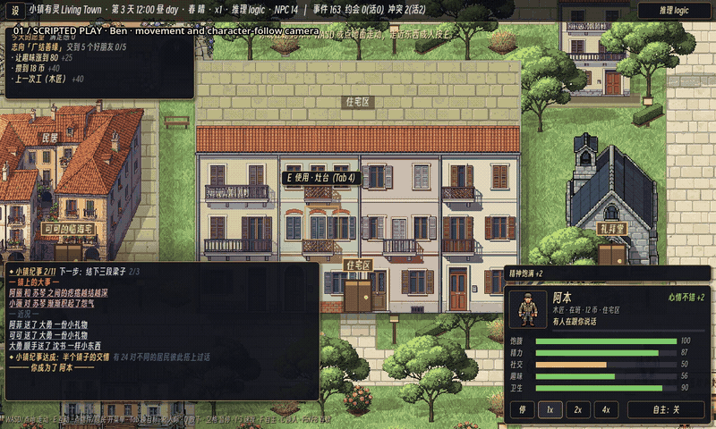

# 小镇有灵 · Living Town

一个可以成为居民、也可以静静观察的像素生活模拟小镇。

居民会工作、吃饭、交朋友，也会记住承诺、传闻和矛盾。你可以选择一位居民，走进咖啡馆和家里，参与他们的日常；也可以打开观察台，看看一件小事怎样影响关系、经济和公共生活。

[English](README_EN.md) · [设计与开发记录](docs/README.md)



[播放完整演示（MP4）](docs/media/gameplay-tour.mp4) · [录制说明与章节](docs/249-gameplay-tour.md) · [地图蓝图](analysis/247/neighborhood-blueprint.png)

## 最近更新

- 按滨海街区蓝图重建道路、庭院通道、树带和花园，加入更细致的 PixelLab 建筑与景观素材。
- 区分连排住宅、商店、公共建筑和工坊的立面；修正建筑朝向，让入口与街道对应。
- 增加不规则室内空间、房间分隔和可通行楼梯；相机平滑跟随角色进出建筑。
- 市政政策、选举反馈与合作银行已有可查看的影响回执。

## 在小镇里

- **过日子**：选择居民，照顾需求，完成愿望，工作和休息。
- **建立关系**：聊天、送礼、邀请、传闻、冲突与道歉会留下记录。
- **观察变化**：查看居民状态、小镇故事、交易账本和公共政策。
- **自由探索**：逛市场、图书馆、浴室、工坊、住宅和海边；昼夜与天气改变氛围。

这是持续开发中的可玩原型。部分建筑用于街景展示，并非每一栋都能进入。演示采用 logic 后端，前半段通过真实移动和门口 API 驱动角色，后半段为标注清楚的观察视角；它不代表全部机制或模型表现都已验证。

## 开始游玩

使用 **Godot 4.6.2**，导入 `game/project.godot`，按 **F5（运行项目）**。首次打开需要等待素材导入。

```bash
git clone https://github.com/ForTe13X/living-town.git
cd living-town
godot --editor --path game
```

默认生活模式会让你选择居民。**无需模型或 API key** 即可游玩；本地 LLM / NobodyWho SLM 是可选后端，权重与扩展二进制不随仓库分发。安装与降级逻辑见 [LLM 集成](docs/03-LLM集成架构.md)。

| 操作 | 按键 |
| --- | --- |
| 行走 | WASD / 方向键 / 点击地面 |
| 互动、切换目标 | E / Tab |
| 取消、关系面板 | Q / R |
| 暂停、速度 | 空格 / 1–3 |
| 自主行动、换人 | F / C |
| 存档、读档 | F5 / F8（游戏窗口内） |

## 开发

`game/` 是 Godot 工程，`tools/` 包含审计、测试和录制工具，`docs/` 保留设计与实验记录。仿真负责裁决，模型只在合法候选与表达层工作。

```bash
python tools/lint_data.py
python tools/audit_coastal_plan.py
python tools/audit_neighborhoods.py
bash tools/ci.sh
```

Windows 本地 Godot 检查通过 `tools/run-godot-supervised.ps1` 运行，录制方法见 [演示说明](docs/249-gameplay-tour.md)。欢迎提交可复现的问题、玩法反馈和 PR。

代码采用 MIT License。美术包含 CC0 衍生素材与 PixelLab 生成素材；来源见 [素材说明](docs/09-美术资产与版权.md)、[滨海素材记录](docs/246-coastal-circulation-pixellab-camera.md) 和 [朝向修正](docs/248-blueprint-frontages.md)。
