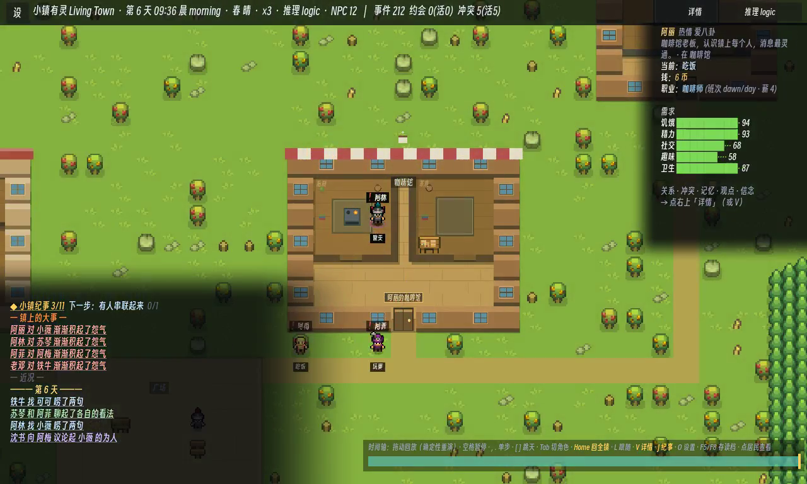

# 小镇有灵 · Living Town

[English](README_EN.md) · [文档索引](docs/README.md)

[](https://github.com/ForTe13X/living-town/actions/workflows/ci.yml)

像素小镇生活模拟原型。居民有需求、记忆、性格和关系，会赴约、爽约、争执、和解，也会形成声誉与派系。底层是一套确定性的社会引擎；本地 LLM/SLM 只负责把引擎给出的合法候选转成台词和选择。

模型不可用时，游戏仍然运行。断网、超时或非法输出都会自动回退到规则决策，因此接入模型只改变表现层，不改变世界状态的可靠性。


> 安卓真机录制（`logic` 后端）：入夜后居民各自赴约、闲聊、传八卦、闹别扭——每一步都源自同一套确定性社会引擎。


## 当前状态

下列**世界与社会系统**都已出货，且各自有 CI 门守着——点名不变量编号的由 [`game/bench/Invariants.gd`](game/bench/Invariants.gd) 守，其余由 `tools/ci.sh` 的数据 lint / 地图审计 / 6 个集成场景守。末三条（外壳、后端、推理延迟）是实测记录，不是不变量。

- **确定性社会底座**：打招呼、赠礼、八卦、邀约、对质、道歉、关系账本、知识边界、承诺、冲突和解决流程。关系变化能追溯到事件，因此系统能解释一个居民为什么生气或信任某人。
- **一座生成的小镇**：64×48 网格、8 个功能区，**walkability 是权威数据**，寻路是确定性 A\*。`tools/audit_map.py` 是专为此设的 CI 门——校验 typed-layers 自洽、全图可达、每件家具都有可达的交互格、区间有 ≥2 条路线，以及节日当天 spawn 的机会地形同样落在合法可交互的格子上。
- **多层室内**：七栋楼都有数据驱动的内部（`game/data/interiors.json`），居民真的会进屋、上楼、回家睡觉，不是贴图。
- **工作、班次与工资**：`game/data/jobs.json` + `skills.json`，技能等级影响工资。
- **一套货币经济**：价格、工资、镇库、贫困线。由**硬**不变量 #34（金钱守恒）与 #35（余额非负、不可透支）守着。
- **天气与季节**：`game/data/weather.json` 的类型与效用乘子。
- **节日**：世界对象按期生成/回收，硬不变量 #36 守"配对无残留"。
- **选举**：周期性投票，硬不变量 #37 守计票自洽。
- **涌现的社会层**：声誉与八卦级联、观点派系、互助盟约（含 GTFT 宽恕与 free-rider 解体）、秘密的吐露/泄漏/背叛。
- **可玩外壳**：昼夜光照、时钟与速度控制、NPC 头顶台词和表情、玩家与 NPC 自由对话、回放观察台。可以在任意 tick 检查居民的需求、信念、关系和冲突。
- **三档 AI 后端**：`logic` 纯规则、`llm` 本地 OpenAI 兼容服务、`slm` 通过 NobodyWho 做嵌入式 GGUF 推理。所有后端运行同一套引擎，并能安全降级。
- **本地推理实测**：Qwen2.5-1.5B-Q4 在测试过的消费级 GPU/APU 机器上约 1-2.5 秒完成一次决策；3B 约 2.9 秒。启动探针按当前机器测得的延迟设置 deadline。

**还不到位的**（详见 [docs/05](docs/05-路线图与里程碑.md)、[docs/43](docs/43-wave-c-plan.md)）：
**没有目标、没有引导、没有单局形状**——第 3 分钟没有任何东西把玩家叫回来，这是最大的一条；
角色精灵仍是 CC0 的**奇幻 RPG 素材包**（法师戴尖帽拿法杖）与现代小镇题材打架，方向已裁决但**一笔未改**（[docs/44](docs/44-art-direction.md)）；
手机上仍有 **24.6% 的黑边**（`aspect=keep`；换 `expand` 在真机上黑屏，已回滚）；
颜色是散在代码里的 **134 个硬编码色值**，统一调色板只有靶子没有收敛；
触屏动作条与音频**都没有在真机上验过**，也**没有人真的戴耳机听过**这套合成音效。

> 2026-07-26 的 Wave C 关掉了此前列在这里的六条：全哑、玩家动词锁在 `--player` 旗标后、开局只见 14% 的地图、
> 全镇视角 58% 是引擎默认清屏色、居民每秒瞬移 12.5 次、四季与天气渲染逐像素相同。

演示视频（按录制的构建从新到旧）：

- [新系统总览：经济 / 天气 / 节日 / 选举](docs/media/new_systems_demo.mp4)（2:25）
- [世界系统：地图、寻路、区块](docs/media/world_systems_demo.mp4)（0:35）
- [选举](docs/media/election_demo.mp4)（1:35）
- [多层室内 · 第二阶段](docs/media/interior_stage2_demo.mp4)（1:10）
- [室内房间](docs/media/interior_rooms_demo.mp4)（0:25）
- [70B 当编剧（导演层）](docs/media/director_70b_demo.mp4)（1:06）
- [玩家能动性](docs/media/player_agency_demo.mp4)（0:30）


> 桌面实录，`logic` 后端，**演示镜头编排**（`--demo-cam`）（1280×768 原尺寸，[完整片段 1:10 带声音](docs/media/town_wavec_demo.mp4)）。
> 左下角是**小镇编年史**——引擎里发生的事被分成「镇上的大事」与「近况」两栏，用中文讲出来
> （`苏琴 串联了 1 个人，一起给 可可 施压`），而不是打印事件枚举名：背叛、盟约、选举、结怨、和解都会自己浮上来。
> 昼夜光照本身也是新的——在 2026-07-26 之前，**截图工具永远渲不出夜晚**，所以这个项目此前所有"画面偏亮/偏暗"的
> 判断都建立在一把坏尺子上（见下「诚实标注」）。



> 同一构建的静帧（第 6 天 09:36 晨——**它是早晨不是正午**，旧文件名 `wavec_town_noon` 是错的，已改名）。地图不再是灰色虚空里的一块矩形——边缘经 3 格亮度斜坡、矮石墙与排水沟没入林中，
> 跨边界的最大相邻像素亮度跃变从 **131.54 降到 2.92**。右侧观察台默认收成一行提示，
> 完整档案（关系·冲突·记忆·派系·盟约·秘密·观点·信念）一键之遥。

更早的片子留作历史（画面与当前构建差别较大）：
[主演示，3:52，中文旁白 + 中英字幕](docs/media/living_town_demo.mp4) ·
[派系与盟约](docs/media/s3_social_demo.mp4) ·
[嵌入式 SLM 桌面驱动](docs/media/slm_gpu_demo.mp4) ·
[SLM 语音](docs/media/voice_gpu_demo.mp4)

## 技术难点与创新

**1. 确定性 + 观察无关：世界怎么活，不取决于你在看哪。**
决策逻辑里没有墙钟、没有全局随机——所有随机由稳定派生的 `seed + tick + salt(+agent)` 决定（不依赖墙钟或全局 RNG），同一 seed 逐字节一致，回放观察台能从任意 tick 精确重建世界。更强的一条红线：**渲染可以跟随相机，但决定"精细模拟谁"的仿真分级不能依赖相机**——否则同一存档不同看法就会回放出不同历史。这条"观察无关"贯穿整个引擎。

**2. 观察无关的聚合 LOD（本阶段核心工作）。**
要把镇子扩到数百人，必须对远处居民降精度；难点在于常规 LOD 按相机远近降级，会让历史依赖观察路径、直接击穿上面的确定性红线。这里做了一个**观察无关的聚合 LOD**——满帧 cohort 完全由 committed 仿真态选取（谁在做事 / 无状态轮转 / 玩家近旁），绝不读相机（唯一按相机半径降频的旧保守分支只用于 bench 诊断、不参与出货）。经六项验证：逐字节 default-off、**相机路径无关**（5 个固定 `lod_focus` 值 → 同一 digest）、存读/fresh-vs-restart 确定、规模硬不变量、诚实成本、liveness floor；其中【相机路径无关 + 确定性】两项已并入 CI 作为永久门。
> 诚实标注：这是一个**观察无关原型**，不是"已交付数百 NPC"。真机微秒实测：**sim-tick(~64ms) 与逐-agent/社交绘制(~60ms) 是两大成本**（合计约占单帧 ¾），其余为每帧开销与少量静态重绘。LOD 只砍 sim-tick 那块、不是充分解——另一大块要靠渲染裁剪。方法论上的教训（记在 [docs/33](docs/33-viewer-independent-lod-delivery.md)）：**别推断瓶颈，埋计时器测**——我曾三次凭直觉判错单一瓶颈；即便如此，复盘时我仍把没测的第三块顺手标成"静态重绘"，靠 N=12 整帧只 11ms 的上界才自己抓出这个过度归因。

**3. 决策与表达解耦：模型永不改写世界状态。**
引擎枚举合法候选，模型只读候选与上下文、返回一个候选 index + 可选台词；世界推进完全由确定性引擎负责，模型永不直接写状态。非法输出 / 超时 / 无模型都安全回退到规则决策。表现层可换（罐头台词 / 本地 SLM / 云端 LLM），世界的可靠性不变。

**4. 涌现的社会动力学。**
八卦把第三方声誉传播开 → 形成共识 → 可能演成集体疏远；观点分歧结成派系；互助盟约带 GTFT 式宽恕。这些不是脚本，而是规则交互涌现的，且每一步都能溯源到具体事件——系统能解释一个居民为什么生气、为什么信任某人。

**5. 不变量回归门 + 影子反事实探针。**
30 天 soak 检查 37 条社会不变量（信念来源、承诺结算、金钱守恒、私聊边界……），**23 条硬 + 14 条软**，划分见 [`game/bench/Invariants.gd`](game/bench/Invariants.gd) 的 `HARD_IDS`。更进一步，"影子探针"在**不改变轨迹**的前提下测量一个干预到底翻转了哪些决策，把"机制到底有没有用"从轶事变成可量化的数字。
> 诚实标注：其中 **#15「涌现放逐」是已知有缺陷的指标，只报不门**——它用终态声誉挑人、却用全程日志算接受率（时间泄漏）。修掉泄漏后的 #15v2 在 126 个 seed 上全部 INCONCLUSIVE，所以结论是**不加机制**、也不拿它当门。全链见 [docs/31](docs/31-15-resolution.md)。

**6. 端上 SLM：从 16GB 泄漏到手机上真的产出决策。**
在真机（红魔 8 Elite / Android 15）上，`backend=slm` 曾经是**发起 40 · 成功 0**，Native Heap `3 → 7.5 → 16GB` 无界涨直到 OOM。
- **根因不是它看起来的那个。** 第一版结论"Adreno GPU Vulkan 特定"**被我自己的后续测试证伪**——那次只测了最小冒烟路径。补一个跑真·游戏内决策路径的 bench 后，桌面 AMD Vulkan 上同样段错误，panic 直说 `access to instance after it has been freed`：真根因是**每次决策都新建一个 worker、在飞时 free**（use-after-free）。桌面模型快→free 抢在回包前→崩；手机慢→worker 释放不掉→泄漏。**同一个 bug 的两张脸。**
- **治法**：全局养一个池化的持久 worker，串行、绝不 mid-flight free，回包按 epoch 作废。**真机满负载复验**：Native Heap 峰值 3.2GB（加载时）→ **217MB 封顶不涨**，跑满 13 个模拟日、**0 崩**、FPS 88-91。
- **然后是第二次翻盘**：剩下的"手机不产出决策"也**不是挂死，是太慢**。加了延迟埋点才分得清——真机 A/B 显示 **Adreno GPU 满负载在飞解码 ~16-20s**（渲染器和推理抢同一块 GPU），而 **8 Elite CPU 只要 ~3-8s（暖）**。于是**安卓上默认改用 CPU 推理**，端上决策这才真正落地。
- **诚实的分母**：**不能**说"手机上 2/3 的 NPC 决策由端侧 SLM 驱动"——那是 landed/**fired**，换了个方便的分母。worker 严格串行，它本身就是镇级吞吐的上限。用诚实分母（实际落地的决策数）实测：桌面 **16.1%–62.3%**，随阵容规模与解码速度变化两个数量级；手机那一次运行约 **2%**。见 [docs/35](docs/35-slm-decision-share-and-lod-soft-gate.md)。
- **最不舒服、但最该写在这里的一条：`landed` ≠ `drove`。** 模型落地的编号，可能正好就是引擎自己会选的那个。于是我们做了 shadow 对照——在**同一份冻结候选集**上同时算出引擎基线，看两者到底有多少不同（Δ/C），并与**同配置的均匀随机零假设**对照。结论：**模型确实改变了决策（Δ/C 15%–55%），但改得与随机挑不可区分**——Δ/L 与随机零假设相差 ≤1.4 个百分点，分数序位 0.41–0.54（随机=0.50），而在引擎自己的效用轴上**比随机还多丢 0.6%–11.2% 的效用**。同一套仪器对 mock 鹦鹉给出的读数落在另一侧（序位 0.012–0.017、保住 97% 效用），所以这不是仪器的问题。
  **该怎么读**：这**证伪的是"模型让决策更好"**，不是"模型没用"——引擎的 `score` 是启发式而非真值，本项目的设计意图本就是**风味与声音**而非效用最优（模型只能在合法候选里挑，永远改不了世界状态）。但任何"更聪明/更合理的决策"的说法，目前**没有证据**。全文见 [docs/36](docs/36-model-influence-delta-over-c.md)。
- **于是我们把零假设做成了可运行的对照，再问一次：决策路到底值不值？** 加了一个确定性的 `random` 后端，并做**剂量配平**（模型因串行+延迟只驱动约 62% 的决策，同步随机驱动 100%——不配平就只是在量"模型慢"）。结论比上一条更不客气（[docs/38](docs/38-does-the-decision-path-earn-it.md)）：
  - 模型**确实**能与随机区分——但**没有一条差异指向好的方向**。在本设计自己声称的那条轴（行为多样性）上，它**输给随机数发生器**：logic 10.89 → slm 11.56 → random 13.84。
  - 它把小镇**去社交化**得比随机更狠：社交动作占比 29.4%(logic) → 17.2%(random) → **12.2%(模型)**；`gossip_rep` 7.2% → 0.5%。
  - **那点差异不是判断力，是位置偏好**：模型的选号直方图塌成了**位置分布**——`index 0` 在 3285 次里被选中 **0 次**、30% 压在 `index 3`。把这个直方图喂给一个**对内容完全无知**的采样器，它复现了模型的两条头条差异（p=0.24 / 0.25）。
- **🔄 后续更正（同日，[docs/42](docs/42-prompt-pathology-or-capability-ceiling.md)）：上面那两条结论对**当前出货的 1.5B** 成立，但**成因大半是可修的**，不是"端上决策做不到"的证据。** 用同一套 prompt 在 4090 上跑大模型对拍（5290 个真实决策点、判据与解析逐行复用、零假设解析计算）：
  - **31B 明显在读内容**：分数序位 **0.276**（随机=0.495、完美鹦鹉=0.000），效用保留 +0.538，p=0.0078 且 8/8 seed。**所以任务编码本身是可读的**——不是一个坏任务。
  - **1.5B 守恒的是"位置"而不是"内容"**：打乱/反转候选顺序后，它的槽位峰值始终停在 3、**槽位 0 恒为 0.0000**；而 31B 反过来守恒内容。冒烟枪是 system prompt 里那句示例——**"如 3 或 A"**：删掉它，index-3 的概率质量掉 62%；改成"如 0"，选中 0 的比例涨 24 倍。
  - **于是"饿穿"有了机制**：`index 0` 在 **74.8%** 的情况下就是"吃饭/睡觉"。生存动作占比——引擎 36.9%、31B 42.1%、随机 18.5%、**出货 1.5B 仅 4.8%**。**agent 饿死是因为模型从不选第 0 项，而第 0 项通常正是"去吃饭"——这是格式 bug，不是能力 bug。**
  - **而且我们一直在测一个代码并不想用的模型**：`AIBackend.slm_model_path` **本来就默认 3B**，是安卓的 `_resolve_model_path()` 把它绕过了。3B **没有塌陷**（accept 85%→100%、选中 0 的比例 0.00%→18.4%）。
  - 诚实的另一半：**修好格式并不能给 1.5B 买到判断力**（八种改法下序位始终 0.46-0.50）——所以"1.5B 到了能力天花板"同时也是真的。**两件事同时成立。**
  - ⇒ 下一步不是蒸馏，而是**先切到代码本就默认的 3B + 修那两条 prompt 字符串**，然后把 docs/36/38/40 的测量**全部重跑**。

- **⚠️→✅ 一条出货阻断项，也是 CI 结构性看不见的（已修、已加门）**：`backend=slm` 下硬不变量 **#01「无饿穿」在 8/8 个 seed 上被违反**（同配置 logic 是 0/8）。因为 CI 钉 `Sim.backend=null`，**模型路径上的硬不变量从未被任何门检查过**。已排除犹豫/串行化（`mock` 在同样的延迟与空转率下不饿死任何人）——是**选择本身**让 agent 不去吃饭。
  **根因不是"模型选得差"，是引擎少了一条边界**：引擎的生存保护里，只有"危机时摘掉社交候选"那一层是**禁令**，另一层（urgency 主导的打分让吃/睡胜出）**只是打分**——对"在同一候选集里按下标挑一个"的外部后端完全无效。#01 是**硬**不变量，不该建立在"后端会自觉挑对"之上。
  修法是两条**只长在外部后端分支上**的引擎边界（危机中只放行救急的选择 + 这趟差事的车费需求预算付不付得起），并新增 CI 步骤 **4d `BackendGate`**：用**确定性**的 `random` 后端（选号来自项目自有种子流、时延按 tick 计 ⇒ 逐字节可重跑，门自己每次都机检这条）在两档剂量上守 #01。实测 8/8 红 → **8/8 绿**，12 seed × 20 天 24/24 绿，N=48 下也是 0 饿穿；**金标一个字节没动**（`backend==null` 时那两条边界永不被调用）。代价：出货剂量下护栏动了 **7.3%** 的落地决策（有效 L/C 63.8% → 59.1%），多样性不受影响。全文见 [docs/45](docs/45-external-backend-invariant-gate.md)。
- **代价也说清**：CPU 推理活跃时 FPS 从 88 掉到 34-46。另一项此前没被计入的代价：等待期间 agent 会空转——N=12 下 5453 次询问里有 2835 次什么都没落地，**模型让小镇更"犹豫"**。
- **顺带修正一个我们自己的指标缺陷**：此前四处引用的"bad_parse 29–36% = 模型格式不遵从"是**混淆**——它把"模型回了 prose"和"回答有效但等待期间世界变了(候选过期)"算在了一起。拆开实测：真实格式不遵从 **7.5%–19.4%**，且**随镇子变大而下降**（世界翻动更快 → 更多有效回答过期）；N=60 时**三分之二的表观模型失败其实是陈旧**。这一点仓库其实 6 月就测到过（[docs/11](docs/11-LLM部署实测对比与选型.md) §S5：「合法率损失的主因是异步陈旧，不是模型错」），后来被写丢了——现在补回。

全文与全部实测表见 [docs/34](docs/34-slm-device-hang-leak.md)；出 APK 见 [docs/18](docs/18-android-apk-build.md)。
> 上述真机数字来自单台设备（红魔 8 Elite / 骁龙 8 Elite / Android 15），不是跨机型基准。

**7. 把"数字要有零假设"这条纪律用到画面上——以及为此付出的代价。**
这个项目一直用不变量门和零假设来管**仿真**，却从没把同一条纪律用在**视觉**上。2026-07-26 的一波并行改造把账算清了：

- **量具本身是坏的，而且没人知道坏了多久。** `--shot` 截图**永远渲不出昼夜**——`CanvasModulate` 建出来是白的，
  而日光曲线只在三个回调里施加，截图路径把 `auto_run` 关了，三条路一条都不走。
  证据是两张历史截图：HUD 一张写 `00:38 夜`、一张写 `12:00 昼`，**主草地色逐字节都是 (133,166,67)**。
  ⇒ 在此之前，本项目所有"画面偏亮/偏暗"的判断都不可信。修它的那一行现在由**本仓库第一条视觉门**守着，
  而那道门**探不到渲染环境就 SKIP**——*一道在别人机器上因环境变红的门，比没有门更坏，它训练所有人忽略红色。*
- **★ 六条验收判据被执行它们的子任务当场证伪，六条全是派任务者写的。** 例如「四季两两像素 diff 必须不同」
  在**未改动的树上就全过**（居民每天都在移动）；「面板边缘 16px 剖线的最大跃变」有 **8px 落在地图内**，
  而界内像素画本身就有约 130 的跃变 ⇒ **指标有地板，修好后只从 131.54 动到 129.93**；拆成"跨界/界外/保真度"
  三个量之后，同一份改动立刻显出 **131.54 → 2.92（−97.8%）**。
  **一个报不出成功的指标，和一个什么都拦不住的指标，是同一种失败的两面。**
  沉淀成一条可执行的规矩：**写下任何视觉判据之后，先问一句"一个什么都不做的改动能不能通过它？"**
  > **但"六条"这个数字要打折**：外部对抗评审用本项目自己的规矩（"相关症状 ≠ 独立证据"）反打回来，说得对——
  > 那更可能是**同一个上游错误被复制了六次**（没先定义"干预→观测→归因"的链条，就直接在最终截图上找一个数），
  > 而不是六种彼此不同的判据设计失败。**前者是一条可修的规矩，后者是一份虚增的统计重量。**
- **连验收取景都可能把问题藏起来**：指定的全镇取景下，信息面板大部分压在地图**之外**的背板上
  （文字带背景 29.4/255），而在玩家真正会看到的跟随相机下是 **102.3/255**——只看指定那一帧，"读不清"几乎不成立。
- **同期还查出四个不在任何任务书里的真实缺陷**：SLM 熔断器一旦触发**换模型也解除不了**
  （而"改用 CPU"正是我们自己文档给的自救处方）；"只改两个 prompt 字符串"的方案会把候选裁剪率从 0.4% 推到 5.84%、
  **把引擎自己的最优解顶到首位**，从而摧毁它正要修的那个性质；**每段录屏的前 5-7 秒录的是引擎启动闪屏**
  （包括当时挂在本 README 上的那一段）；以及一道写好的门**从没接进 CI**，而**我在转述时把作者原话里那句"它没接进 CI"压掉了**。

- **★ 而这一整节量的都不是"有没有人想玩"。** 三路评审（外部对抗 AI + 两个独立只读 agent，指令均为"REFUTE"）
  给出的判决是同一句：**"它看起来明显更好了，而且仍然没有人会玩它。"**
  上面每一个数字量的都是**可读性**，而可读性不是**吸引力**——**playability 这一波一次都没有被测到**，
  本项目也还没有任何能测它的仪器。所以这一节应当读作"我们把量具修好了并用它修了画面"，
  **不应**读作"产品变好玩了"。真正拦在前面的仍然是那条写在「还不到位的」第一行的：**没有目标、没有引导、没有单局形状。**
- **同一轮评审还证明了这套方法本身的漏洞**：本波每一条视觉验收都是**点采样或 diff-bbox**，
  **没有任何一条是"有人把整帧看一遍"**——于是三样东西进了**每一张**已发布素材：一个录屏光标、
  一片把原始数据键印在草地上的缺贴图占位块、一块写着「测试阁楼」的招牌。
  计划里给音频写了"必须有人真的戴耳机听一遍"，**却没给画面写对应的那一句**。三样都已修复并重录。

全文见 [docs/43](docs/43-wave-c-plan.md)（逐棒回执与被证伪的判据）与 [docs/13](docs/13-实验札记-experiment-journey.md)（札记）。

## 工程设计

1. **模型不直接改状态。** 引擎枚举合法候选，模型只返回候选 index 与可选台词。非法输出、超时或服务缺失都会回退到确定性规则。
2. **不变量作为回归门。** 30 天 soak 会检查 37 条社会性质，包括信念来源、承诺结算、道歉流程、声誉影响、私聊秘密边界、金钱守恒和不可透支。**权威清单是代码本身**：[`game/bench/Invariants.gd`](game/bench/Invariants.gd)（每条带 id、中文名与失败详情）。方法学见 [docs/08](docs/08-测试与验证.md)。
3. **事件溯源支持回放。** 随机性由 `seed + tick + salt + agent` 派生（`_rng_at` 每次新建 RNG、纯输入播种、无状态），不依赖墙钟或全局随机。同一 seed 生成逐字节一致的摘要，回放观察台可从任意 tick 重建世界。
4. **Godot 是权威；Node 端口是历史交叉验证。** [`tools/sim_social_port.mjs`](tools/sim_social_port.mjs) 曾镜像 M1-S3 的社交内核用于秒级迭代，自查 **33 条**断言（对应引擎的 #1-#33），并确实证过"这套逻辑对 RNG 实现是鲁棒的"（端口用 mulberry32，Godot 用 `RandomNumberGenerator`，两边数值不同而性质同时成立）。**但它已于 2026-07-26 正式退役**（[docs/39](docs/39-node-port-disposition.md)）：其逻辑冻结在 2026-07-03、两天后即被"阵容 6→12"打破，且它**从不比对状态**（两边各跑各的轨迹），今天在 12 seed 里有 7 个是红的。**现在不要把它当验证依据。**
   但**它不是当前的门**，说清楚：它**不覆盖** #34-#37（金钱守恒 / 货币非负 / 节日配对 / 选举计票），与 Godot **不逐字节可比**，**不在 `tools/ci.sh` 里**，自 2026-07-03 首次公开快照后**未再更新**，而且**部分 seed 已经跑红**（`--seed 20260626 --days 30` 退出 1；seed 1 与 42 仍 33/33 全过）。逐条核对见 [docs/08 §1](docs/08-测试与验证.md)。**回归门只有一个，在 Godot 侧。**

## 快速开始

需要 [Godot 4.6+](https://godotengine.org/)（工程声明 `config/features = 4.6`，CI 钉在 4.6.2）。

**跑整条门**——和 GitHub Actions 跑的是同一个脚本：

```bash
GODOT=/path/to/godot bash tools/ci.sh
```

9 道关：版权红线（整棵已跟踪树里不得有权重/二进制）、数据 lint、地图审计、markdown 链接 lint、Godot 解析冒烟、**S0 不变量门**（37 条 × 12 seed × 60 天 + determinism 三跑 + **已提交金标**跨进程锚 + **逐 tick 前缀链** + 套件级活性）、LOD 观察无关门、**DetGate 场景确定性门**（default/faction/betray/freerider 四轨）、6 个集成场景。任一红即退出 1。

> ⚠️ 一处诚实边界：CI 钉 `Sim.backend=null`，因此**上述硬不变量从未在模型路径上被检查过**——而 `backend=slm` 下 #01「无饿穿」实测 8/8 seed 被违反（[docs/38](docs/38-does-the-decision-path-earn-it.md)）。红线#2「无模型也能玩」安全，但"开着模型时红线#1 仍成立"是**未经检验的继承假设**。

窗口模式：

```bash
godot --path game -- --speed 2.0
```

操作：空格暂停，`1/2/3/4` 调速，滚轮缩放，点击居民打开状态，拖动时间轴回放。选中居民后可在底部输入框对话。

单 seed 详细 headless soak（逐事件、逐不变量）：

```bash
godot --headless --path game --script res://scripts/sim_soak.gd -- --days 30
```

Node 端口（历史交叉验证，**不是门**，部分 seed 已红——见「工程设计」第 4 条）：

```bash
node tools/sim_social_port.mjs --days 30 --seed 1
```

可选本地模型后端：

- `--backend llm`：启动 LM Studio 或其他 OpenAI 兼容本地服务，默认 `localhost:1234`，并加载指令模型。
- `--backend slm`：把 [NobodyWho](https://github.com/nobodywho-ooo/nobodywho) 放到 `game/addons/nobodywho/`，把 GGUF 权重放到 `game/models/`，例如 Qwen2.5-1.5B-Instruct-Q4_K_M。

接线细节见 [docs/03-LLM集成架构.md](docs/03-LLM集成架构.md)。硬件实测见 [docs/11-LLM部署实测对比与选型.md](docs/11-LLM部署实测对比与选型.md)。安卓出包见 [docs/18](docs/18-android-apk-build.md)。

## 目录

```text
game/                  Godot 4 工程：scripts、data、scenes 与测试场景
  scripts/Sim.gd       世界状态、tick、需求/效用 AI、合法候选 API
  scripts/AIBackend.gd 可插拔 AI 后端，处理超时与降级
  scripts/Memory.gd    按 recency、importance、relevance 检索记忆流
  bench/               不变量单一真相源、S0 网格 harness、LOD 观察无关门
tools/                 CI 脚本、数据/地图/链接 lint、Node 逻辑端口、录屏流水线
bench/bakeoff/         离线蒸馏 bake-off 与 Theory Engine 原型（Python，未接入游戏循环）
docs/                  设计、架构、评审、实测与实验记录（索引见 docs/README.md）
```

## 文档

| 文档 | 内容 |
|---|---|
| [01 产品愿景与玩法](docs/01-产品愿景与玩法.md) | 游戏概念、核心循环、不做什么 |
| [02 技术架构](docs/02-技术架构-混合仿真.md) | 确定性引擎 + LLM 表现层 |
| [03 LLM 集成](docs/03-LLM集成架构.md) | 后端、结构化输出、超时与降级 |
| [07 社交底座](docs/07-技术文档-社交底座.md) | 社交事务、关系、信念、承诺与冲突 |
| [08 测试与验证](docs/08-测试与验证.md) | 不变量门、硬/软划分、两个运行时的覆盖面核对、复现方式 |
| [11 部署实测](docs/11-LLM部署实测对比与选型.md) | 多机器、多模型尺寸的延迟数据 |
| [13 实验札记](docs/13-实验札记-experiment-journey.md) | 995 行过程日志：发现、奇技、坑，**以及被推翻的结论** |
| [18 Android APK 构建](docs/18-android-apk-build.md) | 骁龙 8 Elite / arm64 出带端上 SLM 的包 |
| [31 #15 结案](docs/31-15-resolution.md) | 一个"看着像机制缺陷"的残余，被证成度量假象 → 不加机制 |
| [33 观察无关 LOD](docs/33-viewer-independent-lod-delivery.md) | 相机不喂仿真的 LOD，以及"别推断瓶颈，埋计时器测"的教训 |
| [34 真机 SLM 挂死与泄漏](docs/34-slm-device-hang-leak.md) | 16GB 原生泄漏 → use-after-free → 池化治本 → 真机 GPU/CPU A/B → 端上默认 CPU |
| [`bench/bakeoff/README.md`](bench/bakeoff/README.md) | 3 命令可复现的蒸馏 bake-off + 两个诚实负结果 |

**全部 33 篇编号文档的分主题索引见 [docs/README.md](docs/README.md)。** 文档主要为中文。

## 素材与许可

代码使用 MIT License。像素素材来自 Puny World、Characters 等 CC0 资源包，来源列在 [docs/09-美术资产与版权.md](docs/09-美术资产与版权.md)。封面为 AI 生成。模型权重与 NobodyWho 二进制不随仓库分发，请从上游获取。

部分文档会提到一个上游游戏评测流水线，用于 headless 渲染、自动录屏与 LLM-as-judge 实验；本仓库运行时不依赖该流水线。
