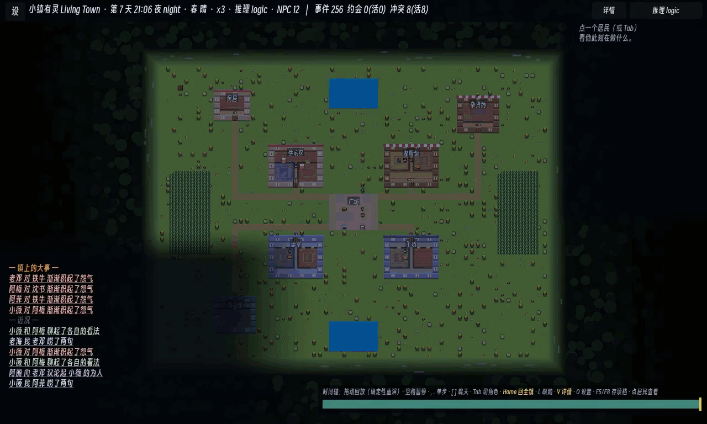

# 小镇有灵 · Living Town

[English](README_EN.md) · [文档索引](docs/README.md)

[](https://github.com/ForTe13X/living-town/actions/workflows/ci.yml)

像素小镇生活模拟原型。居民有需求、记忆、性格和关系，会赴约、爽约、争执、和解，也会形成声誉与派系。底层是一套确定性的社会引擎；本地 LLM/SLM 只负责把引擎给出的合法候选转成台词和选择。

模型不可用时，游戏仍然运行。断网、超时或非法输出都会自动回退到规则决策，因此接入模型只改变表现层，不改变世界状态的可靠性。


> 安卓真机录制（`logic` 后端）：入夜后居民各自赴约、闲聊、传八卦、闹别扭——每一步都源自同一套确定性社会引擎。


## 当前状态

下列**世界与社会系统**都已出货，且各自有 CI 门守着——点名不变量编号的由 [`game/bench/Invariants.gd`](game/bench/Invariants.gd) 守，其余由 `tools/ci.sh` 的数据 lint / 地图审计 / 6 个集成场景守。末三条（外壳、后端、推理延迟）是实测记录，不是不变量。

- **确定性社会底座**：打招呼、赠礼、八卦、邀约、对质、道歉、关系账本、知识边界、承诺、冲突和解决流程。关系变化能追溯到事件，因此系统能解释一个居民为什么生气或信任某人。
- **一座生成的小镇**：64×48 网格、8 个功能区，**walkability 是权威数据**，寻路是确定性 A\*。`tools/audit_map.py` 是专为此设的 CI 门——校验 typed-layers 自洽、全图可达、每件家具都有可达的交互格、区间有 ≥2 条路线。
- **多层室内**：七栋楼都有数据驱动的内部（`game/data/interiors.json`），居民真的会进屋、上楼、回家睡觉，不是贴图。
- **工作、班次与工资**：`game/data/jobs.json` + `skills.json`，技能等级影响工资。
- **一套货币经济**：价格、工资、镇库、贫困线。由**硬**不变量 #34（金钱守恒）与 #35（余额非负、不可透支）守着。
- **天气与季节**：`game/data/weather.json` 的类型与效用乘子。
- **节日**：世界对象按期生成/回收，硬不变量 #36 守"配对无残留"。
- **选举**：周期性投票，硬不变量 #37 守计票自洽。
- **涌现的社会层**：声誉与八卦级联、观点派系、互助盟约（含 GTFT 宽恕与 free-rider 解体）、秘密的吐露/泄漏/背叛。
- **可玩外壳**：昼夜光照、时钟与速度控制、NPC 头顶台词和表情、玩家与 NPC 自由对话、回放观察台。可以在任意 tick 检查居民的需求、信念、关系和冲突。
- **三档 AI 后端**：`logic` 纯规则、`llm` 本地 OpenAI 兼容服务、`slm` 通过 NobodyWho 做嵌入式 GGUF 推理。所有后端运行同一套引擎，并能安全降级。
- **本地推理实测**：Qwen2.5-1.5B-Q4 在测试过的消费级 GPU/APU 机器上约 1-2.5 秒完成一次决策；3B 约 2.9 秒。启动探针按当前机器测得的延迟设置 deadline。

**还不到位的**（详见 [docs/05](docs/05-路线图与里程碑.md)）：游戏是**全哑的**（无任何音频）；手机上只能看不能玩（7 个玩家动词全是键盘绑定）；最戏剧的五类社交事件目前**不会**出现在事件日志里；社交"暖"的那一半偏冷（跑一个模拟月的默认存档只有 2 次约会、0 次结盟、0 次互助）。

演示视频（按录制的构建从新到旧）：

- [新系统总览：经济 / 天气 / 节日 / 选举](docs/media/new_systems_demo.mp4)（2:25）
- [世界系统：地图、寻路、区块](docs/media/world_systems_demo.mp4)（0:35）
- [选举](docs/media/election_demo.mp4)（1:35）
- [多层室内 · 第二阶段](docs/media/interior_stage2_demo.mp4)（1:10）
- [室内房间](docs/media/interior_rooms_demo.mp4)（0:25）
- [70B 当编剧（导演层）](docs/media/director_70b_demo.mp4)（1:06）
- [玩家能动性](docs/media/player_agency_demo.mp4)（0:30）



> 桌面实录（`logic` 后端，[完整片段 0:60](docs/media/town_chronicle_demo.mp4)）：左下角是**小镇编年史**——引擎里发生的事被分成「镇上的大事」与「近况」两栏，用中文讲出来（`苏琴 串联了 1 个人，一起给 可可 施压`），而不是打印事件枚举名。这一栏此前只讲得出打招呼；现在背叛、盟约、选举、结怨、和解都会自己浮上来。

更早的片子留作历史（画面与当前构建差别较大）：
[主演示，3:52，中文旁白 + 中英字幕](docs/media/living_town_demo.mp4) ·
[派系与盟约](docs/media/s3_social_demo.mp4) ·
[嵌入式 SLM 桌面驱动](docs/media/slm_gpu_demo.mp4) ·
[SLM 语音](docs/media/voice_gpu_demo.mp4)

## 技术难点与创新

**1. 确定性 + 观察无关：世界怎么活，不取决于你在看哪。**
决策逻辑里没有墙钟、没有全局随机——所有随机由稳定派生的 `seed + tick + salt(+agent)` 决定（不依赖墙钟或全局 RNG），同一 seed 逐字节一致，回放观察台能从任意 tick 精确重建世界。更强的一条红线：**渲染可以跟随相机，但决定"精细模拟谁"的仿真分级不能依赖相机**——否则同一存档不同看法就会回放出不同历史。这条"观察无关"贯穿整个引擎。

**2. 观察无关的聚合 LOD（本阶段核心工作）。**
要把镇子扩到数百人，必须对远处居民降精度；难点在于常规 LOD 按相机远近降级，会让历史依赖观察路径、直接击穿上面的确定性红线。这里做了一个**观察无关的聚合 LOD**——满帧 cohort 完全由 committed 仿真态选取（谁在做事 / 无状态轮转 / 玩家近旁），绝不读相机（唯一按相机半径降频的旧保守分支只用于 bench 诊断、不参与出货）。经六项验证：逐字节 default-off、**相机路径无关**（5 个固定 `lod_focus` 值 → 同一 digest）、存读/fresh-vs-restart 确定、规模硬不变量、诚实成本、liveness floor；其中【相机路径无关 + 确定性】两项已并入 CI 作为永久门。
> 诚实标注：这是一个**观察无关原型**，不是"已交付数百 NPC"。真机微秒实测：**sim-tick(~64ms) 与逐-agent/社交绘制(~60ms) 是两大成本**（合计约占单帧 ¾），其余为每帧开销与少量静态重绘。LOD 只砍 sim-tick 那块、不是充分解——另一大块要靠渲染裁剪。方法论上的教训（记在 [docs/33](docs/33-viewer-independent-lod-delivery.md)）：**别推断瓶颈，埋计时器测**——我曾三次凭直觉判错单一瓶颈；即便如此，复盘时我仍把没测的第三块顺手标成"静态重绘"，靠 N=12 整帧只 11ms 的上界才自己抓出这个过度归因。

**3. 决策与表达解耦：模型永不改写世界状态。**
引擎枚举合法候选，模型只读候选与上下文、返回一个候选 index + 可选台词；世界推进完全由确定性引擎负责，模型永不直接写状态。非法输出 / 超时 / 无模型都安全回退到规则决策。表现层可换（罐头台词 / 本地 SLM / 云端 LLM），世界的可靠性不变。

**4. 涌现的社会动力学。**
八卦把第三方声誉传播开 → 形成共识 → 可能演成集体疏远；观点分歧结成派系；互助盟约带 GTFT 式宽恕。这些不是脚本，而是规则交互涌现的，且每一步都能溯源到具体事件——系统能解释一个居民为什么生气、为什么信任某人。

**5. 不变量回归门 + 影子反事实探针。**
30 天 soak 检查 37 条社会不变量（信念来源、承诺结算、金钱守恒、私聊边界……），**23 条硬 + 14 条软**，划分见 [`game/bench/Invariants.gd`](game/bench/Invariants.gd) 的 `HARD_IDS`。更进一步，"影子探针"在**不改变轨迹**的前提下测量一个干预到底翻转了哪些决策，把"机制到底有没有用"从轶事变成可量化的数字。
> 诚实标注：其中 **#15「涌现放逐」是已知有缺陷的指标，只报不门**——它用终态声誉挑人、却用全程日志算接受率（时间泄漏）。修掉泄漏后的 #15v2 在 126 个 seed 上全部 INCONCLUSIVE，所以结论是**不加机制**、也不拿它当门。全链见 [docs/31](docs/31-15-resolution.md)。

**6. 端上 SLM：从 16GB 泄漏到手机上真的产出决策。**
在真机（红魔 8 Elite / Android 15）上，`backend=slm` 曾经是**发起 40 · 成功 0**，Native Heap `3 → 7.5 → 16GB` 无界涨直到 OOM。
- **根因不是它看起来的那个。** 第一版结论"Adreno GPU Vulkan 特定"**被我自己的后续测试证伪**——那次只测了最小冒烟路径。补一个跑真·游戏内决策路径的 bench 后，桌面 AMD Vulkan 上同样段错误，panic 直说 `access to instance after it has been freed`：真根因是**每次决策都新建一个 worker、在飞时 free**（use-after-free）。桌面模型快→free 抢在回包前→崩；手机慢→worker 释放不掉→泄漏。**同一个 bug 的两张脸。**
- **治法**：全局养一个池化的持久 worker，串行、绝不 mid-flight free，回包按 epoch 作废。**真机满负载复验**：Native Heap 峰值 3.2GB（加载时）→ **217MB 封顶不涨**，跑满 13 个模拟日、**0 崩**、FPS 88-91。
- **然后是第二次翻盘**：剩下的"手机不产出决策"也**不是挂死，是太慢**。加了延迟埋点才分得清——真机 A/B 显示 **Adreno GPU 满负载在飞解码 ~16-20s**（渲染器和推理抢同一块 GPU），而 **8 Elite CPU 只要 ~3-8s（暖）**。于是**安卓上默认改用 CPU 推理**，端上决策这才真正落地。
- **诚实的分母**：能说的是"**被发起的那些** SLM 调用大多落在 deadline 内"（合并版装机眼验：发起 22 · 成功 13 · **超时 0**）。**不能**说"手机上 2/3 的 NPC 决策由端侧 SLM 驱动"——那是 landed/**fired**，换了个方便的分母。worker 严格串行，它本身就是镇级吞吐的上限，**全镇决策中端上模型的占比尚未测量**。
- **代价也说清**：CPU 推理活跃时 FPS 从 88 掉到 34-46。现在的瓶颈已经**不是延迟而是模型输出质量**（1.5B 偶尔回 prose 而非纯编号，被 fail-closed 的解析器挡下、优雅退回 logic）。

全文与全部实测表见 [docs/34](docs/34-slm-device-hang-leak.md)；出 APK 见 [docs/18](docs/18-android-apk-build.md)。
> 上述真机数字来自单台设备（红魔 8 Elite / 骁龙 8 Elite / Android 15），不是跨机型基准。

## 工程设计

1. **模型不直接改状态。** 引擎枚举合法候选，模型只返回候选 index 与可选台词。非法输出、超时或服务缺失都会回退到确定性规则。
2. **不变量作为回归门。** 30 天 soak 会检查 37 条社会性质，包括信念来源、承诺结算、道歉流程、声誉影响、私聊秘密边界、金钱守恒和不可透支。**权威清单是代码本身**：[`game/bench/Invariants.gd`](game/bench/Invariants.gd)（每条带 id、中文名与失败详情）。方法学见 [docs/08](docs/08-测试与验证.md)。
3. **事件溯源支持回放。** 随机性由 `seed + tick + salt` 派生，不依赖墙钟或全局随机。同一 seed 生成逐字节一致的摘要，回放观察台可从任意 tick 重建世界。
4. **Godot 是权威；Node 端口是历史交叉验证。** [`tools/sim_social_port.mjs`](tools/sim_social_port.mjs) 镜像 M1-S3 的社交内核用于秒级迭代，自查 **33 条**断言（对应引擎的 #1-#33）——它确实证过"这套逻辑对 RNG 实现是鲁棒的"（端口用 mulberry32，Godot 用 `RandomNumberGenerator`，两边数值不同而性质同时成立）。
   但**它不是当前的门**，说清楚：它**不覆盖** #34-#37（金钱守恒 / 货币非负 / 节日配对 / 选举计票），与 Godot **不逐字节可比**，**不在 `tools/ci.sh` 里**，自 2026-07-03 首次公开快照后**未再更新**，而且**部分 seed 已经跑红**（`--seed 20260626 --days 30` 退出 1；seed 1 与 42 仍 33/33 全过）。逐条核对见 [docs/08 §1](docs/08-测试与验证.md)。**回归门只有一个，在 Godot 侧。**

## 快速开始

需要 [Godot 4.6+](https://godotengine.org/)（工程声明 `config/features = 4.6`，CI 钉在 4.6.2）。

**跑整条门**——和 GitHub Actions 跑的是同一个脚本：

```bash
GODOT=/path/to/godot bash tools/ci.sh
```

7 道关：数据 lint、地图审计、markdown 链接 lint、Godot 解析冒烟、S0 不变量门（37 条 × 12 seed × 60 天 + determinism 双跑）、LOD 观察无关门、6 个集成场景。任一红即退出 1。

窗口模式：

```bash
godot --path game -- --speed 2.0
```

操作：空格暂停，`1/2/3/4` 调速，滚轮缩放，点击居民打开状态，拖动时间轴回放。选中居民后可在底部输入框对话。

单 seed 详细 headless soak（逐事件、逐不变量）：

```bash
godot --headless --path game --script res://scripts/sim_soak.gd -- --days 30
```

Node 端口（历史交叉验证，**不是门**，部分 seed 已红——见「工程设计」第 4 条）：

```bash
node tools/sim_social_port.mjs --days 30 --seed 1
```

可选本地模型后端：

- `--backend llm`：启动 LM Studio 或其他 OpenAI 兼容本地服务，默认 `localhost:1234`，并加载指令模型。
- `--backend slm`：把 [NobodyWho](https://github.com/nobodywho-ooo/nobodywho) 放到 `game/addons/nobodywho/`，把 GGUF 权重放到 `game/models/`，例如 Qwen2.5-1.5B-Instruct-Q4_K_M。

接线细节见 [docs/03-LLM集成架构.md](docs/03-LLM集成架构.md)。硬件实测见 [docs/11-LLM部署实测对比与选型.md](docs/11-LLM部署实测对比与选型.md)。安卓出包见 [docs/18](docs/18-android-apk-build.md)。

## 目录

```text
game/                  Godot 4 工程：scripts、data、scenes 与测试场景
  scripts/Sim.gd       世界状态、tick、需求/效用 AI、合法候选 API
  scripts/AIBackend.gd 可插拔 AI 后端，处理超时与降级
  scripts/Memory.gd    按 recency、importance、relevance 检索记忆流
  bench/               不变量单一真相源、S0 网格 harness、LOD 观察无关门
tools/                 CI 脚本、数据/地图/链接 lint、Node 逻辑端口、录屏流水线
bench/bakeoff/         离线蒸馏 bake-off 与 Theory Engine 原型（Python，未接入游戏循环）
docs/                  设计、架构、评审、实测与实验记录（索引见 docs/README.md）
```

## 文档

| 文档 | 内容 |
|---|---|
| [01 产品愿景与玩法](docs/01-产品愿景与玩法.md) | 游戏概念、核心循环、不做什么 |
| [02 技术架构](docs/02-技术架构-混合仿真.md) | 确定性引擎 + LLM 表现层 |
| [03 LLM 集成](docs/03-LLM集成架构.md) | 后端、结构化输出、超时与降级 |
| [07 社交底座](docs/07-技术文档-社交底座.md) | 社交事务、关系、信念、承诺与冲突 |
| [08 测试与验证](docs/08-测试与验证.md) | 不变量门、硬/软划分、两个运行时的覆盖面核对、复现方式 |
| [11 部署实测](docs/11-LLM部署实测对比与选型.md) | 多机器、多模型尺寸的延迟数据 |
| [13 实验札记](docs/13-实验札记-experiment-journey.md) | 995 行过程日志：发现、奇技、坑，**以及被推翻的结论** |
| [18 Android APK 构建](docs/18-android-apk-build.md) | 骁龙 8 Elite / arm64 出带端上 SLM 的包 |
| [31 #15 结案](docs/31-15-resolution.md) | 一个"看着像机制缺陷"的残余，被证成度量假象 → 不加机制 |
| [33 观察无关 LOD](docs/33-viewer-independent-lod-delivery.md) | 相机不喂仿真的 LOD，以及"别推断瓶颈，埋计时器测"的教训 |
| [34 真机 SLM 挂死与泄漏](docs/34-slm-device-hang-leak.md) | 16GB 原生泄漏 → use-after-free → 池化治本 → 真机 GPU/CPU A/B → 端上默认 CPU |
| [`bench/bakeoff/README.md`](bench/bakeoff/README.md) | 3 命令可复现的蒸馏 bake-off + 两个诚实负结果 |

**全部 33 篇编号文档的分主题索引见 [docs/README.md](docs/README.md)。** 文档主要为中文。

## 素材与许可

代码使用 MIT License。像素素材来自 Puny World、Characters 等 CC0 资源包，来源列在 [docs/09-美术资产与版权.md](docs/09-美术资产与版权.md)。封面为 AI 生成。模型权重与 NobodyWho 二进制不随仓库分发，请从上游获取。

部分文档会提到一个上游游戏评测流水线，用于 headless 渲染、自动录屏与 LLM-as-judge 实验；本仓库运行时不依赖该流水线。
