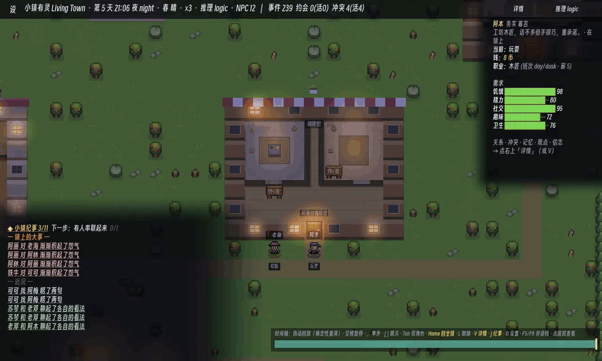

# Living Town

[中文](README.md) · [Documentation index](docs/README.md)

[](https://github.com/ForTe13X/living-town/actions/workflows/ci.yml)

*Living Town* is a pixel life-sim prototype. Residents have needs, memories, personalities, and relationships. They can keep or break appointments, argue, reconcile, build reputations, and form factions. The foundation is a deterministic social engine; a local LLM/SLM only turns engine-enumerated legal choices into dialogue and selection.

The game keeps running when the model is unavailable. Network failures, timeouts, or invalid outputs fall back to rule decisions, so model integration changes presentation rather than state reliability.



> Desktop capture (`logic` backend, demo camera `--demo-cam`, native 1280×768, 5 fps × 6 s).
> Night into morning: residents eat, chat, spread gossip and fall out. Bottom-left is the **Town Chronicle**
> (engine events written as prose, not printed enum ids); the observatory on the right shows the selected
> resident's **job / shift / wage / five needs**.
> Recipe: `tools/record-godot.sh` for 45 s → `tools/make_gif.sh <mp4> <gif> 1 5 31 6`.
> **Integer-only downscaling** is a rule this pipeline measured for itself: the GIF this README used to lead with
> was 680×408 — a 0.53125× *non-integer* scale — and the measurement also falsified the premise that going integer
> would make the HUD text readable. The only setting that buys readability is 1× (five-row comparison table in the
> header of `tools/make_gif.sh`).


## Current State

The **world and social systems** below all ship, and each has a CI gate behind it — the ones citing an invariant number are guarded by [`game/bench/Invariants.gd`](game/bench/Invariants.gd), the rest by the data lint, map audit, art gate, voice-coverage gate and 9 integration scenes in [`tools/ci.sh`](tools/ci.sh). The last three entries (shell, backends, inference latency) are measurements, not invariants.

- **Deterministic social substrate**: greetings, gifts, gossip, invitations, confrontation, apologies, relationship ledgers, belief boundaries, promises, conflicts, and resolution flow. Relationship changes are linked back to events, so the system can explain why a resident is angry or trusting.
- **A generated town**: a 64×48 grid with 8 districts where **walkability is authoritative data** and pathfinding is a deterministic A\*. `tools/audit_map.py` is a CI gate built for exactly this — it checks typed-layer consistency, full reachability, that every piece of furniture has a reachable interaction tile, that districts have ≥2 distinct routes, and that festival objects spawned for the day land on legal, reachable tiles too.
- **Multi-floor interiors**: all seven buildings have data-driven interiors (`game/data/interiors.json`); residents actually walk in, go upstairs, and go home to sleep. Not a backdrop.
- **Jobs, shifts and wages**: `game/data/jobs.json` + `skills.json`, with skill level feeding wages.
- **The division of labour has somewhere to happen**: carpenter / handyman / fisherman / teacher each have their own worksite; the vendor converts town-level stock into goods an individual can buy (measured at **141-165 `transfer`s per seed per 60 days**, roughly **15%** of all meals in town); the street cleaner closes his own loop on the cleanliness level (plaza clean → he goes and plays; below roughly **45%** → he sweeps).
  > This bullet used to be false, and it stayed false **after someone had eyeballed it**: *every single* "do work" action in the whole town happened on **one tile**, `desk_1[40,31]` (152-186 times per 60 days), shared by four jobs — including **a fisherman fishing at a carving bench**; and the new worksites' ids matched no sprite slot, so they **shipped as missing-texture placeholders printing raw data keys onto the grass**. Both were found by measurement in a later baton. See [docs/48 §一·五](docs/48-wave-f-plan.md).
- **A money economy**: prices, wages, a town treasury, a poverty line. Guarded by **hard** invariants #34 (money conservation) and #35 (non-negative balances, no overdraft). Person-to-person money is not just the vendor: `transfer(tenant, landlord, rent)` runs every night, and `housing.json` holds **8 registered leases** ([docs/48 §一·五](docs/48-wave-f-plan.md)).
- **Weather and seasons**: types and utility multipliers in `game/data/weather.json`.
- **Festivals**: world objects spawn and despawn on schedule; hard invariant #36 guards pairing with no residue.
- **Elections**: periodic votes; hard invariant #37 guards tally consistency.
- **An emergent social layer**: reputation and gossip cascades, opinion factions, mutual-aid pacts (with GTFT forgiveness and free-rider dissolution), and secrets that get confided, leaked, and betrayed.
- **Playable shell**: day/night lighting, clock and speed controls, NPC dialogue bubbles and expressions, free player-to-NPC conversation, and a replay observatory for inspecting residents, needs, beliefs, relationships, and conflicts at any tick.
- **Three AI backends**: `logic` for pure rules, `llm` for local OpenAI-compatible services, and `slm` for embedded GGUF inference through NobodyWho. All backends run the same engine and can fall back safely.
- **Measured local inference**: Qwen2.5-1.5B-Q4 through embedded SLM runs in roughly 1-2.5 seconds on tested consumer GPU/APU machines; 3B is around 2.9 seconds. Startup probes set deadlines from the current machine.

**What is not there yet** — **this section was rewritten from the latest wave's measurements, not carried over** (see [docs/05](docs/05-路线图与里程碑.md), [docs/49](docs/49-wave-g-plan.md)):

- **No goal, no onboarding, no session shape** — nothing calls the player back at minute three. **This is still the biggest one**,
  and three reviews (an external adversarial model plus two independent read-only agents, all instructed to refute)
  returned the same verdict: **"it looks meaningfully better, and nobody would still play it."** ([docs/43](docs/43-wave-c-plan.md))
- **The town's two ponds are flat single-colour stickers.** A 110×70 px sample on a real-device frame is **7700 px of exactly one colour**;
  `game/assets/art/terrain/water.png` is **16×16 with 1 colour**, while `grass_b` / `grass_flowers` in the same folder have **4 each**;
  water has **only that one tile** — no variant, no shoreline transition ⇒ two 8×5 bodies of water render as **hard 90° single-colour rectangles**
  pasted onto the grass with no shoreline at all. **The irony**: `WorldView`'s water layer has a *better-looking* fallback path
  (draw deep-water colour and dot in static ripples when the texture is missing) — **it can never run, because the texture exists**.
  A worse asset turned better code into dead code. This is not a regression from this wave; `water.png` has not changed since 27 June —
  **nobody had ever looked at a real-device frame with fresh eyes.** ([docs/49 §六](docs/49-wave-g-plan.md))
- **The new art gate covers one tenth of the art.** It guards the **10** character sheets in `game/assets/art/pro/`;
  there are **31 more shipped pngs** under `game/assets/art/` (emote 10 / decor 8 / terrain 5 / obj 5 / building 3)
  with **no gate at all**. ([docs/49 §七](docs/49-wave-g-plan.md))
- **The art defect fixed last wave is invisible to a human at 2×.** After 144 px of outline was completed,
  **40 pixels changed out of 983040 in-engine (0.0041%)**; in a true 2× side-by-side, **five pairs were indistinguishable**,
  and it only becomes visible at **8×**. What it bought was contrast (a cap brim against the noon ground colour goes **2.00:1 → 7.91:1**),
  but in the same batch Archer-Green's twin tails **already had 6.77:1** ⇒ **the value of those pixels is uneven; roughly half is ceremonial**.
  The baton that did the work also volunteered that two of its choices were made **to dodge a tie in the metric** —
  metric-driven, not picture-driven. ([docs/13](docs/13-实验札记-experiment-journey.md), 2026-07-30 afternoon §五)
- **The ten silhouettes are now pairwise distinguishable, but the floor is stuck.** The minimum is exactly **120 px**, and **two pairs tie at it**;
  enumerating 16 add-outline / recolour combinations, **not one could raise that floor** (both bottlenecks run through the same sheet,
  which was not on the repair list) ⇒ that acceptance criterion could only ever mean "don't break it". Twelve residents still share those ten sheets,
  and **阿梅 still has no clothes**. ([docs/49 §二](docs/49-wave-g-plan.md), [docs/44 §一](docs/44-art-direction.md))
- The phone still loses **24.6% of the screen to letterboxing** (`aspect=keep`; `expand` black-screened the real device and was rolled back).
  Re-measured this wave on a Wave G device frame: on a 2688 px-wide screen the **content area is x=331..2356 and the pure-black bars are 662 px = 24.6%**. ([docs/46 §二·九](docs/46-wave-d-plan.md))
- **Nobody has put on headphones and listened to the audio** — every claim about it is an RMS figure or a window count.
  The plan states explicitly that this one **can only be done by a human and will not be faked**. ([docs/48 §三](docs/48-wave-f-plan.md))
- The touch action bar has CI assertions (`player_touch_test`: button path ≡ key path), but **nobody has pressed it on a real device**.

> Wave C (2026-07-26) closed six items previously listed here: the silence, the player verbs stuck behind a `--player` flag, the opening camera showing 14% of the map, the 58% of the whole-town view that was the engine's default clear colour, residents teleporting 12.5×/second, and seasons and weather rendering pixel-identically.
> Waves F/G closed two more: **four worksites shipping as placeholder boxes**, and **12 personas × 111 (persona, action) pairs sharing one set of 12 generic lines**
> — which was not *silence* but **loss of persona voice wearing the costume of "dialogue works fine"**: `aid` 29/29, `confide` 22/22 and `rally_oust` 61/61 bubbles all came from those 12 lines.

Demo videos, newest build first:

- [New systems tour: economy / weather / festivals / elections](docs/media/new_systems_demo.mp4) (2:25)
- [World systems: map, pathfinding, districts](docs/media/world_systems_demo.mp4) (0:35)
- [Elections](docs/media/election_demo.mp4) (1:35)
- [Multi-floor interiors, stage 2](docs/media/interior_stage2_demo.mp4) (1:10)
- [Interior rooms](docs/media/interior_rooms_demo.mp4) (0:25)
- [A 70B model as the director layer](docs/media/director_70b_demo.mp4) (1:06)
- [Player agency](docs/media/player_agency_demo.mp4) (0:30)


> **A whole frame from the phone** (NX789J / Android, `livingtown-waveG.apk`, 2688×1216). Day 2, 18:17 dusk · spring, clear · NPC 12 · 86 events;
> the chronicle panel is telling 2 of 11 story arcs. The bathhouse tub and woodpile and the workshop's two benches are real sprites —
> **not one placeholder box, not one raw data key on the grass.**
> This image is **also the evidence for two of the entries in "What is not there yet" above**: the pure-black bars left and right are that 24.6%,
> and the two cyan rectangles with perfectly straight edges, top and bottom of the map, are the "ponds".
> **The whole frame is published deliberately**, because the recurring visual failure in this project has been exactly
> "only point samples were taken; nobody ever looked at a whole frame" (see Technical Highlight 7).


> A still from the same build (day 6, 09:36 — it is **morning, not noon**; the old filename `wavec_town_noon` was wrong and has been corrected). The map is no longer a rectangle sitting in a grey void — its edge passes through a 3-tile
> luminance ramp, a low stone wall and a drainage ditch before sinking into forest, dropping the maximum adjacent-pixel
> luminance step across the boundary from **131.54 to 2.92** — **that figure is scoped to seed 3 / tick 600 / spring**, not
> "holds in all four seasons" ([docs/48 §三](docs/48-wave-f-plan.md): the author's own "not measured" note said "never rendered
> outside spring"). The instrument used for the later cross-season re-check now lives in `tools/seam.py`, whose header records a
> more expensive lesson: **in the rain, `cross.max` gets punctured by a single raindrop, so any criterion must sit on `p90`.**
> The observatory on the right collapses to a single hint by
> default; the full dossier (relations, conflicts, memory, faction, pacts, secrets, attitudes, beliefs) is one tap away.

Older clips, kept for history (they look noticeably different from the current build):
[the Wave C demo-camera GIF](docs/media/town_chronicle.gif) (680×408 — **non-integer downscale, HUD text unreadable**; the one at the top is the fixed version) ·
[Wave C full 1:10 clip with sound](docs/media/town_wavec_demo.mp4) ·
[an earlier Android device capture](docs/media/town_demo.gif) ·
[main demo, 3:52, Chinese narration with bilingual subtitles](docs/media/living_town_demo.mp4) ·
[factions and alliances](docs/media/s3_social_demo.mp4) ·
[embedded SLM on desktop](docs/media/slm_gpu_demo.mp4) ·
[SLM voice](docs/media/voice_gpu_demo.mp4)

## Technical Highlights & Innovations

**1. Deterministic and observation-independent: how the town lives does not depend on where you look.**
The decision logic uses no wall-clock time and no global random — all randomness is stably derived from `seed + tick + salt(+agent)` (never wall-clock or a global RNG). The same seed is byte-identical, and the replay observatory reconstructs the world exactly from any tick.

> **That last clause has a measured scope, not an assumed one** (re-checked 2026-07-30): it holds on the **zero-model logic floor with no player intervention** — there, `goto_tick` reproduces the same `event_log` byte for byte.
> **With a non-logic backend, or once the player has entered town, scrubbing the timeline rebuilds a *different* history**: replay is forced through the logic floor (`AIBackend.gd:788`), and the player's historical interventions are not in the replay (`Sim.gd:939-940` says so itself).
> Measured over 8 days on seed 1: `random` backend live 346 events → replay 363; player present live 376 → replay 363 (byte-identical to the no-player run).
> The derived views (Town Chronicle / Town Stories) remain a **pure function of the current `event_log`** — they add no freedom of their own; what changes is the log.
> Per-arm evidence and the permanent gate: [docs/47 §三·七](docs/47-wave-e-plan.md).

A stronger red line: **rendering may follow the camera, but the simulation LOD that decides *who* gets simulated in detail must not depend on it** — otherwise the same save viewed differently would replay a different history. This observation-independence runs through the whole engine.

**2. An observation-independent aggregate LOD (the focus of this stage).**
Scaling the town to hundreds of residents means reducing fidelity for distant ones; the hard part is that a conventional LOD keyed on camera distance would make history depend on the observation path, breaking the determinism red line above. So the full-detail cohort is chosen entirely from committed simulation state (who is doing work / a stateless rotation / near the player), never from the camera (the one older conservative branch that dims by camera radius is bench-diagnostic only, not shipped). It passes six checks: byte-identical when off, **camera-path invariance** (5 fixed `lod_focus` values → one digest), deterministic across save/load and fresh-vs-restart, hard invariants at scale, honest cost, and a liveness floor — of which camera-path invariance and determinism are wired into CI as permanent gates.
> Stated honestly: this is an **observation-independent prototype**, not "hundreds of NPCs delivered." Microsecond profiling on a real phone showed the two dominant costs are **the sim tick (~64ms) and per-agent/social drawing (~60ms)** — together roughly ¾ of the frame — with the rest being per-frame overhead and a small amount of static redraw. The LOD only cuts the sim-tick part, so it is not a sufficient fix; the other half needs render culling. The methodological lesson (in [docs/33](docs/33-viewer-independent-lod-delivery.md)): **don't infer the bottleneck, instrument and measure it** — I misjudged the single bottleneck three times; even then, while writing this up I still mislabeled the un-measured third as "static redraw," and only caught the over-attribution because the whole N=12 frame is just 11ms.
> The current device reading (the first time Wave C's audio/touch, Wave D's night lighting and frame time, and Wave E's
> production loop and palette all ran together on one handset): day 48 · **winter, rain** · ×1 · NPC 12 · 2033 events ·
> 87 conflicts (44 live) · 2903 draws · 97 nodes · 85MB ⇒ **FPS 83 · 12.0ms**. For comparison, before the frame-time
> baton the same depth read **11 FPS**. **This reading is still pressed against a roughly 90Hz refresh ceiling**, so it is
> evidence of "good enough", not evidence of headroom. ([docs/48 §二·一](docs/48-wave-f-plan.md))

**3. Decision and expression are decoupled: the model never mutates world state.**
The engine enumerates legal candidates; the model only reads candidates and context and returns one candidate index plus optional dialogue. The world advances purely through the deterministic engine — the model never writes state directly. Invalid output, timeout, or a missing model all fall back safely to rules. The presentation layer is swappable (canned lines / local SLM / cloud LLM) without changing the reliability of the world.

**4. Emergent social dynamics.**
Gossip spreads third-party reputation → consensus forms → it can escalate into collective avoidance; disagreement crystallizes into factions; mutual-aid pacts carry GTFT-style forgiveness. None of this is scripted — it emerges from rule interactions, and every step traces back to a concrete event, so the system can explain why a resident is angry or trusts someone.

**5. Invariant regression gates plus a shadow counterfactual probe.**
CI defaults to 12 seeds × 60 days and checks **40** social invariants (belief provenance, promise settlement, money conservation, private-channel secrecy, and more) — **25 hard, 14 soft, 1 diagnostic**. **The authoritative list is the code**: `HARD_IDS` and `DIAG_IDS` in [`game/bench/Invariants.gd`](game/bench/Invariants.gd) (those three numbers are simply counts of them). Going further, a "shadow probe" measures — **without changing the trajectory** — exactly which decisions an intervention flips, turning "does this mechanism actually matter" from anecdote into a number.
> Stated honestly: **#15 "emergent ostracism" is a known-leaky metric and is reported, not gated** — it picks the worst-reputation resident from *final* standing but computes their acceptance rate over the *entire* log, which is temporal leakage. After the leak was fixed, #15v2 came back INCONCLUSIVE on all 126 seeds, so the conclusion was to **add no mechanism** and not to gate on it. Full chain in [docs/31](docs/31-15-resolution.md).

**6. On-device SLM: from a 16GB leak to a phone that actually produces decisions.**
On a physical Redmagic 8 Elite (Android 15), `backend=slm` used to mean **40 fired, 0 succeeded**, with Native Heap climbing `3 → 7.5 → 16GB` until OOM.
- **The root cause was not the one it looked like.** The first conclusion — "specific to Adreno GPU Vulkan" — **was falsified by my own follow-up test**: it had only exercised the minimal smoke path. A bench that drives the real in-game decision path segfaulted on desktop AMD Vulkan too, with a panic that said it plainly: `access to instance after it has been freed`. The real cause was **a fresh worker per decision, freed while still in flight** (use-after-free). Fast desktop model → the free beats the callback → crash; slow phone → the worker can't be released → leak. **One bug, two faces.**
- **The fix**: one pooled, persistent worker; serial; never freed mid-flight; late callbacks invalidated by epoch. **Re-verified on the device under full load**: Native Heap peaks at 3.2GB during load then settles to a **flat 217MB**, across 13 sim-days, **zero crashes**, 88-91 FPS.
- **Then it reversed a second time**: the remaining "phone produces no decisions" was **not a hang either — it was slowness**. Only latency telemetry could tell them apart. A device A/B showed in-flight decode under full load at **~16-20s on the Adreno GPU** (the renderer and inference contend for the same GPU) versus **~3-8s warm on the 8 Elite CPU**. So **Android now defaults to CPU inference**, and on-device decisions finally land.
- **The honest denominator**: "2/3 of NPC decisions on the phone are SLM-driven" must **not** be claimed — that is landed/**fired**, a convenient denominator. The worker is strictly serial and is itself the town-wide throughput ceiling. Measured against the honest denominator (decisions actually committed): **16.1%–62.3% on desktop**, swinging two orders of magnitude with cast size and decode speed; ≈**2%** in the one phone run. See [docs/35](docs/35-slm-decision-share-and-lod-soft-gate.md).
- **The most uncomfortable line, and the one that most belongs here: `landed` ≠ `drove`.** The index the model returns may be exactly the one the engine would have picked anyway. So we ran a shadow comparison — computing the engine's own baseline on the **same frozen candidate set** — and compared the disagreement rate (Δ/C) against a **per-configuration uniform-random null**. Result: **the model does change decisions (Δ/C 15%–55%), but it changes them in a way that is statistically indistinguishable from picking at random** — Δ/L sits within 1.4 percentage points of the random null, score-rank is 0.41–0.54 (random = 0.50), and on the engine's own utility axis the model **forgoes 0.6%–11.2% more utility than a random pick would**. The same instrument reads the opposite for a mock parrot (rank 0.012–0.017, retains 97% of utility), so this is not an artefact of the measurement.
  **How to read it**: this falsifies "**the model makes decisions better**" — not "the model is useless". The engine's `score` is a heuristic, not ground truth, and the design intent was always **flavour and voice** rather than utility optimality (the model may only pick among legal candidates and never writes world state directly — its pick is re-validated and applied by the engine). But any claim of *smarter* or *more sensible* decisions is, as of today, **unevidenced**. Full write-up: [docs/36](docs/36-model-influence-delta-over-c.md).
- **So we made the null hypothesis runnable and asked again: does the decision path earn its cost?** We added a deterministic `random` backend and **dose-matched** it (the model drives only ~62% of decisions because it is serial and slow; a synchronous random drives 100% — without matching, you are measuring "the model is slow", not "the model chooses badly"). The answer is blunter than the previous bullet ([docs/38](docs/38-does-the-decision-path-earn-it.md)):
  - The model **is** distinguishable from random — but **no difference points the good way**. On the design's own stated axis (behavioural variety) it **loses to a random number generator**: logic 10.89 → slm 11.56 → random 13.84.
  - It **de-socialises** the town harder than random does: share of social actions 29.4% (logic) → 17.2% (random) → **12.2% (model)**; `gossip_rep` 7.2% → 0.5%.
  - **The difference is positional, not judgement.** The model's pick histogram collapsed into a *positional* distribution — `index 0` chosen **0 times out of 3285**, 30% piled on `index 3`. Feeding that histogram to a **content-blind** sampler reproduced both of the model's headline differences (p=0.24 / 0.25).
- **🔄 Later correction, same day ([docs/42](docs/42-prompt-pathology-or-capability-ceiling.md)): the two bullets above hold for **the 1.5B we currently ship**, but the cause is now identified and is largely **fixable** — they are not evidence that on-device decisions cannot work.** Running the identical prompt against a large model on a 4090 (5290 real decision points, criteria and parser ported line-by-line, nulls computed analytically):
  - **The 31B is clearly reading content**: score-rank **0.276** (random = 0.495, perfect parrot = 0.000), utility retention +0.538, p=0.0078 and 8/8 seeds. **So the task encoding is readable** — it is not a broken task.
  - **The 1.5B conserves *position*, not content**: shuffle or reverse the candidate order and its slot peak stays at 3 with **slot 0 at exactly 0.0000**, while the 31B does the opposite and conserves content. The smoking gun is the exemplar in the system prompt — **"如 3 或 A" ("e.g. 3 or A")**: delete it and index-3 probability mass drops 62%; change it to "如 0" and pick-0 rises 24×.
  - **That gives the starvation a mechanism**: `index 0` is 吃饭/睡觉 (eat/sleep) **74.8%** of the time. Share of survival actions — engine 36.9%, 31B 42.1%, random 18.5%, **shipping 1.5B just 4.8%**. **Agents starve because the model never picks option 0, and option 0 is usually "go eat" — a format bug, not a capability bug.**
  - **And we had been measuring a model the code does not want**: `AIBackend.slm_model_path` **already defaults to the 3B**; Android's `_resolve_model_path()` bypasses it. The 3B shows **no collapse** (accept 85%→100%, pick-0 0.00%→18.4%).
  - The honest other half: **fixing the format does not buy the 1.5B judgement** (rank stays 0.46-0.50 across eight variants) — so "the 1.5B is at a capability ceiling" is *also* true. **Both things hold at once.**
  - ⇒ The next step is not distillation but **shipping the 3B the code already defaults to, plus fixing those two prompt strings** — and then re-running every measurement in docs/36/38/40.

- **⚠️ A ship-blocker that CI structurally cannot see**: under `backend=slm`, hard invariant **#01 (no starvation) is violated in 8 of 8 seeds** (0 of 8 under logic in the same config). Because CI pins `Sim.backend=null`, **hard invariants have never been checked on the model path at all**. Hesitancy and serialisation are ruled out (`mock` starves nobody at identical latency and idle rate) — it is the **choices themselves** that stop agents eating. Red line #2 (playable with no model) is safe, but "red line #1 still holds while the model is on" was **inherited by assumption, and is not true**. Fix + gate is the next baton.
- **The cost, stated**: with CPU inference active, FPS drops from 88 to 34-46. A second cost we had not been counting: agents idle while waiting — of 5453 queries at N=12, 2835 committed nothing, so **the model makes the town more hesitant**.
- **A metric defect of our own, corrected**: the "bad_parse 29–36% = model format non-adherence" figure quoted in four places **conflated two things** — the model returning prose, and a valid answer whose candidate went stale during the wait. Split apart: true format non-adherence is **7.5%–19.4%**, and it *falls* as the town grows (faster world churn → more valid answers go stale); at N=60, **two-thirds of apparent model failure is staleness**. The repo had actually measured this back in June ([docs/11](docs/11-LLM部署实测对比与选型.md) §S5: "the main cause of validity loss is async staleness, not model error") and then lost it — restored here.

Full write-up and all measurement tables in [docs/34](docs/34-slm-device-hang-leak.md); APK build in [docs/18](docs/18-android-apk-build.md).
> These device numbers come from a single handset (Redmagic 8 Elite / Snapdragon 8 Elite / Android 15). This is not a cross-device benchmark.

**7. Applying "a number needs a null hypothesis" to the picture — and what that cost.**
This project has always governed the *simulation* with invariant gates and null hypotheses, and had never once applied the same
discipline to what is *on screen*. A wave of parallel visual work on 2026-07-26 settled the bill:

- **The instrument itself was broken, and nobody knew for how long.** `--shot` **could never render day or night** — the
  `CanvasModulate` is created white, the daylight curve is applied only in three callbacks, and the screenshot path turns
  `auto_run` off, so none of the three ever fire. The proof is two historical screenshots whose HUDs read `00:38 night` and
  `12:00 day`: the dominant grass colour is **byte-identical (133,166,67)** in both. Every "too bright / too dark" judgement
  before that point was untrustworthy. The one-line fix is now guarded by **this repo's first visual gate** — a gate that
  **skips when it cannot find a rendering environment**, because *a gate that goes red on someone else's machine for
  environmental reasons is worse than no gate: it trains everyone to ignore red.*
- **★ Six acceptance criteria were falsified by the very sub-tasks executing them — all six written by the dispatcher.**
  "All four seasons must differ pixel-wise" **passes on the unmodified tree** (residents move between days). "Max adjacent
  step along a 16px profile across the panel edge" puts **8px inside the map**, where in-bounds pixel art has its own ~130-step
  edges ⇒ **the metric has a floor and moved only 131.54 → 129.93 after the fix**; split into crossing / outside / fidelity,
  the same change immediately reads **131.54 → 2.92 (−97.8%)**.
  **A metric that cannot report success and a metric that cannot catch anything are two faces of one failure.**
  Distilled into a rule: **after writing any visual criterion, ask whether a change that does nothing could pass it.**
- **Even the mandated framing can hide the defect**: in the specified whole-town view, the info panel sits mostly over the
  backdrop *outside* the map (text-band background 29.4/255), while under the follow camera a player actually uses it is
  **102.3/255** — judged on that one frame, "unreadable and covering the world" barely registers.
- **Four real defects surfaced that appeared in no brief**: the SLM circuit breaker, once tripped, **cannot be cleared by
  switching models** — although "switch to CPU" is the remedy our own documentation prescribes; the "just change two prompt
  strings" plan would have pushed the candidate-capping rate from 0.4% to 5.84% and **promoted the engine's own argmax to the
  first slot**, destroying the very property it was fixing; **every recording's first 5-7 seconds is the engine splash screen**
  (including the clip then linked from this README); and a finished gate had **never been wired into CI**, while **the relay
  compressed away the author's own sentence saying so**.

- **★ Discount the number "six", though.** An external adversarial review turned this project's own rule —
  *correlated symptoms are not independent evidence* — back on us, correctly: those six are more likely **one upstream
  error replicated six times** (never defining the intervention → observation → attribution chain before hunting for a
  number in the final screenshot) than six distinct criterion-design failures. The first is a fixable rule; the second is
  borrowed statistical weight.
- **★ And none of this section measures whether anyone wants to play.** Three reviews (an external adversarial model plus
  two independent read-only agents, all instructed to refute) returned the same verdict: **"it looks meaningfully better,
  and nobody would still play it."** Every number above measures *readability*, and readability is not *appeal* —
  **playability was never measured in this wave**, and this project has no instrument that could measure it. Read this
  section as "we fixed the instrument and used it to fix the picture", **not** as "the product got fun". What actually
  blocks that is still the first line of *What is not there yet*: **no goal, no onboarding, no session shape.**
- **The same review exposed the hole in the method itself**: every visual check this wave was a **point sample or a
  diff-bbox**, and **not one was "a person looked at the whole frame."** So three things shipped into *every* published
  asset: a recording cursor, a field of missing-texture placeholders printing raw data keys onto the grass, and a signboard
  reading "Test Attic". The plan demanded a human listen to the audio; **it never demanded a human look at a frame.**
  All three are now fixed and the assets re-recorded.

Full account in [docs/43](docs/43-wave-c-plan.md) (per-baton receipts and the falsified criteria) and
[docs/13](docs/13-实验札记-experiment-journey.md) (the journal).

**8. A whole wave spent on one question: "under what circumstances does this gate go red?"**
"The gate is green" was never evidence. On 2026-07-30 three **long-green** gates were taken apart, and each one only counted
once a negative control had been **watched going red**. The three broke in three different ways — and none of them was
an implementation bug. **The criterion itself was wrong.**

| Gate | What was wrong | Negative control | Result |
|---|---|---|---|
| **#39** "production traced to an **on-shift** job" | **Half the name had no code behind it** — it never read the event's `tick`, never called `_in_shift` | delete the shift check inside `_produce_for` | before the fix `hard_fails: []`, after the fix `hard_fails: [39]`; the two arms have an identical `digest` ⇒ observation-side change only |
| **#40** "production loop liveness" | **Coarser than the property it guards** — it judged the town-wide total, so four of five goods could die and it stayed green | delete the teacher→storybook production | green before tightening; after tightening to per-good it reports `[broken-chain good] 话本(P=0,C=3)` |
| `story_test` **ledger consistency** | **The criterion has teeth, but they cannot reach the horizon CI runs** | replace `closed_count()` with the naive form its own comment warns against | **green at 14 days, red only at 150 (32 vs 1085)** |

- **Measure the margin before tightening.** Before #40 was tightened, per-good totals were taken over 12 seeds × 60 days:
  the number of seeds where **either side was 0 is 0/12**, the thinnest cell being beans at `P=4` ⇒ `">0"` has margin.
  **If some good were legitimately 0 on some seeds, tightening would just manufacture a randomly-red fake gate.**
- **The `story_test` one was the hardest to see because it had been confessing all along**: every run printed
  `ledger consistency: … (0 arcs trimmed, which does not affect this)`. `MAX_CLOSED = 32`, CI's horizon is 14 days,
  and a run only closes 2-4 arcs ⇒ **the thing being guarded had never once happened in CI**.
  The fix is not to run CI for 150 days (3 minutes a run) but a millisecond synthetic fixture whose **first assertion proves
  that trimming actually occurred**. ⇒ **The zero next to the green tick carries more information than the tick**:
  `0 arcs trimmed`, `N=12`, `backend=null` are all confessions of what a run did *not* cover.
- **The honest boundary, stated**: #39's negative control only pushed **two** jobs out of shift, not eight — that shift check is
  **redundant** for most jobs. So it can catch "one job starts producing all night" but **not** "every job does".
  **The tooth is real, but not as wide as the name sounds.**

The same wave **added** two gates, covering two classes of asset where until then *nothing would have gone red if you changed them*:

- **The art gate** (`tools/art_gate.py`, CI step 2b): the shipped `game/assets/art/pro/` must equal what is **rebuilt on the spot
  from `library/`**. Deliberately **not** "a checksum manifest matches" — that kind of gate can be passed by updating the manifest,
  which is exactly what someone sneaking a pixel through would do next. **Six branches were each watched going red** (measured, not argued).
  It also self-certifies three things on every run: ① the rebuild read 10 files from `library/` and **0 from `pro/`**, so it is independent
  of what ships; ② injecting a 1 px perturbation into a reachable frame must make the comparator report "1 px differs" **and name the sheet**;
  ③ it prints how much it actually scanned — this run: **10/10 sheets pixel-identical, 1,966,080 pixels / 7,864,320 bytes compared**.
  *The third is not decoration: printing ✅ next to a zero is a recurring disease in this repo.*
  (The hard criterion is the **decoded RGBA** only; PNG container bytes are printed but never reddened — they track the zlib/Pillow version,
  and *a gate that goes red on someone else's machine for environmental reasons is worse than no gate: it trains everyone to ignore red.*)
- **The voice-coverage gate** (`game/bench/VoiceGate.gd`, CI step 4f): every candidate action that is **offered** must have a line
  in that persona's own voice (the denominator is "offered", not "chosen", or the gate's discriminating power fluctuates at random).
  The grid was measured, not guessed: **seeds 1-3 × 60 days**, reading **293 pairs / 31 distinct actions** when the gate was written,
  while a 20-day grid **misses 3 actions** — and the missed ones are precisely the high-risk "nobody ever wrote a line for it" region.
  (On today's tree the same cell reads **297 pairs / 34 actions** — **the action set moves**, which is the point of the next bullet.)
- **★ This gate sat an unrehearsed exam on the day it landed.** It was written against the action set *as it then was*; after it was
  committed, another baton merged and added `打渔 / 授课 / 劈柴` — three actions that **did not exist when the gate was written**.
  The gate reported them pair by pair: `dan|劈柴 offered 832×  ·  hai|打渔 704×  ·  shu|授课 1238×`.
  **Nobody pointed it at those three.** It is the first time in this project a gate caught something **outside the negative control
  designed for it** — which is the whole difference between a green tick and a gate.
- **The coverage floor is deliberately 250, not the measured 293, and certainly not "all 31 actions must be present"**: another baton
  was at that moment deciding whether to retire a job, and deleting a job **legitimately** removes actions and pairs. Pinning the floor
  to the measured value would plant a false red under a legitimate deletion. **Better to under-report one shrinkage than to falsely
  redden one legitimate removal.** — **And that decision paid off immediately**: once the three new actions merged, the same cell grew
  from 293/31 to **297/34**. The floor of 250 still has margin, whereas a gate pinned at 293, or at "all 31 actions", would have
  **falsely reddened** right here.

Per-gate receipts in [docs/48 §四/§五/§六/§七](docs/48-wave-f-plan.md); the distilled lessons in [docs/13](docs/13-实验札记-experiment-journey.md) (two entries dated 2026-07-30).

## Engineering Design

1. **The model does not mutate state directly.** The engine enumerates legal candidates; the model returns a candidate index and optional dialogue. Invalid output, timeout, or missing service falls back to deterministic rules.
2. **Invariants act as regression gates.** The soak checks **40** properties of the simulated society, including belief provenance, promise settlement, apology flow, reputation effects, private-channel secrecy, money conservation, and no overdraft. **The authoritative list is the code**: [`game/bench/Invariants.gd`](game/bench/Invariants.gd) (each check carries an id, a name, and a failure detail string). Methodology in [docs/08](docs/08-测试与验证.md).
   **But "there is an invariant for it" does not mean "it is guarded"** — three of them were just proven to have had no discriminating power for a long time; see Technical Highlight 8 above.
3. **Event sourcing enables replay.** Randomness is derived from `seed + tick + salt + agent` (`_rng_at` builds a fresh RNG per call, seeded purely from those inputs — it is stateless), without wall-clock time or global random state. The same seed produces byte-identical summaries, and the replay observatory rebuilds the world from any tick — **scoped to the zero-model logic floor with no player intervention** (with a non-logic backend, or a player in town, it rebuilds a different history; measurements and gate in the callout under Technical Highlight 1 and [docs/47 §三·七](docs/47-wave-e-plan.md)).
4. **Godot is the authority; the Node port is a historical cross-check.** [`tools/sim_social_port.mjs`](tools/sim_social_port.mjs) once mirrored the M1-S3 social core for second-scale iteration and self-checked **33 assertions** (corresponding to engine invariants #1-#33), and genuinely did establish that the logic is robust to the RNG implementation (the port uses mulberry32, Godot uses `RandomNumberGenerator`; the numbers differ and the properties hold on both sides). **It was formally retired on 2026-07-26** ([docs/39](docs/39-node-port-disposition.md)): its logic froze on 2026-07-03 and broke two days later when the cast went 6→12, and it **never compared state** with the engine (both sides merely run their own trajectory). It is red on 7 of 12 seeds today. **Do not treat it as validation.**
   But **it is not the current gate**, and the specifics matter: it has **no coverage** of #34-#37 (money conservation, non-negative currency, festival pairing, election tally), it is **not byte-comparable** with Godot, it is **not invoked by `tools/ci.sh`**, it has **not been updated** since the 2026-07-03 initial public snapshot, and **it is currently red on some seeds** (`--seed 20260626 --days 30` exits 1; seeds 1 and 42 still pass 33/33). Line-by-line comparison in [docs/08 §1](docs/08-测试与验证.md). **There is exactly one regression gate, and it is on the Godot side.**

## Quick Start

Requires [Godot 4.6+](https://godotengine.org/) (the project declares `config/features = 4.6`; CI pins 4.6.2).

**Run the whole gate** — the same script GitHub Actions runs:

```bash
GODOT=/path/to/godot bash tools/ci.sh
```

**Fourteen steps** (numbers are the step ids inside `tools/ci.sh`): `0` the copyright red line (no weights or binaries anywhere in the tracked tree), `1` data lint, `1b` map audit, `2` markdown link lint, `2b` the **art gate** (shipped `pro/` == rebuilt on the spot), `3` Godot parse smoke, `4` the **S0 invariant gate** (40 invariants × 12 seeds × 60 days, a determinism triple-run, a **committed golden** cross-process anchor, a **per-tick prefix hash chain**, and suite-level liveness), `4b` the LOD observation-independence gate, `4c` the **DetGate scenario-determinism gate** (default/faction/betray/freerider), `4d` BackendGate, `4e` ModelPathGate, `4f` the **voice-coverage gate**, `5` 9 integration scenes, `6` the visual gate (day/night instrument, out-of-bounds repaint, space round-trip; **it SKIPs rather than falsely reddens when no rendering environment is available**). Any red step exits 1.

> ⚠️ One honest boundary, **now narrower but not gone**: the golden, LOD and DetGate steps all pin `Sim.backend=null`,
> so `AIBackend.decide()` is never entered and their green **asserts nothing about the model path**.
> Step `4d` BackendGate exists for exactly this: it guards the hard invariants (including #01) on the external-backend
> commit path using a **deterministic `random` backend** (indices from the project's own seeded stream, latency counted in
> ticks ⇒ byte-for-byte re-runnable, which the gate machine-checks on every run).
> **What is still not covered is `slm` itself** — it has run-to-run noise and by design never enters CI.
> `tools/ci.sh` also records the reverse honesty in its own comment at 4d: that gate's "closed-set" arm is **structurally
> incapable of escaping** on the `random`/`slm` arms, so the green it prints is **tautological, not evidence** — it is a
> **regression gate** for future backends, not a certificate that the existing ones were verified.
> Full chain: [docs/45](docs/45-external-backend-invariant-gate.md), [docs/38](docs/38-does-the-decision-path-earn-it.md).

Windowed mode:

```bash
godot --path game -- --speed 2.0
```

Controls: space pauses, `1/2/3/4` changes speed, mouse wheel zooms, clicking a resident opens state, and the timeline scrubs replay. After selecting a resident, type in the bottom input to talk.

Detailed single-seed headless soak (per-event, per-invariant):

```bash
godot --headless --path game --script res://scripts/sim_soak.gd -- --days 30
```

The Node port (historical cross-check, **not a gate**, currently red on some seeds — see Engineering Design item 4):

```bash
node tools/sim_social_port.mjs --days 30 --seed 1
```

Optional local model backends:

- `--backend llm`: start LM Studio or another OpenAI-compatible local service at the default `localhost:1234`, then load an instruction model.
- `--backend slm`: install [NobodyWho](https://github.com/nobodywho-ooo/nobodywho) under `game/addons/nobodywho/` and place a GGUF model, such as Qwen2.5-1.5B-Instruct-Q4_K_M, under `game/models/`.

Integration details are in [docs/03-LLM集成架构.md](docs/03-LLM集成架构.md). Hardware measurements are in [docs/11-LLM部署实测对比与选型.md](docs/11-LLM部署实测对比与选型.md). Android packaging is in [docs/18](docs/18-android-apk-build.md).

## Layout

```text
game/                  Godot 4 project: scripts, data, scenes, and test scenes
  scripts/Sim.gd       World state, ticks, needs/utility AI, legal candidate API
  scripts/AIBackend.gd Pluggable AI backends with timeout and fallback handling
  scripts/Memory.gd    Memory stream retrieval by recency, importance, and relevance
  bench/               Single source of truth for invariants, S0 grid harness, LOD gate
tools/                 CI script, data/map/link linters, Node logic port, recording pipeline
bench/bakeoff/         Offline distillation bake-off and Theory Engine prototype (Python, not wired into the game loop)
docs/                  Design, architecture, review notes, measurements, and experiments (index: docs/README.md)
```

## Documentation

| Document | Contents |
|---|---|
| [01 产品愿景与玩法](docs/01-产品愿景与玩法.md) | Game concept, core loop, and non-goals |
| [02 技术架构](docs/02-技术架构-混合仿真.md) | Deterministic engine with LLM as presentation layer |
| [03 LLM 集成](docs/03-LLM集成架构.md) | Backends, structured output, timeout, and fallback |
| [07 社交底座](docs/07-技术文档-社交底座.md) | Social transactions, relationships, beliefs, promises, and conflicts |
| [08 测试与验证](docs/08-测试与验证.md) | The invariant gate, hard/soft split, a runtime-coverage comparison, and reproduction steps |
| [11 部署实测](docs/11-LLM部署实测对比与选型.md) | Measured latency across machines and model sizes |
| [13 实验札记](docs/13-实验札记-experiment-journey.md) | A process journal: findings, tricks, traps — **and retracted conclusions** |
| [18 Android APK build](docs/18-android-apk-build.md) | Building an arm64 APK with an on-device SLM for Snapdragon 8 Elite |
| [31 #15 resolution](docs/31-15-resolution.md) | A residual that looked like a mechanism defect, proven to be a measurement artifact → add nothing |
| [33 Viewer-independent LOD](docs/33-viewer-independent-lod-delivery.md) | An LOD where the camera never feeds the sim, plus the "don't infer the bottleneck, instrument it" lesson |
| [34 On-device SLM hang and leak](docs/34-slm-device-hang-leak.md) | 16GB native leak → use-after-free → pooled worker → device GPU/CPU A/B → CPU by default on Android |
| [41 Baton contract](docs/41-baton-contract.md) | The shared constraints for every parallel sub-task: four red lines, statistical discipline, extra clauses for visual work — **and the requirement that every report contain a section on where its own brief was wrong** |
| [48 Wave F](docs/48-wave-f-plan.md) | Giving the division of labour somewhere to happen; taking three long-green gates apart with negative controls; the voice-coverage grid |
| [49 Wave G](docs/49-wave-g-plan.md) | Art was the one asset class in this repo with no gate at all; the device eyeball that found "the two ponds are flat single-colour stickers" |
| [`bench/bakeoff/README.md`](bench/bakeoff/README.md) | A 3-command reproducible distillation bake-off plus two honest negative results |

**A themed index of all 48 numbered documents is in [docs/README.md](docs/README.md).** Documentation is primarily in Chinese.

## Assets And License

Code is MIT licensed. Pixel assets come from CC0 packs such as Puny World and Characters; sources are listed in [docs/09-美术资产与版权.md](docs/09-美术资产与版权.md). The cover image is AI-generated. Model weights and NobodyWho binaries are not distributed in this repository; fetch them from upstream sources.

The 10 character sheets in `game/assets/art/pro/` are **redrawn derivatives** of a CC0 pack (alpha masking, lookup-table recolouring, copying pixels from the base sheet, and hand-written templates at fixed coordinates; **no scaling, no interpolation**). **Generated imagery contributes zero** — AI images may serve as a mood board and never enter a sprite frame. CI step 2b now machine-checks this: what ships must equal what is **rebuilt on the spot**.

Some documents refer to an upstream game-evaluation pipeline for headless rendering, automated recording, and LLM-as-judge experiments. This repository does not depend on that pipeline at runtime.
