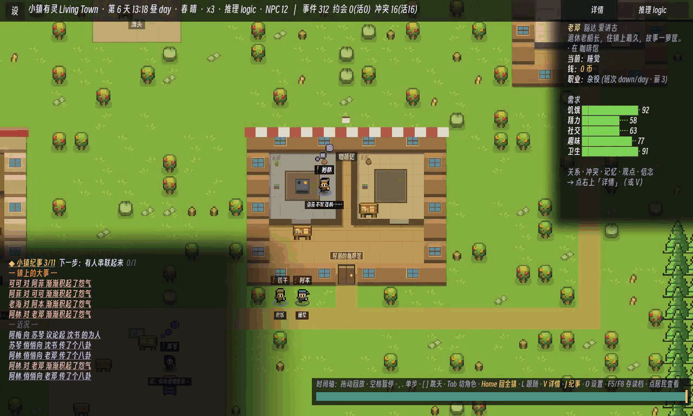
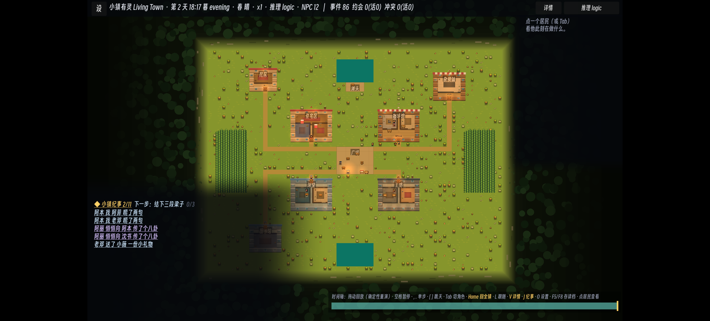
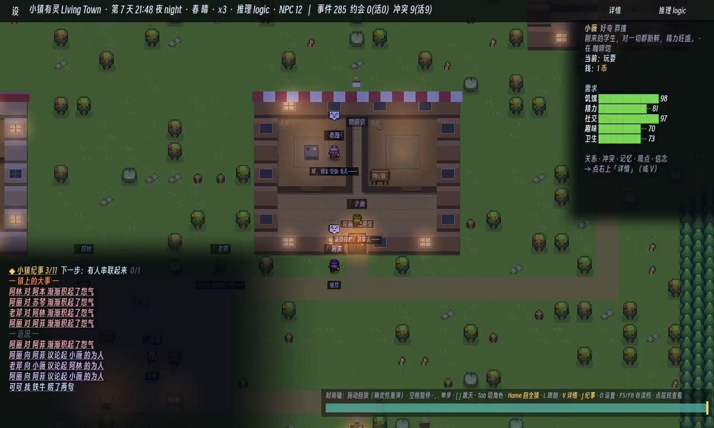
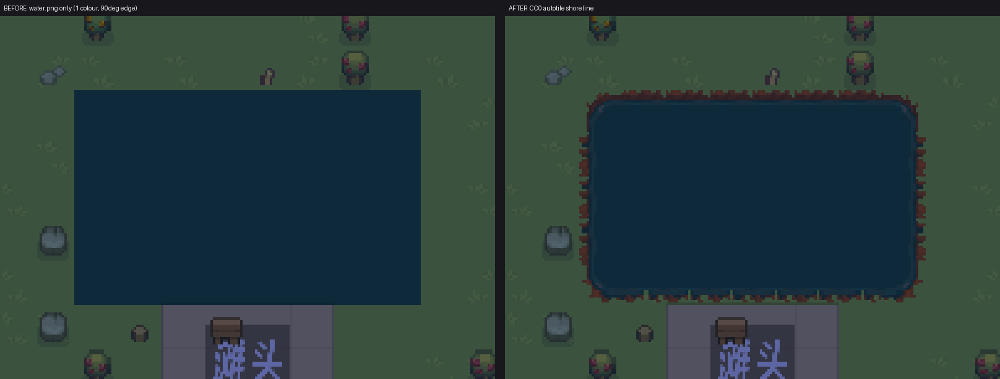
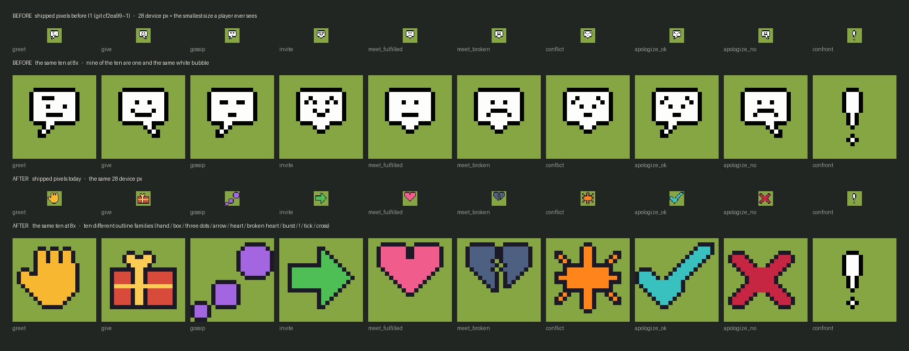
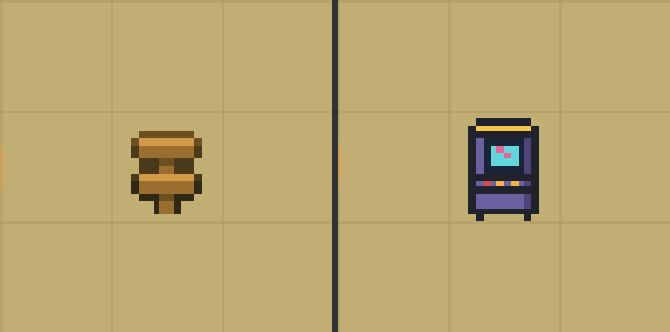

# Living Town

[中文](README.md) · [Documentation index](docs/README.md)

[](https://github.com/ForTe13X/living-town/actions/workflows/ci.yml)

*Living Town* is a pixel life-sim prototype. Residents have needs, memories, personalities, and relationships. They can keep or break appointments, argue, reconcile, build reputations, and form factions. The foundation is a deterministic social engine; a local LLM/SLM only turns engine-enumerated legal choices into dialogue and selection.

The game keeps running when the model is unavailable. Network failures, timeouts, or invalid outputs fall back to rule decisions, so model integration changes presentation rather than state reliability.

> ### 📄 If you don't read code, start here
>
> **[docs/56 · Progress report for non-technical readers](docs/56-阶段报告-给非技术读者.md)** (in Chinese) — the same facts
> with no code in them: what actually **happens** in the town now, what this round **added**, **what still doesn't work**,
> and where the week's effort actually went. This README does not restate it. Its section 4, *"What isn't there yet"*,
> is **deliberately blunt**, and we are not going to soften it here either.
>
> **A new edition was published on 2026-08-02**, covering Waves U→W (nine parallel batons). **Its headline is a retraction**:
> a number both this README and the previous report cited — *"a mechanism we shipped cost 42% of mutual aid"* — **does not exist**
> ([docs/88](docs/88-wave-w-w1-the-42-percent.md)).
> What deserves more attention is how it was handled at the time: **the person who merged it did so knowing the mechanism had not been found**,
> and wrote that sentence verbatim into the commit message (`2d314c7`) — **what saved this was that written-down sentence, not any automated gate**
> (all of them were green).
> The second headline is no nicer: **the red line promises up to 60 residents per town, and on a 40-resident town a HARD invariant is red**
> ([docs/89](docs/89-wave-w-w2-n40-red.md)).
> Every edition's body is left **unrewritten** in git history, including the previous one covering Waves R→T.



> Desktop capture (`logic` backend, demo camera `--demo-cam`, native 1280×768, **1× integer scale**, 5 fps × 6.5 s / 33 frames).
> The first two seconds are the **cafe exterior** in daylight (the observatory has a resident selected, need bars ticking)
> → **the camera cuts inside** → indoors from night to dawn, and in the last frames two residents are in the room,
> with the observatory showing one of them. Bottom-left is the **Town Chronicle**
> (engine events written as prose, not printed enum ids); the observatory on the right shows the selected
> resident's **job / shift / wage / five needs**.
> Recipe: `tools/record-godot.sh` for 100 s → `tools/make_gif.sh`; **it differs from the previous town-only GIF's recipe
> only in start/duration** ([docs/78 §二·5](docs/78-wave-t-t3-interior-cam-and-hud.md)).
>
> ✅ **This caption was rewritten on 2026-08-01. It previously read "this capture only shows the town plane, you cannot see
> interiors" — that sentence is now out of date.** The old diagnosis was right as far as it went: the `--shot-fit` camera code
> was nested inside `Main.gd`'s still-image branch, so `--demo-cam` never left the town plane (S3 measured 0 of 45 frames indoors;
> T3 re-measured **0/100** on the *unmodified* tree with a stricter criterion).
> **But "just lift it out and it records" was wrong — a second half was missing**: `demo_apply()`'s return value has
> **no "which Space am I in" dimension**. Fixing only the first half leaves the room at **15.2%** of the frame with the floor
> label unreadable (negative control: [`t3_halfexit_vs_fit.png`](docs/media/t3_halfexit_vs_fit.png)).
> With an indoor-interlude table added: **same recording recipe, indoor frames 0/100 → 12/100, room at 61.8% of the frame.**
> ⚠️ **Two boundaries, stated**: (1) the interlude windows are anchored to **ticks, not seconds** — to reproduce a given indoor
> stretch you must search by tick; (2) of the two rooms the demo camera enters, **the workshop is measurably empty** — 0 of 127
> occupancy samples had anyone in it (dwellings 79.5%, cafe 23.6%). "There will be people living in the interiors you see" is
> **false for the workshop**.
>
> **Integer-only downscaling** is a rule this pipeline measured for itself: the GIF this README used to lead with
> was 680×408 — a 0.53125× *non-integer* scale — and the measurement also falsified the premise that going integer
> would make the HUD text readable. The only setting that buys readability is 1× (five-row comparison table in the
> header of `tools/make_gif.sh`). **T3 raised the worst HUD row (the key-hint line) from contrast 4.24 to 8.32, and explicitly
> did not overturn that table**: at 0.5× the CJK stroke run is still a single pixel, so the lead image stays at `divisor=1`.
>
> The **town-only** capture from the same build is still here: [`s3_town_waveS.gif`](docs/media/s3_town_waveS.gif) (5 fps × 6 s / 30 frames).


## Current State

The **world and social systems** below all ship, and each has a CI gate behind it — the ones citing an invariant number are guarded by [`game/bench/Invariants.gd`](game/bench/Invariants.gd), the rest by the data lint, map audit, **three art gates** (steps 2b·2c·2d), voice-coverage gate and 9 integration scenes in [`tools/ci.sh`](tools/ci.sh). The last three entries (shell, backends, inference latency) are measurements, not invariants.

- **Deterministic social substrate**: greetings, gifts, gossip, invitations, confrontation, apologies, relationship ledgers, belief boundaries, promises, conflicts, and resolution flow. Relationship changes are linked back to events, so the system can explain why a resident is angry or trusting.
- **A generated town**: a 64×48 grid with 8 districts where **walkability is authoritative data** and pathfinding is a deterministic A\*. `tools/audit_map.py` is a CI gate built for exactly this — it checks typed-layer consistency, full reachability, that every piece of furniture has a reachable interaction tile, that districts have ≥2 distinct routes, and that festival objects spawned for the day land on legal, reachable tiles too.
- **Multi-floor interiors**: all seven buildings have data-driven interiors (`game/data/interiors.json`); residents actually walk in, go upstairs, and go home to sleep. Not a backdrop.
- **Jobs, shifts and wages**: `game/data/jobs.json` + `skills.json`, with skill level feeding wages.
- **The division of labour has somewhere to happen**: carpenter / handyman / fisherman / teacher / mason and others each have their own worksite (`production.json`'s `worksites`, each carrying its own `advertises`); the vendor converts town-level stock into goods an individual can buy (measured at **141-165 `transfer`s per seed per 60 days**, roughly **15%** of all meals in town); the street cleaner closes his own loop on the cleanliness level (plaza clean → he goes and plays; below roughly **45%** → he sweeps).
  Since G3 there is also the **first "a good made out of another good" chain**: roof tiles must be fired, firing needs firewood, and firewood is now contested between the bathhouse and the kiln — **the town's first contested resource** (`production.json`, `produce.泥瓦匠.inputs`).
  A shortage is **a social event, not an inventory warning**: when a roof leaks and there are no tiles, residents resent **a specific person**, whose standing drops (`shortage_standing`).
  ⚠️ **No recipe or output figures are quoted here** — they are being changed right now by the dual-scale work; see the entry under *What is not there yet*. Plain-language version: [docs/56 §二/§三](docs/56-阶段报告-给非技术读者.md).
  > This bullet used to be false, and it stayed false **after someone had eyeballed it**: *every single* "do work" action in the whole town happened on **one tile**, `desk_1[40,31]` (152-186 times per 60 days), shared by four jobs — including **a fisherman fishing at a carving bench**; and the new worksites' ids matched no sprite slot, so they **shipped as missing-texture placeholders printing raw data keys onto the grass**. Both were found by measurement in a later baton. See [docs/48 §一·五](docs/48-wave-f-plan.md).
- **A money economy**: prices, wages, a town treasury, a poverty line. Guarded by **hard** invariants #34 (money conservation) and #35 (non-negative balances, no overdraft). Person-to-person money is not just the vendor: `transfer(tenant, landlord, rent)` runs every night, and `housing.json` holds **8 registered leases** ([docs/48 §一·五](docs/48-wave-f-plan.md)).
- **Weather and seasons**: types and utility multipliers in `game/data/weather.json`.
- **Festivals**: world objects spawn and despawn on schedule; hard invariant #36 guards pairing with no residue.
- **Elections**: periodic votes; hard invariant #37 guards tally consistency.
- **Doing good work now gets noticed too — and the boundary is narrower than it sounds.** Until this round, social judgement about
  *who did what* ran in **one direction only: blame**. Measured: **497 production events / 0 witnessed, 5540 wage payments / 0 witnessed**,
  while the reverse channel (a shortage gets blamed on a specific person) has been complete all along (65% witnessed).
  ⇒ **The channel was empty not for lack of bystanders** (3.00 people present on average while the baker works) — **it was simply never written.**
  The fix copies the reverse channel and flips the sign (`production.craft_credit`, one JSON key, **no new event type**),
  guarded by the new hard invariant **#41** ([docs/84](docs/84-wave-v-v1-craft-social-trace.md), `2d314c7`).
  > ⚠️ **The baton shrank its own claim; copied here**: taking the three channels apart one at a time, **only "standing" actually changes the world**.
  > The bystanders' **beliefs and memories are behaviourally inert today** (with standing off, "write every consequence" and "write none"
  > give **byte-identical digests 4/4**).
  > ⇒ **The accurate statement is "the trace exists, is gateable and revertible, and nothing reads it yet" — not "the division of labour has social output now."**
  > ⚠️ **It is installed on 1 of 8 producing jobs** (the street cleaner) ⇒ the town's "craft" arcs can **structurally only be about the same resident**.
  > ⚠️ **It also reported a regression it had caused (`aid` −42%) — and that regression has since been shown NOT to exist**; see *What is not there yet*.
- **The town tells its own story, and every narrated line carries a citation.** `Story.gd` folds scattered events into arcs
  (an opening, a few beats, an ending). This round coverage went from **12/25 → 14/25 event types (48.0% → 56.0%)**; the newly told
  ones are **craft**, **aligning views** (`endorse`, previously 0/267) and **the player's mediation** (previously invisible).
  Traceability became a gate: `narrate_cited()` emits, for every line, the id of the `event` it rests on, and `audit()` takes those ids
  back to `event_log` and checks four things per line — **392 arcs / 1234 narrated lines, 0 violations**; inject "invent a plot line
  out of thin air" and it goes red on 62 of them ([docs/90](docs/90-wave-w-w3-story-layer.md), `5de9549`).
  > ⚠️ **The gate's boundary was pinned down by its own author with a negative control, and it matters more than the 0 violations**:
  > **swap the opening prose of two arc types** (so every grudge now opens with "they formed a mutual-aid pact")
  > ⇒ **0 violations, whole gate green.**
  > ⇒ **It guards "this sentence has a citation", not "this sentence is true"** — and that gap has **no cheap fix**
  > (judging correctness needs a second source of truth for the prose).
  > ⚠️ **Both denominators are reported**: by event *count* coverage only moved 19.9% → 21.3%, because more than half of the ~32k
  > untold events are ledger entries (`pay`/`consume`/`spoil`) that do not even reach the news feed. **Do not read count-coverage as the story layer's scorecard.**
- **An emergent social layer**: reputation and gossip cascades, opinion factions, mutual-aid pacts (with GTFT forgiveness and free-rider dissolution), and secrets that get confided, leaked, and betrayed.
- **Playable shell**: day/night lighting, clock and speed controls, NPC dialogue bubbles and expressions, free player-to-NPC conversation, and a replay observatory for inspecting residents, needs, beliefs, relationships, and conflicts at any tick.
- **Three AI backends**: `logic` for pure rules, `llm` for local OpenAI-compatible services, and `slm` for embedded GGUF inference through NobodyWho. All backends run the same engine and can fall back safely.
- **Measured local inference**: Qwen2.5-1.5B-Q4 through embedded SLM runs in roughly 1-2.5 seconds on tested consumer GPU/APU machines; 3B is around 2.9 seconds. Startup probes set deadlines from the current machine.

**What is not there yet** — **this section was rewritten from the last few waves' measurements, not carried over** (see [docs/05](docs/05-路线图与里程碑.md), [docs/49](docs/49-wave-g-plan.md), [docs/50](docs/50-wave-h-plan.md)/[53](docs/53-wave-i-plan.md)/[55](docs/55-wave-j-plan.md)):

- **⭐ A retraction: the "−42%" this README cited in its previous edition does not exist.**
  V1 shipped with a self-reported regression — mutual aid `aid` **118 → 68 (−42%)**, same direction on 11 of 12 seeds — and honestly wrote
  «**the attribution was measured, the mechanism was not found, and nothing was ruled out**».
  **I merged it anyway, knowing the mechanism was unknown**, and wrote that verbatim into `2d314c7`
  («this merge ships with the unexplained regression … but *whether −42% is intended by design* has no supporting evidence»),
  then made "the next wave's first job is to find its mechanism" the top item ([docs/87 §〇](docs/87-wave-w-plan.md)).
  **The next wave went looking, and produced three independent falsifications** ([docs/88](docs/88-wave-w-w1-the-42-percent.md), `1046fe0`):
  - **On the held-out seeds the sign is reversed**: 13-30 is `105 → 110`, 31-60 is `170 → 180` ⇒ **+5.5% across 48 held-out seeds**.
  - **Dose-response is non-monotonic**: `standing` = −0.25 / 0 / +0.125 / **+0.25 (shipped)** / +0.5 ⇒ `aid` = 79 / 113 / 101 / **68** / 93.
    **Flip "praise" into "disparagement" and it still drops 33%** ⇒ "craft reputation crowds out mutual aid" cannot be true by construction.
  - **A sham perturbation with zero social content pushes it harder**: changing a *pathfinding* constant `obj_dist_penalty`
    from 0.400 to **0.401** (+0.25%) ⇒ 118→94; to 0.38 ⇒ **65, lower than the shipped arm**.
  ⇒ **Under same-magnitude perturbations, −20% ‥ −45% is this quantity's normal range, and −42% sits *inside* it**
  — **it does not measure "what you changed", it measures "whether the trajectory moved".**
  > **⭐ The part worth reading is not the conclusion but *where the evidence was*.** R12 clause ④ requires running held-out seeds.
  > **V1 ran them, and committed the logs** — **the four lines that falsify the whole conclusion sit one or two lines away from the lines it quoted.
  > Running is not reading.**
  > **The disposition was to change nothing numeric**: not one parameter, not one key. What changed were two comments that stated
  > falsehoods as measurements (one of them with a rationale **five waves out of date**). A new gate `LIVENESS_QUORUM` guards
  > **coverage, not count** — because the count drops 20-45% under *any* perturbation, so **guarding it would plant a false red for every
  > later baton that moves the digest**. Its negative control is **real history**: roll two constants back to 2026-07-25 ⇒ `aid` coverage **0/12**,
  > gate red — **while five pact-related hard invariants stay green in a world where no pact ever formed.**
- **⭐ The red line promises up to 60 residents per town, and on a 40-resident town a HARD invariant is red.**
  CI runs N=12 and N=16; **N=40 had never been run by anyone**. It was, this round ([docs/89](docs/89-wave-w-w2-n40-red.md), `b8116db`):
  - Soft arm: `#40` red on **11/60** seeds (N=16: 2/60, N=24: 4/60); **41 of 49 sliding 12-seed windows (84%) break the gate.**
    All 12 lower-arm reds are **grain below the floor**; the driving quantity is the on-shift completion count of **baker + fisherman**
    (ρ 0.66-0.87, **strengthening with N**), and **only those two of eight jobs decline with N**.
    ⚠️ The baton explicitly wrote that this is **a dominant variable, not a criterion**: of the 12 lowest-ranked seeds, **7 are not red**,
    and their grain lands in **0.510-0.541** — the sliver directly above the floor.
  - **Hard arm**: `#01` "no need bottoms out" is red on **seed 8** and **seed 56**. And in the `seeds 49-60` window
    **the soft supply gate is 12/12 green while the gate still says `FAIL ❌`** ⇒ **a whole cell of green supply, red on a hard invariant nobody was looking for.**
    **All three hard reds on record land at N=40.**
  ⚠️ **Four boundaries, copied from the baton**: both are **a single person grazing zero** (0.1 day / 0.5 day), **not a famine**;
  **the cause was not investigated** (the assignment was the soft red; the hard one was swept up incidentally);
  **N=48/60 were not run on today's tree** ⇒ "only at N=40" really means "of the {16,24,40} I ran, only 40";
  and this is the `backend=null`, no-LOD floor ⇒ it says **"this criterion fires at N=40"**, not **"this happens on a phone"**.
  ⇒ [docs/41 §3](docs/41-baton-contract.md) says «**never relax a hard invariant to make a gate green**»
  ⇒ **this can only be fixed, or the promise honestly rewritten — and rewriting the promise is the user's decision.**
- **⭐ The new "every narrated line must have a citation" audit cannot guard "the sentence is true".**
  Swap the opening prose of two arc types (every grudge now opens with "they formed a mutual-aid pact") ⇒ **0 violations, gate rc=0, fully green**,
  and even the pre-existing prose assertions pass. **This was found, run, and written into `does_not_detect` by the gate's own author**,
  who also stated there is **no cheap fix** ([docs/90 §七](docs/90-wave-w-w3-story-layer.md)).
- **⭐ The story acceptance gate runs in a configuration where it cannot go red.** `story_test`'s CI default is **12 seeds × 14 days**,
  and the `promise` / `secret` / `pact` arcs are **0/0 on 12 of 12 seeds** — none of those three event types has happened yet by day 14
  ⇒ **the teeth are in fact entirely in the synthetic fixtures; the "real world" cell is far emptier than it reads.**
  The baton **did not touch the CI default** (not in its lane) and left the cheap fix to the next one ([docs/90 §十二](docs/90-wave-w-w3-story-layer.md)).
- **⭐ Citing this repository's per-seed numbers across versions goes wrong, and it nearly did once.**
  One baton almost shipped a table stitched from two different trees (table built, numbers computed, conclusions drafted — *then* it ran the `git diff`
  it should have run at the start). **Not one byte of the criteria had changed, but the world had**: comparing digests for the same N and seed
  across both trees — **144 comparable seeds, zero identical** ([docs/89 §〇之前](docs/89-wave-w-w2-n40-red.md)).
  ⇒ **"check your baseline" answers "is my code current", not "which tree was the data I want to cite measured on".**
  Consequence: **every per-seed number in [docs/85](docs/85-wave-v-v2-n24-nonmonotonic.md) is stale**; an expiry notice now sits at its head
  — **notice only; not one word of the body was changed.**
- **No onboarding, and nothing that calls the player back at minute three.** Three reviews (an external adversarial model
  plus two independent read-only agents, all instructed to refute) returned the same verdict:
  **"it looks meaningfully better, and nobody would still play it."** ([docs/43](docs/43-wave-c-plan.md), [docs/46 §〇](docs/46-wave-d-plan.md))
  > **Read that verdict with its date attached: it was given on 2026-07-26**, and **it has never been re-run since**
  > (no plan or receipt after docs/43 / docs/46 records the review ever being re-run). One thing did land afterwards:
  > D2 shipped a **read-only derived** session-progress line ([`game/scripts/Goals.gd`](game/scripts/Goals.gd) plus
  > **11** goals in `game/data/goals.json`, with replay-equivalence machine-proved by `goals_test` in CI step 5).
  > So the accurate statement is "**there is now one session shape; onboarding and appeal have still been measured by nobody**"
  > rather than "there is nothing". **This project still has no instrument that could measure playability** — that part has not changed.
- **The economy's output side does not keep up as the town grows; dual-scale has landed, but two cells are still red.**
  I3's N-scale measurement ([docs/54](docs/54-scale-n60.md)) established that the production system was **designed and calibrated
  entirely at N=12**, while red line #3 states a shipping target of 60 residents. My first instinct — "admit the economy is a
  small-town feature and amend the red line" — **was rejected by external adversarial review**, and the reason was right:
  *"You didn't discover that 60 isn't a functional target. You discovered that nobody ever wrote down **which kind of capacity** 60 meant."*
  So an **Entity capacity vs Simulation capacity** matrix was written first ([docs/41 §0.5](docs/41-baton-contract.md)), and the user
  then chose **dual-scale** out of three options (micro: all 60 agents keep being simulated individually for needs, consumption,
  relationships and the social consequences of shortage; **the output side** moves to a macro pool).
  **K1 landed it** (`02ad571`, [docs/57](docs/57-wave-k-plan.md)): at N=60 roof tiles went from **out of stock 60/60 days** to **0-34 days**,
  `#40` red 12/12 → **2/12**; **N=12 is byte-identical** (no golden re-bake needed); deleting the whole `scale` block returns the N=60
  digest to end-of-Wave-J ⇒ **the mechanism is fully ablatable**.
  L2 then showed that "work loses to socialising at large N" is a **structural comparison**, not one number set too low
  (**six of the eight job adverts slide together, and the slide is independent of `amount`**, `e31d4a5`); M2 moved `SURVIVAL_GATE` 32→36
  off a dose-response curve (`d7f4ac4`). **Output and recipe figures are still not quoted here** — they are still being changed.
  > ### ⚠️ 2026-08-01 correction: **the line above ("both N=60 and N=16 still miss the soft gate by one seed") was too optimistic**
  > S1 ran all 60 seeds on the **unmodified merged tree** ([docs/72](docs/72-wave-s-s1-demand-reach-and-base-rate.md), `744884f`):
  > **on the 48 seeds that were never used to pick the thresholds, 5 fall below `SUPPLY_FLOOR` = 10.4%** (Wilson [4.5%, 22.2%]),
  > and cutting the 60 seeds into five consecutive blocks of 12, **`--seeds 49-60` prints `S0 GATE: FAIL ❌` on the unmodified tree.**
  > ⇒ **CI green means "nothing broke on these 12 seeds", not "this calibration holds"** — and those 12 happen to be both
  > the set the thresholds were picked on *and* the lowest-variance stretch of all 60 (spread 0.205 vs 0.468 / 0.486).
  > ⚠️ **Boundary, stated**: only `#40`'s lower arm — a **soft** rule — breaks. **Hard invariants are 12/12 and 48/48 green across all 60 seeds.**
  >
  > **The root cause was found this round** ([docs/76](docs/76-wave-t-t1-stock-pull.md), `139fc16`): **worksite-advert scoring never
  > reads `town_stock`** ⇒ **an empty warehouse and a full one produce byte-identical scores.** The output side is open-loop at
  > *both* ends (the baker was offered the counter 449 times while the town held zero grain and took it 17 times; in the other
  > direction, in the worst seed **61.3% of the grain produced hit the storage cap and was thrown away** (beans peak at 80.7%) — anything hitting `cap` is neither stored nor booked).
  > The fix (`_stock_pull_mult`) measurably flips `--seeds 49-60` from FAIL to **PASS 12/12** and `13-60` from 43/48 to **47/48**.
  > **⚠️ And it ships switched off**: enabling it turns `ci.sh` step 4a (N=16) red — `work_pull_mult(16)=1.125` cancels the damping
  > half outright, degrading the mechanism into accelerate-only. The baton **did not loosen the criterion and did not keep sweeping
  > the acceptance grid**; it left the mechanism in the tree with the key off and wrote down exactly where it is blocked.
  > ⇒ **The status at the time was "we know why, we have a key that measurably works, and the key is still locked."**
  > Two riders: **nothing in CI guards that key once it is on** (the seeds 1-12 cell is completely insensitive to it), and one
  > key-on CI run produced a single `DetGate` "same seed, two runs diverge" that **could not be reproduced 16/16 in isolation and
  > has not been explained.**
  >
  > ### ✅ 2026-08-02 update: **the key is open, and that unreproducible red was reproduced in place and diagnosed**
  > ([docs/80](docs/80-wave-u-u1-open-the-key.md), `188f4c8`)
  > - **`stock_pull` is now in the shipping data**: `#40` red at step 4a (N=16) went **3/12 → 0/12**, with
  >   **N=12 byte-identical** (12/12 and 48/48 digests unchanged).
  > - **What blocked it was not the thing I told it to measure first.** The assignment made "at N≥16 two of the six goods slots are
  >   **permanently** taken by beans/chapbooks" the first item to confirm or refute — and **refuting it needed no new run**:
  >   beans occupy only **7/12** at N=16. That sentence had been measured at **N=60**, while step 4a runs **N=16**
  >   ⇒ **a conclusion was carried from one N to another and nobody measured the step in between.** The real blocker was
  >   the population term and the stock term **stacking**.
  > - **⭐ That `DetGate` divergence was not randomness, and red line #1 was not broken**: **`game/data/**` was modified between the two runs**
  >   (same seed, two different data sets). The disposition turned it into a gate — **fingerprint the data before the run** —
  >   so that red went from "unexplainable" to "named and dated".
  >   ⇒ **The previous edition's warning that "a red you failed to reproduce is not a red that wasn't there" was cashed in**:
  >   there *was* a problem, **and it was not in the red line under suspicion — it was in experimental hygiene.**
  > - ⚠️ **T1's own acceptance criterion is still unmet**: seeds 13-60 still carry one red (seed 44, beans **0.495**, floor 0.500,
  >   a margin of 0.005), where it had asked for **0/48**.
  >
  > **`#40` now has two arms** (R1, `fc519d6`, [docs/68](docs/68-wave-r-r1-economy-ceiling.md)): the sentence above about it having
  > **only a lower arm** no longer holds. The new "shortages have vanished" upper arm turned N=60 red (8/12) the day it landed,
  > **and that is not a false red**. ⚠️ **Its author's own boundary, copied verbatim**: the threshold was chosen under the constraint
  > that the two CI cells must stay green ⇒ **it is structurally incapable of declaring today's N=12/N=16 wrong. It is a ratchet,
  > not a verdict that the calibration is right.**
- **Fixing gossip propagation cost something immediately, and that budget was already zero.**
  After O1, held-out seeds 13-30 keep hard invariants 18/18 → 18/18, but **soft failures go 0 → 1** (`#40` at seed 22, firewood 0.48 < threshold 0.50).
  **It is not "gossip ate the production"**: across the 18 held-out seeds the median worst-good satisfaction actually **rose** (0.691 → 0.733);
  what changed is a **longer tail** (min 0.500 → 0.454). **And the pre-change minimum was exactly the threshold, 0.500 — the margin was already zero**,
  only nobody had rechecked it: the 0.569/0.579 recorded back at H5 had long gone stale after L2/M2/K1 each moved the trajectory. (`def63e7`)
- **The faction contact gate fixes only the cross-boundary half, and the baton that built it said so.**
  For pairs who have never met: byte-identical **25/25**. **For pairs who have met, the property is unchanged** — `_aligned` compares
  *current true* attitudes, so any global partition built on it is still non-local. Real locality needs a per-agent "what I think he thinks"
  model = an architectural change, which [docs/41 §0.8](docs/41-baton-contract.md) requires be reviewed first, **so it was deliberately not built**.
  Cost stated plainly: faction participation **−26%** (`endorse` 257→198, `rally_oust` 325→244, **both still covered on 12/12 seeds**).
  One adjacent, **unfixed** finding: `_form_pacts_greedy` calls `_rel()` *before* the familiarity gate, and `_rel` **creates** entries
  ⇒ ghost zero-relationships for nearly every pair, every night. Inert today, but **"A has a ledger entry for B" ≠ "A has met B"**.
  ([docs/66](docs/66-faction-contact-gate.md))
- **What the model is *shown* has zero gate coverage — a contract gap, not a violation.**
  8 of the 13 social actions have existence conditions that read the *partner's* private state ⇒ seeing `gossip→Aben` is itself being told
  "Aben lacks some belief I hold". Measured: **52.4% of decision points** (62.7% at N=20) carry at least one such option.
  The write side is clean (`emotion`/`affinity_delta` are parsed but `Sim.gd` references neither — 0 sites, and `git log -S` is empty
  ⇒ never wired). ⇒ Filed as contract **§0.7 [pending approval]**, with **the red line deliberately left unchanged** (widening it is an
  architectural change; §0.8 requires review first, and it is the user's call). This also corrects an impression this README could otherwise give:
  **`BackendGate` does mount a real backend** (`decide()` called 4879 times) — **but `build_prompt()` is called 0 times** ⇒ the accurate
  statement is "**CI guards what the model hands back; what the model was shown has zero coverage**". ([docs/65](docs/65-model-path-epistemic-read.md))
- **We wrote rules for our own method. This round measured that method's hit rate for the first time — and the number is an *upper bound*.**
  [docs/50](docs/50-wave-h-plan.md) §四 dispatched H4, "give the methodology a denominator" (a brief-mutation test: inject N known false
  facts into already-merged briefs, send read-only batons to find them, report the detection rate), and reserved a number for it.
  **H4 never delivered at the time** — the doc existed on no branch and the tool did not exist. (The reserved number was cited through
  `lint_links`' `@branch` escape hatch, and **that hatch is unverified** ⇒ **the missing artefact was referenced through the very channel
  that kept it from being noticed.**) **Both halves landed on 2026-08-01:**
  - **Retrospective** ([docs/73](docs/73-wave-s-s2-denominator-and-gate-teeth.md), `dc8a977`): **62** caught on the spot,
    **at least 20** caught only afterwards ⇒ **62/82 = 0.756, Wilson [0.653, 0.836] — and the whole interval is an upper bound**,
    because the ones nobody ever found cannot be enumerated. Corroboration: one read-only baton, in one day, on a tree everyone had
    already read, **added 5 more** (3 stale numbers + 2 coverage holes in criteria).
  - **Prospective** (injections actually dispatched, [docs/77](docs/77-wave-t-t2-prospective-injection.md), `975460f`): six arms,
    47 injections. The cleanest result splits the "false number" layer in two: where the true value **has a second copy in the tree
    or can still be recomputed today**, **3/3**; where it **exists only in that one document and would require re-doing a measurement**,
    **0/2** — the baton wrote plainly that it went looking for the tool that produced those numbers and **the tool was never committed**.
    ⇒ **"Expensive" here does not mean "takes 200 seconds"; it means "the probe that measured it never entered the repo."**
  - The same experiment produced a less comfortable finding: **detection rate is a function of how the task is framed.** Given a
    byte-identical brief, the arm told "check it line by line" scored 10/10; the arm merely asked for an implementation plan scored
    **0/2 on the symbol-name layer** — **it knew the right answer (its plan spelled the correct names) but never said "the brief is wrong."**
  ⚠️ **Having a number does not make the number quotable**: the baton listed three upward biases and one downward one (the injections
  were authored by the same person who graded them; the briefs were from completed waves so cross-references were reachable; L5/L6
  injections carried a typographic fingerprint; downward: `git log -S` was unusable inside the isolated copies), and **the v1 round's
  four arms were voided entirely by an isolation leak — not one number from them entered the table.**
  ⇒ This README reports, throughout, the Nth time a claim was falsified by our own measurement — **N now has a denominator, but it is
  an upper bound, not a point estimate.** ⚠️ It also retracts the old **30/30 = 100%** figure from [docs/50](docs/50-wave-h-plan.md):
  no interval (Wilson lower bound 0.886), five classes of very different falsification cost pooled into one ratio, raw data never kept
  (not re-checkable), and **its own control group produced a mechanism claim that pointed the wrong way and survived into the next wave.**
  ⇒ **It was not "no denominator"; it was a bad denominator that would get quoted.**
- **The red-line gate for "no model weights / precompiled binaries in git" used to be a hand-written list of file extensions.**
  Measured: of the sample names, it **caught 3 and let 8 through**, including `.onnx / .tflite / .dlc` — **exactly the three formats
  this project's own on-device NPU roadmap will produce** (named by [docs/73](docs/73-wave-s-s2-denominator-and-gate-teeth.md)).
  Fixed (`e85dde8`): list completed **plus a second arm that reads the first 16 bytes for magic numbers** (renaming no longer evades it),
  with its negative control wired into CI as its own step. ⚠️ **The person who fixed it made the same family of mistake first**:
  `git ls-files` by default emits non-ASCII paths as an escaped string that cannot be opened on disk ⇒ **20 of 740 tracked files were
  never read, all of them Chinese-named docs — the new arm was blind to every non-ASCII filename.** Switching to `-z` gave 740/740.
- **The art defect G2 fixed is invisible to a human at 2×.** After 144 px of outline was completed,
  **40 pixels changed out of 983040 in-engine (0.0041%)**; in a true 2× side-by-side, **five pairs were indistinguishable**,
  and it only becomes visible at **8×**. What it bought was contrast (a cap brim against the noon ground colour goes **2.00:1 → 7.91:1**),
  but in the same batch Archer-Green's twin tails **already had 6.77:1** ⇒ **the value of those pixels is uneven; roughly half is ceremonial**.
  The baton that did the work also volunteered that two of its choices were made **to dodge a tie in the metric** —
  metric-driven, not picture-driven. ([docs/13](docs/13-实验札记-experiment-journey.md), 2026-07-30 afternoon §五)
- **The ten silhouettes are now pairwise distinguishable, but the floor is stuck.** The minimum is exactly **120 px**, and **two pairs tie at it**;
  enumerating 16 add-outline / recolour combinations, **not one could raise that floor** (both bottlenecks run through the same sheet,
  which was not on the repair list) ⇒ that acceptance criterion could only ever mean "don't break it". Twelve residents still share those ten sheets,
  and **阿梅 still has no clothes**. ([docs/49 §二](docs/49-wave-g-plan.md), [docs/44 §一](docs/44-art-direction.md))
- The phone still loses **24.6% of the screen to letterboxing** (`aspect=keep`; `expand` black-screened the real device and was rolled back).
  G4 re-measured it on a Wave G device frame: on a 2688 px-wide screen the **content area is x=331..2356 and the pure-black bars are 662 px = 24.6%**. ([docs/46 §二·九](docs/46-wave-d-plan.md))
- **Nobody has put on headphones and listened to the audio** — every claim about it is an RMS figure or a window count.
  The plan states explicitly that this one **can only be done by a human and will not be faked**. ([docs/48 §三](docs/48-wave-f-plan.md))
- The touch action bar has CI assertions (`player_touch_test`: button path ≡ key path), but **nobody has pressed it on a real device**.
- **At the default whole-town view, no names, expressions, bubbles or need bars are drawn at all.** The zoom after `go_home()`
  measures **0.229** (H3 measured it two independent ways; the 0.333 in the `ProbeController.gd:15` comment is an older number
  that **ignored the margins**), while `WorldView.LABEL_MIN_ZOOM = 0.45` ⇒ the player must press `+` three times to see that layer.
  This is a **reasoned trade-off, not a new bug**, but it means part of the art work listed below **is not visible in the default framing**.
- **That trade-off charged its first bill immediately**: after `decor/tree_big` was redrawn, at the whole-town framing (zoom 0.229)
  **before and after both read as one patch of green texture and nobody can tell them apart** — the improvement **only shows up close**
  (a limitation J2 wrote into its own receipt).
- **Two furniture icons still look far too alike.** Across the pairwise source-pixel differences of the 9 obj/decor sprites,
  `obj/counter` vs `obj/desk` is only **17/256**, while the next-nearest pair is **86/256** ⇒ **any floor strong enough to stop
  "two pieces of furniture drawn as the same picture" would go red on the clean tree**, so that criterion **cannot be set today**;
  the fix is to redraw those two. The reasoning is written out under "明确不做" in [`tools/asset_gate.py`](tools/asset_gate.py).

> Wave C (2026-07-26) closed six items previously listed here: the silence, the player verbs stuck behind a `--player` flag, the opening camera showing 14% of the map, the 58% of the whole-town view that was the engine's default clear colour, residents teleporting 12.5×/second, and seasons and weather rendering pixel-identically.
> Waves F/G closed two more: **four worksites shipping as placeholder boxes**, and **12 personas × 111 (persona, action) pairs sharing one set of 12 generic lines**
> — which was not *silence* but **loss of persona voice wearing the costume of "dialogue works fine"**: `aid` 29/29, `confide` 22/22 and `rally_oust` 61/61 bubbles all came from those 12 lines.
> **Waves G/H/I/J closed five more** (before/after images under *Art: three before/after pairs* below; the gates and criteria under *Technical Highlight 9*): **the two ponds being flat single-colour stickers**,
> **26 shipped art files with no gate at all**, **nine of the ten emote icons being the same white bubble**,
> **two sprites that were pictures of the wrong objects**, and **a grey placeholder box that appeared in every playthrough past day 14**.

Demo videos, newest build first:

- [New systems tour: economy / weather / festivals / elections](docs/media/new_systems_demo.mp4) (2:25)
- [World systems: map, pathfinding, districts](docs/media/world_systems_demo.mp4) (0:35)
- [Elections](docs/media/election_demo.mp4) (1:35)
- [Multi-floor interiors, stage 2](docs/media/interior_stage2_demo.mp4) (1:10)
- [Interior rooms](docs/media/interior_rooms_demo.mp4) (0:25)
- [A 70B model as the director layer](docs/media/director_70b_demo.mp4) (1:06)
- [Player agency](docs/media/player_agency_demo.mp4) (0:30)



> **A whole frame from the phone** (NX789J / Android, `livingtown-waveG.apk`, 2688×1216). Day 2, 18:17 dusk · spring, clear · NPC 12 · 86 events;
> the chronicle panel is telling 2 of 11 story arcs. **Not one placeholder box, not one raw data key on the grass.**
> The pure-black bars left and right are that 24.6% from *What is not there yet*.
> **The whole frame is published deliberately**, because the recurring visual failure in this project has been exactly
> "only point samples were taken; nobody ever looked at a whole frame" (see Technical Highlight 7).
> It also puts the trade-off above in plain sight: at this zoom there is **not one name, not one expression, not one need bar**.
>
> ⚠️ **This frame PREDATES the art fixes of the following waves — read it with its date.** The two cyan rectangles with
> perfectly straight edges, top and bottom of the map, are the ponds as they then were; after G5 they have a shoreline
> (before/after below). **This image was not re-shot.**



> A still from the same build (day 6, 09:36 — it is **morning, not noon**; the old filename `wavec_town_noon` was wrong and has been corrected). The map is no longer a rectangle sitting in a grey void — its edge passes through a 3-tile
> luminance ramp, a low stone wall and a drainage ditch before sinking into forest, dropping the maximum adjacent-pixel
> luminance step across the boundary from **131.54 to 2.92** — **that figure is scoped to seed 3 / tick 600 / spring**, not
> "holds in all four seasons" ([docs/48 §三](docs/48-wave-f-plan.md): the author's own "not measured" note said "never rendered
> outside spring"). The instrument used for the later cross-season re-check now lives in `tools/seam.py`, whose header records a
> more expensive lesson: **in the rain, `cross.max` gets punctured by a single raindrop, so any criterion must sit on `p90`.**
> The observatory on the right collapses to a single hint by
> default; the full dossier (relations, conflicts, memory, faction, pacts, secrets, attitudes, beliefs) is one tap away.

### Art: three before/after pairs from Waves G / I / J



> **Same seed, same tick, same resolution (2688×1216) on the phone.** That right-angled rectangle on the left was the pond.
> The fix was not to draw a shoreline — **the shoreline had been sitting in the same CC0 tileset since June, ten columns away**;
> the original cut had taken only the **centre fill tile** of a 3×3 water autotile.
> The criterion took four attempts before it held (max-step read decorations 3 px outside the pond; `p90` read a sand landmark
> hugging the south bank; an absolute threshold was green by day and red at night; luminance alone reads a visible night-time
> transition as a cliff). It ended up as **transition path length ÷ straight-line grass→water distance**: 1.0 is the floor the
> triangle inequality gives you, a flat sticker sits at exactly **1.000**, and after the fix it is **1.679**.
> Whole-frame change: **9141 px (0.839%), and zero pixels changed outside the two pond rectangles.** ([docs/49 §六/§七](docs/49-wave-g-plan.md))



> **Top two rows are before, bottom two are after**; the small rows are at **28 device px** —
> `40 (EMOTE_PX) × 0.45 (LABEL_MIN_ZOOM) × 1.583 (device scale)`, i.e. **the smallest size a player can ever see**
> (below that `WorldView` skips the whole layer). The tenth, `confront`, is pixel-identical before and after: it was the one
> CC0 slice that was already distinguishable, so **it was left alone**.
> The figure is rebuildable: [`docs/media/k2_emote_before_after.py`](docs/media/k2_emote_before_after.py), with both sides
> taken from committed trees.



> That "signpost" on the left was the shipped texture for the **arcade cabinet**. **It was not cropped wrong — it was cropped
> perfectly** (0/0/0/0 opaque pixels on the four crop edges). But `arcade_1` sits at **[33,24]** in `map.json` and the procedurally
> drawn `board` landmark sits at **[33,26]**: **same column, two tiles apart.**
> The bathhouse tub had the same disease — it was a picture of **a well** (the real well is at [30,26]). Both pairs:
> [`j2_bath_before_after.png`](docs/media/j2_bath_before_after.png) and [`j2_trees_before_after.png`](docs/media/j2_trees_before_after.png).

Older clips, kept for history (they look noticeably different from the current build):
[the Wave C demo-camera GIF](docs/media/town_chronicle.gif) (680×408 — **non-integer downscale, HUD text unreadable**; the one at the top is the fixed version) ·
[Wave C full 1:10 clip with sound](docs/media/town_wavec_demo.mp4) ·
[an earlier Android device capture](docs/media/town_demo.gif) ·
[main demo, 3:52, Chinese narration with bilingual subtitles](docs/media/living_town_demo.mp4) ·
[factions and alliances](docs/media/s3_social_demo.mp4) ·
[embedded SLM on desktop](docs/media/slm_gpu_demo.mp4) ·
[SLM voice](docs/media/voice_gpu_demo.mp4)

## Technical Highlights & Innovations

**1. Deterministic and observation-independent: how the town lives does not depend on where you look.**
The decision logic uses no wall-clock time and no global random — all randomness is stably derived from `seed + tick + salt(+agent)` (never wall-clock or a global RNG). The same seed is byte-identical, and the replay observatory reconstructs the world exactly from any tick.

> **That last clause has a measured scope, not an assumed one** (re-checked 2026-07-30): it holds on the **zero-model logic floor with no player intervention** — there, `goto_tick` reproduces the same `event_log` byte for byte.
> **With a non-logic backend, or once the player has entered town, scrubbing the timeline rebuilds a *different* history**: replay is forced through the logic floor (`AIBackend.gd:788`), and the player's historical interventions are not in the replay (`Sim.gd:939-940` says so itself).
> Measured over 8 days on seed 1: `random` backend live 346 events → replay 363; player present live 376 → replay 363 (byte-identical to the no-player run).
> The derived views (Town Chronicle / Town Stories) remain a **pure function of the current `event_log`** — they add no freedom of their own; what changes is the log.
> Per-arm evidence and the permanent gate: [docs/47 §三·七](docs/47-wave-e-plan.md).

A stronger red line: **rendering may follow the camera, but the simulation LOD that decides *who* gets simulated in detail must not depend on it** — otherwise the same save viewed differently would replay a different history. This observation-independence runs through the whole engine.

**2. An observation-independent aggregate LOD (the focus of this stage).**
Scaling the town to hundreds of residents means reducing fidelity for distant ones; the hard part is that a conventional LOD keyed on camera distance would make history depend on the observation path, breaking the determinism red line above. So the full-detail cohort is chosen entirely from committed simulation state (who is doing work / a stateless rotation / near the player), never from the camera (the one older conservative branch that dims by camera radius is bench-diagnostic only, not shipped). It passes six checks: byte-identical when off, **camera-path invariance** (5 fixed `lod_focus` values → one digest), deterministic across save/load and fresh-vs-restart, hard invariants at scale, honest cost, and a liveness floor — of which camera-path invariance and determinism are wired into CI as permanent gates.
> Stated honestly: this is an **observation-independent prototype**, not "hundreds of NPCs delivered." Microsecond profiling on a real phone showed the two dominant costs are **the sim tick (~64ms) and per-agent/social drawing (~60ms)** — together roughly ¾ of the frame — with the rest being per-frame overhead and a small amount of static redraw. The LOD only cuts the sim-tick part, so it is not a sufficient fix; the other half needs render culling. The methodological lesson (in [docs/33](docs/33-viewer-independent-lod-delivery.md)): **don't infer the bottleneck, instrument and measure it** — I misjudged the single bottleneck three times; even then, while writing this up I still mislabeled the un-measured third as "static redraw," and only caught the over-attribution because the whole N=12 frame is just 11ms.
> The current device reading (the first time Wave C's audio/touch, Wave D's night lighting and frame time, and Wave E's
> production loop and palette all ran together on one handset): day 48 · **winter, rain** · ×1 · NPC 12 · 2033 events ·
> 87 conflicts (44 live) · 2903 draws · 97 nodes · 85MB ⇒ **FPS 83 · 12.0ms**. For comparison, before the frame-time
> baton the same depth read **11 FPS**. **This reading is still pressed against a roughly 90Hz refresh ceiling**, so it is
> evidence of "good enough", not evidence of headroom. ([docs/48 §二·一](docs/48-wave-f-plan.md))

**3. Decision and expression are decoupled: the model never mutates world state.**
The engine enumerates legal candidates; the model only reads candidates and context and returns one candidate index plus optional dialogue. The world advances purely through the deterministic engine — the model never writes state directly. Invalid output, timeout, or a missing model all fall back safely to rules. The presentation layer is swappable (canned lines / local SLM / cloud LLM) without changing the reliability of the world.

**4. Emergent social dynamics.**
Gossip spreads third-party reputation → consensus forms → it can escalate into collective avoidance; disagreement crystallizes into factions; mutual-aid pacts carry GTFT-style forgiveness. None of this is scripted — it emerges from rule interactions, and every step traces back to a concrete event, so the system can explain why a resident is angry or trusts someone.

**5. Invariant regression gates plus a shadow counterfactual probe.**
CI defaults to 12 seeds × 60 days and checks **41** social invariants (belief provenance, promise settlement, money conservation, private-channel secrecy, and more) — **26 hard, 14 soft, 1 diagnostic** (V1 added #41, "the social trace of craft", into the hard tier). **The authoritative list is the code**: `HARD_IDS` and `DIAG_IDS` in [`game/bench/Invariants.gd`](game/bench/Invariants.gd) (those three numbers are simply counts of them). ⚠️ A correction about *how to count* that is itself a specimen of this repo's characteristic bug: that file's header used to say "the count is what `grep -c` gives" — **and that recipe was itself wrong**, off by one, because the comment line contains the very literal it counts. **A note on how to count counted itself.** It now states *how* to count rather than the counted value. Going further, a "shadow probe" measures — **without changing the trajectory** — exactly which decisions an intervention flips, turning "does this mechanism actually matter" from anecdote into a number.
> Stated honestly: **#15 "emergent ostracism" is a known-leaky metric and is reported, not gated** — it picks the worst-reputation resident from *final* standing but computes their acceptance rate over the *entire* log, which is temporal leakage. After the leak was fixed, #15v2 came back INCONCLUSIVE on all 126 seeds, so the conclusion was to **add no mechanism** and not to gate on it. Full chain in [docs/31](docs/31-15-resolution.md).

**6. On-device SLM: from a 16GB leak to a phone that actually produces decisions.**
On a physical Redmagic 8 Elite (Android 15), `backend=slm` used to mean **40 fired, 0 succeeded**, with Native Heap climbing `3 → 7.5 → 16GB` until OOM.
- **The root cause was not the one it looked like.** The first conclusion — "specific to Adreno GPU Vulkan" — **was falsified by my own follow-up test**: it had only exercised the minimal smoke path. A bench that drives the real in-game decision path segfaulted on desktop AMD Vulkan too, with a panic that said it plainly: `access to instance after it has been freed`. The real cause was **a fresh worker per decision, freed while still in flight** (use-after-free). Fast desktop model → the free beats the callback → crash; slow phone → the worker can't be released → leak. **One bug, two faces.**
- **The fix**: one pooled, persistent worker; serial; never freed mid-flight; late callbacks invalidated by epoch. **Re-verified on the device under full load**: Native Heap peaks at 3.2GB during load then settles to a **flat 217MB**, across 13 sim-days, **zero crashes**, 88-91 FPS.
- **Then it reversed a second time**: the remaining "phone produces no decisions" was **not a hang either — it was slowness**. Only latency telemetry could tell them apart. A device A/B showed in-flight decode under full load at **~16-20s on the Adreno GPU** (the renderer and inference contend for the same GPU) versus **~3-8s warm on the 8 Elite CPU**. So **Android now defaults to CPU inference**, and on-device decisions finally land.
- **The honest denominator**: "2/3 of NPC decisions on the phone are SLM-driven" must **not** be claimed — that is landed/**fired**, a convenient denominator. The worker is strictly serial and is itself the town-wide throughput ceiling. Measured against the honest denominator (decisions actually committed): **16.1%–62.3% on desktop**, swinging two orders of magnitude with cast size and decode speed; ≈**2%** in the one phone run. See [docs/35](docs/35-slm-decision-share-and-lod-soft-gate.md).
- **The most uncomfortable line, and the one that most belongs here: `landed` ≠ `drove`.** The index the model returns may be exactly the one the engine would have picked anyway. So we ran a shadow comparison — computing the engine's own baseline on the **same frozen candidate set** — and compared the disagreement rate (Δ/C) against a **per-configuration uniform-random null**. Result: **the model does change decisions (Δ/C 15%–55%), but it changes them in a way that is statistically indistinguishable from picking at random** — Δ/L sits within 1.4 percentage points of the random null, score-rank is 0.41–0.54 (random = 0.50), and on the engine's own utility axis the model **forgoes 0.6%–11.2% more utility than a random pick would**. The same instrument reads the opposite for a mock parrot (rank 0.012–0.017, retains 97% of utility), so this is not an artefact of the measurement.
  **How to read it**: this falsifies "**the model makes decisions better**" — not "the model is useless". The engine's `score` is a heuristic, not ground truth, and the design intent was always **flavour and voice** rather than utility optimality (the model may only pick among legal candidates and never writes world state directly — its pick is re-validated and applied by the engine). But any claim of *smarter* or *more sensible* decisions is, as of today, **unevidenced**. Full write-up: [docs/36](docs/36-model-influence-delta-over-c.md).
- **So we made the null hypothesis runnable and asked again: does the decision path earn its cost?** We added a deterministic `random` backend and **dose-matched** it (the model drives only ~62% of decisions because it is serial and slow; a synchronous random drives 100% — without matching, you are measuring "the model is slow", not "the model chooses badly"). The answer is blunter than the previous bullet ([docs/38](docs/38-does-the-decision-path-earn-it.md)):
  - The model **is** distinguishable from random — but **no difference points the good way**. On the design's own stated axis (behavioural variety) it **loses to a random number generator**: logic 10.89 → slm 11.56 → random 13.84.
  - It **de-socialises** the town harder than random does: share of social actions 29.4% (logic) → 17.2% (random) → **12.2% (model)**; `gossip_rep` 7.2% → 0.5%.
  - **The difference is positional, not judgement.** The model's pick histogram collapsed into a *positional* distribution — `index 0` chosen **0 times out of 3285**, 30% piled on `index 3`. Feeding that histogram to a **content-blind** sampler reproduced both of the model's headline differences (p=0.24 / 0.25).
- **🔄 Later correction, same day ([docs/42](docs/42-prompt-pathology-or-capability-ceiling.md)): the two bullets above hold for **the 1.5B we currently ship**, but the cause is now identified and is largely **fixable** — they are not evidence that on-device decisions cannot work.** Running the identical prompt against a large model on a 4090 (5290 real decision points, criteria and parser ported line-by-line, nulls computed analytically):
  - **The 31B is clearly reading content**: score-rank **0.276** (random = 0.495, perfect parrot = 0.000), utility retention +0.538, p=0.0078 and 8/8 seeds. **So the task encoding is readable** — it is not a broken task.
  - **The 1.5B conserves *position*, not content**: shuffle or reverse the candidate order and its slot peak stays at 3 with **slot 0 at exactly 0.0000**, while the 31B does the opposite and conserves content. The smoking gun is the exemplar in the system prompt — **"如 3 或 A" ("e.g. 3 or A")**: delete it and index-3 probability mass drops 62%; change it to "如 0" and pick-0 rises 24×.
  - **That gives the starvation a mechanism**: `index 0` is 吃饭/睡觉 (eat/sleep) **74.8%** of the time. Share of survival actions — engine 36.9%, 31B 42.1%, random 18.5%, **shipping 1.5B just 4.8%**. **Agents starve because the model never picks option 0, and option 0 is usually "go eat" — a format bug, not a capability bug.**
  - **And we had been measuring a model the code does not want**: `AIBackend.slm_model_path` **already defaults to the 3B**; Android's `_resolve_model_path()` bypasses it. The 3B shows **no collapse** (accept 85%→100%, pick-0 0.00%→18.4%).
  - The honest other half: **fixing the format does not buy the 1.5B judgement** (rank stays 0.46-0.50 across eight variants) — so "the 1.5B is at a capability ceiling" is *also* true. **Both things hold at once.**
  - ⇒ The next step is not distillation but **shipping the 3B the code already defaults to, plus fixing those two prompt strings** — and then re-running every measurement in docs/36/38/40.

- **⚠️→✅ A ship-blocker that CI was structurally unable to see (now fixed and gated)**: under `backend=slm`, hard invariant **#01 was violated in 8 of 8 seeds** (0 of 8 under logic in the same config). Because CI pinned `Sim.backend=null`, **hard invariants had never been checked on the model path at all** (step `4d` below closes this; the boundary is stated in Quick Start). Hesitancy and serialisation were ruled out (`mock` starves nobody at identical latency and idle rate) — it was the **choices themselves** that stopped agents eating.
  **The root cause was not "the model chooses badly" — the engine was missing a boundary**: of the engine's two survival protections, only "drop social candidates in a crisis" is a **prohibition**; the other (urgency-dominated scoring that makes eat/sleep win) is **only a score**, which does nothing to an external backend that just picks an index out of the same candidate list. #01 is a **hard** invariant and must not rest on "the backend will choose sensibly".
  The fix is two engine boundaries that **exist only on the external-backend branch** (in a crisis only crisis-relieving picks are admitted, plus a need-budget check on whether this errand's fare is affordable), plus a new CI step **4d `BackendGate`**: it guards #01 at two dose levels using the **deterministic** `random` backend (indices from the project's own seeded stream, latency counted in ticks ⇒ byte-for-byte re-runnable, which the gate machine-checks every run). Measured 8/8 red → **8/8 green**, 24/24 green over 12 seeds × 20 days, and 0 starvation at N=48; **the golden digests did not move by a byte** (with `backend==null` those two boundaries are never called). The cost: at shipping dose the guardrails moved **7.3%** of committed decisions (effective L/C 63.8% → 59.1%), with no effect on variety. Full write-up: [docs/45](docs/45-external-backend-invariant-gate.md).
- **The cost, stated**: with CPU inference active, FPS drops from 88 to 34-46. A second cost we had not been counting: agents idle while waiting — of 5453 queries at N=12, 2835 committed nothing, so **the model makes the town more hesitant**.
- **A metric defect of our own, corrected**: the "bad_parse 29–36% = model format non-adherence" figure quoted in four places **conflated two things** — the model returning prose, and a valid answer whose candidate went stale during the wait. Split apart: true format non-adherence is **7.5%–19.4%**, and it *falls* as the town grows (faster world churn → more valid answers go stale); at N=60, **two-thirds of apparent model failure is staleness**. The repo had actually measured this back in June ([docs/11](docs/11-LLM部署实测对比与选型.md) §S5: "the main cause of validity loss is async staleness, not model error") and then lost it — restored here.

Full write-up and all measurement tables in [docs/34](docs/34-slm-device-hang-leak.md); APK build in [docs/18](docs/18-android-apk-build.md).
> These device numbers come from a single handset (Redmagic 8 Elite / Snapdragon 8 Elite / Android 15). This is not a cross-device benchmark.

**7. Applying "a number needs a null hypothesis" to the picture — and what that cost.**
This project has always governed the *simulation* with invariant gates and null hypotheses, and had never once applied the same
discipline to what is *on screen*. A wave of parallel visual work on 2026-07-26 settled the bill:

- **The instrument itself was broken, and nobody knew for how long.** `--shot` **could never render day or night** — the
  `CanvasModulate` is created white, the daylight curve is applied only in three callbacks, and the screenshot path turns
  `auto_run` off, so none of the three ever fire. The proof is two historical screenshots whose HUDs read `00:38 night` and
  `12:00 day`: the dominant grass colour is **byte-identical (133,166,67)** in both. Every "too bright / too dark" judgement
  before that point was untrustworthy. The one-line fix is now guarded by **this repo's first visual gate** — a gate that
  **skips when it cannot find a rendering environment**, because *a gate that goes red on someone else's machine for
  environmental reasons is worse than no gate: it trains everyone to ignore red.*
- **★ Six acceptance criteria were falsified by the very sub-tasks executing them — all six written by the dispatcher.**
  "All four seasons must differ pixel-wise" **passes on the unmodified tree** (residents move between days). "Max adjacent
  step along a 16px profile across the panel edge" puts **8px inside the map**, where in-bounds pixel art has its own ~130-step
  edges ⇒ **the metric has a floor and moved only 131.54 → 129.93 after the fix**; split into crossing / outside / fidelity,
  the same change immediately reads **131.54 → 2.92 (−97.8%)**.
  **A metric that cannot report success and a metric that cannot catch anything are two faces of one failure.**
  Distilled into a rule: **after writing any visual criterion, ask whether a change that does nothing could pass it.**
- **Even the mandated framing can hide the defect**: in the specified whole-town view, the info panel sits mostly over the
  backdrop *outside* the map (text-band background 29.4/255), while under the follow camera a player actually uses it is
  **102.3/255** — judged on that one frame, "unreadable and covering the world" barely registers.
- **Four real defects surfaced that appeared in no brief**: the SLM circuit breaker, once tripped, **cannot be cleared by
  switching models** — although "switch to CPU" is the remedy our own documentation prescribes; the "just change two prompt
  strings" plan would have pushed the candidate-capping rate from 0.4% to 5.84% and **promoted the engine's own argmax to the
  first slot**, destroying the very property it was fixing; **every recording's first 5-7 seconds is the engine splash screen**
  (including the clip then linked from this README); and a finished gate had **never been wired into CI**, while **the relay
  compressed away the author's own sentence saying so**.

- **★ Discount the number "six", though.** An external adversarial review turned this project's own rule —
  *correlated symptoms are not independent evidence* — back on us, correctly: those six are more likely **one upstream
  error replicated six times** (never defining the intervention → observation → attribution chain before hunting for a
  number in the final screenshot) than six distinct criterion-design failures. The first is a fixable rule; the second is
  borrowed statistical weight.
- **★ And none of this section measures whether anyone wants to play.** Three reviews (an external adversarial model plus
  two independent read-only agents, all instructed to refute) returned the same verdict: **"it looks meaningfully better,
  and nobody would still play it."** Every number above measures *readability*, and readability is not *appeal* —
  **playability was never measured in this wave**, and this project has no instrument that could measure it. Read this
  section as "we fixed the instrument and used it to fix the picture", **not** as "the product got fun". What actually
  blocks that is still the first line of *What is not there yet*: **no goal, no onboarding, no session shape.**
- **The same review exposed the hole in the method itself**: every visual check this wave was a **point sample or a
  diff-bbox**, and **not one was "a person looked at the whole frame."** So three things shipped into *every* published
  asset: a recording cursor, a field of missing-texture placeholders printing raw data keys onto the grass, and a signboard
  reading "Test Attic". The plan demanded a human listen to the audio; **it never demanded a human look at a frame.**
  All three are now fixed and the assets re-recorded.

Full account in [docs/43](docs/43-wave-c-plan.md) (per-baton receipts and the falsified criteria) and
[docs/13](docs/13-实验札记-experiment-journey.md) (the journal).

**8. A whole wave spent on one question: "under what circumstances does this gate go red?"**
"The gate is green" was never evidence. On 2026-07-30 three **long-green** gates were taken apart, and each one only counted
once a negative control had been **watched going red**. The three broke in three different ways — and none of them was
an implementation bug. **The criterion itself was wrong.**

| Gate | What was wrong | Negative control | Result |
|---|---|---|---|
| **#39** "production traced to an **on-shift** job" | **Half the name had no code behind it** — it never read the event's `tick`, never called `_in_shift` | delete the shift check inside `_produce_for` | before the fix `hard_fails: []`, after the fix `hard_fails: [39]`; the two arms have an identical `digest` ⇒ observation-side change only |
| **#40** "production loop liveness" | **Coarser than the property it guards** — it judged the town-wide total, so four of five goods could die and it stayed green | delete the teacher→storybook production | green before tightening; after tightening to per-good it reports `[broken-chain good] 话本(P=0,C=3)` |
| `story_test` **ledger consistency** | **The criterion has teeth, but they cannot reach the horizon CI runs** | replace `closed_count()` with the naive form its own comment warns against | **green at 14 days, red only at 150 (32 vs 1085)** |

- **Measure the margin before tightening.** Before #40 was tightened, per-good totals were taken over 12 seeds × 60 days:
  the number of seeds where **either side was 0 is 0/12**, the thinnest cell being beans at `P=4` ⇒ `">0"` has margin.
  **If some good were legitimately 0 on some seeds, tightening would just manufacture a randomly-red fake gate.**
- **The `story_test` one was the hardest to see because it had been confessing all along**: every run printed
  `ledger consistency: … (0 arcs trimmed, which does not affect this)`. `MAX_CLOSED = 32`, CI's horizon is 14 days,
  and a run only closes 2-4 arcs ⇒ **the thing being guarded had never once happened in CI**.
  The fix is not to run CI for 150 days (3 minutes a run) but a millisecond synthetic fixture whose **first assertion proves
  that trimming actually occurred**. ⇒ **The zero next to the green tick carries more information than the tick**:
  `0 arcs trimmed`, `N=12`, `backend=null` are all confessions of what a run did *not* cover.
- **The honest boundary, stated**: #39's negative control only pushed **two** jobs out of shift, not eight — that shift check is
  **redundant** for most jobs. So it can catch "one job starts producing all night" but **not** "every job does".
  **The tooth is real, but not as wide as the name sounds.**
- **The fourth of the same family — and this one ended in renaming the check, not changing the code.** Hard invariant #1
  was called "no starvation", while the criterion (in `Harness.gd`) counts **any need bottoming out**, not just hunger.
  ⚠️ **This was not drift; it never matched**: `git log -S` on the name, on the criterion expression, and on that loop
  **all return exactly one commit** — the first public snapshot, 2026-07-03. **The name and the wide criterion arrived in
  the same commit** and nobody touched either for 27 days ⇒ **there is no previously-correct version to revert to.**
  Why not go the other way and "count only hunger"? **That was measured, not chosen**: in a four-cell negative control, the
  world where only *social* bottoms out **turns from red to green** under the narrowed criterion — and hunger and social
  bottom-outs occur at **the same order of magnitude**, they just live in different configuration domains (on the zero-model
  floor it is almost all social; on the model path hunger dominates — the `backend=null` blind spot was hiding that second
  half from the statistics). ⇒ The check is now **"no need bottoms out (any need, not only hunger)"**.
  **Renaming is free; discriminating power is not.** The per-cell measurements, the distribution over 114 runs, and the
  detection envelope are written at `INV1_NAME` in [`game/bench/Invariants.gd`](game/bench/Invariants.gd).

The same wave **added** two gates, covering two classes of asset where until then *nothing would have gone red if you changed them*:

- **The art gate** (`tools/art_gate.py`, CI step 2b): the shipped `game/assets/art/pro/` must equal what is **rebuilt on the spot
  from `library/`**. Deliberately **not** "a checksum manifest matches" — that kind of gate can be passed by updating the manifest,
  which is exactly what someone sneaking a pixel through would do next. **Six branches were each watched going red** (measured, not argued).
  It also self-certifies three things on every run: ① the rebuild read 10 files from `library/` and **0 from `pro/`**, so it is independent
  of what ships; ② injecting a 1 px perturbation into a reachable frame must make the comparator report "1 px differs" **and name the sheet**;
  ③ it prints how much it actually scanned — this run: **10/10 sheets pixel-identical, 1,966,080 pixels / 7,864,320 bytes compared**.
  *The third is not decoration: printing ✅ next to a zero is a recurring disease in this repo.*
  (The hard criterion is the **decoded RGBA** only; PNG container bytes are printed but never reddened — they track the zlib/Pillow version,
  and *a gate that goes red on someone else's machine for environmental reasons is worse than no gate: it trains everyone to ignore red.*)
- **The voice-coverage gate** (`game/bench/VoiceGate.gd`, CI step 4f): every candidate action that is **offered** must have a line
  in that persona's own voice (the denominator is "offered", not "chosen", or the gate's discriminating power fluctuates at random).
  The grid was measured, not guessed: **seeds 1-3 × 60 days**, reading **293 pairs / 31 distinct actions** when the gate was written,
  while a 20-day grid **misses 3 actions** — and the missed ones are precisely the high-risk "nobody ever wrote a line for it" region.
  (On today's tree the same cell reads **297 pairs / 34 actions** — **the action set moves**, which is the point of the next bullet.)
- **★ This gate sat an unrehearsed exam on the day it landed.** It was written against the action set *as it then was*; after it was
  committed, another baton merged and added `打渔 / 授课 / 劈柴` — three actions that **did not exist when the gate was written**.
  The gate reported them pair by pair: `dan|劈柴 offered 832×  ·  hai|打渔 704×  ·  shu|授课 1238×`.
  **Nobody pointed it at those three.** It is the first time in this project a gate caught something **outside the negative control
  designed for it** — which is the whole difference between a green tick and a gate.
- **The coverage floor is deliberately 250, not the measured 293, and certainly not "all 31 actions must be present"**: another baton
  was at that moment deciding whether to retire a job, and deleting a job **legitimately** removes actions and pairs. Pinning the floor
  to the measured value would plant a false red under a legitimate deletion. **Better to under-report one shrinkage than to falsely
  redden one legitimate removal.** — **And that decision paid off immediately**: once the three new actions merged, the same cell grew
  from 293/31 to **297/34**. The floor of 250 still has margin, whereas a gate pinned at 293, or at "all 31 actions", would have
  **falsely reddened** right here.

Per-gate receipts in [docs/48 §四/§五/§六/§七](docs/48-wave-f-plan.md); the distilled lessons in [docs/13](docs/13-实验札记-experiment-journey.md) (two entries dated 2026-07-30).

**9. Art: from "change it and nothing goes red" to three gates — in the order *look first, then gate*, and the order has a reason.**
When the art gate above (step 2b) landed, it covered 10 character sheets and **31 shipped pngs had no gate at all**
(emote 10 / decor 8 / terrain 5 / obj 5 / building 3); after G5 added the terrain gate, **26 were still unguarded**.
The way to close that gap was **not** "pin down the rest as well", because that repeats the original mistake:

> **Gating art that nobody has eyeballed pins the current state as "correct" — and that is exactly how the pond bug survived for a month.**

So Waves H/I/J went **eyeball first, gate second, and fix-before-guarding whatever failed**:

- **Look** (H1): pull all 26 up on a real device one at a time, judge but do not change, and produce a
  `OK / unreadable / never appears / needs redrawing` table ([docs/51](docs/51-art-eyeball.md)).
  **"I can't see anything wrong with it" is explicitly accepted as a conclusion** — that is the precondition for daring to gate at all.
- **Gate only the ones judged OK** (H2, CI step 2d), **and refuse the rest by machine check, not by comment**:
  sneak a file that **cannot reach the screen from code** into the gated table ⇒ the gate goes red and names it. **The ratchet works
  both ways** — the day someone wires a dead asset back up, it also goes red, and that is precisely the moment to go and eyeball it again.
- **Fix the "unreadable / drawn wrong" ones first** (I1, J2), then admit them to the gated table.

**Today's coverage is countable**: **46** shipped pngs under `game/assets/art/` (pro 10 / terrain 13 / emote 10 / decor 8 / obj 5),
**45 of them gated** (2b character sheets 10 · 2c terrain 13 · 2d emote/decor/obj 22), with **exactly 1 deliberately unguarded**
(`decor/tree_small`, judged "never appears" — it is also the **only live input** to 2d's "the dead asset must still be dead" self-check).
The three gates are **three instances of one shape, not three shapes**: rebuild on the spot from the CC0 library → compare
**decoded RGBA pixel by pixel** → self-certify the comparator's teeth on every run.

Four things were caught along the way, none of them named in any brief:

- **Nine of the ten emote icons were the same white bubble.** Median pairwise difference 24 px, and the closest pair differed by
  just **6 px** out of 400. **And "just pick better cells from the tileset" was killed by measurement**: across all 38 non-empty
  cells (703 pairs), a greedy plus local search for the most separable 10-subset **tops out at 14/400, with 4 pairs tied there** —
  **the whole sheet is one white bubble with 2-4 pixels of face swapped.** ⇒ nine were **hand-drawn as pixels**, with a recipe
  (glyph table plus a pure redraw function) so they could enter the gate.
  The criterion sits **at on-screen size, not source pixels**: source pairwise minimum 6 → **109** (floor 60, 1.82x margin);
  greyscale at 28 device px 5.74 → **15.73** (floor 10.0, 1.57x margin). **The old batch scored 6 and 5.74 on those two ⇒ this gate
  goes red on the unmodified tree.** (Floors and both measured columns are written at `DISTINCT_SRC_FLOOR` in [`tools/asset_gate.py`](tools/asset_gate.py).)
  > **Eyeball and metric each caught what the other could not**, which is the part worth keeping: only eyes see "the heart has a flat
  > top and reads as a shield" or "the broken heart reads as two wings". Only the metric sees that `meet_fulfilled`'s rose and
  > `meet_broken`'s slate blue have **luminance 141.7 vs 143.8** — same outline family *and* same luminance, scoring 5.87 once colour
  > is compressed away, **worse than the worst pair of the old white bubbles (5.74)**. **Eyes would never have found that.**
- **Two shipped sprites were pictures of the wrong objects.** `obj/bath` was **a well**; `obj/arcade` was **a signpost** — while
  `WorldView._draw_landmarks()` already draws a well and a signpost procedurally, and `arcade_1[33,24]` sits **two tiles up the same
  column from** `board[33,26]`. **Telling "cropped wrong" from "drawn wrong" was made measurable**: opaque-pixel counts on the crop
  boundary plus `bleed` (how much of the artwork keeps going outside the box). `tree_big`: edges 0/27/0/29, `bleed` 0.438 ⇒ **cropped
  wrong**; `bath`/`arcade`: all edges 0, `bleed` 0.000 ⇒ **cropped perfectly, wrong subject**.
  Hence a third property: **no crop may cut through continuous artwork**, floor 0.10 calibrated on 4 positives and 12 negatives
  (3.2x / 1.9x margin on either side). **It judges recipe geometry, so it covers even the ungated file** — `house`/`shop`/`tree_big`
  were each missing exactly this check, and all three times a human found it afterwards.
  > **That arm's `does_not_detect` is the line in this section most worth reading**: swap `arcade` back to a *different* cell that is
  > **cleanly cropped but still the wrong subject** ⇒ `bleed` 0.000 ⇒ **passes**. **That is the bath/arcade disease itself, and the new
  > arm is blind to it.** The baton wrote that down rather than around it.
- **A grey placeholder box that appeared in every playthrough past day 14.** The `WorldPatch` spawned when an election passes has the
  id `civic_<topic>_<day>`, and the prefix `civic` **matches no texture**; `elections.every_days` defaults to **14** ⇒ **any normal
  run that reaches day 14 gets a placeholder box at [22,2] with the raw data key 「扩建咖啡馆」 printed under it.**
  The real fix was not a rename in the data but replacing the **implicit contract** `id.split("_")[0]` as the sprite slot with an
  explicit `type→slot` table plus three `push_error` assertions.
  > **My own judgement was falsified by pixels here**: I told the executing baton that "the missing-texture failure mode has no live
  > instances left on the tree", and it produced this `civic` one. I had also inverted the severities — **missing texture had exactly
  > one live instance, while the `bench` slot alone had five live aliases** (one `bench.png` serving five kinds of object).
- **Three textures, a loader for them, and a documented promise all existed — and no code path could draw them.**
  Three independent static scans all called it "a feature that was never wired up". **`git log -S` says the opposite**:
  `Art.building_tex("hut")` **had been wired, had shipped**, and was deliberately removed on 2026-07-15, in a commit that names it as
  the top cause of a user-reported scale problem (a 16×16 hut scaled to 48px is exactly one tile ⇒ *"a whole house the size of a person"*).
  ⇒ **Wiring it back would be reinstalling a fixed bug**, so the disposition was deletion. The promise in `docs/09` had **outlived the code by 15 days**.
  > Distilled into a rule in the contract: **"zero call sites today" is semantically ambiguous — "never wired up" and "deliberately
  > removed" look identical, and only history can tell them apart. `grep` gives you the present; `git log -S` gives you the intent.**
  > ([docs/41 §1.5](docs/41-baton-contract.md))

**The honest other half of this section** (here, not in a footnote):

- Everything above measures **the asset itself**. `asset_gate` says so about itself: it **does not judge whether the art is good, or
  whether you can read the intended emotion**. A pairwise floor stops "they all became the same picture again"; it **cannot stop
  "all ten are ugly but mutually distinct"**.
- The emote batch has **not one frame of real gameplay with an emote over a resident's head** (`--shot` structurally cannot capture it).
  An engine texture-render probe was used instead: it validated filtering and scaling but **not compositing with the character,
  name plate and need bars**, and never ran on a device.
- The tree improvement **is invisible at the default whole-town framing**, and two furniture icons are still too alike — both are
  left verbatim in *What is not there yet*.

Per-baton receipts: [docs/50](docs/50-wave-h-plan.md) (Wave H), [docs/51](docs/51-art-eyeball.md) (the 26-file device eyeball table),
[docs/53](docs/53-wave-i-plan.md) (Wave I), [docs/55](docs/55-wave-j-plan.md) (Wave J). For the criteria and every negative control,
read the header comments of steps 2b/2c/2d in [`tools/ci.sh`](tools/ci.sh).

## Engineering Design

1. **The model does not mutate state directly.** The engine enumerates legal candidates; the model returns a candidate index and optional dialogue. Invalid output, timeout, or missing service falls back to deterministic rules.
2. **Invariants act as regression gates.** The soak checks **40** properties of the simulated society, including belief provenance, promise settlement, apology flow, reputation effects, private-channel secrecy, money conservation, and no overdraft. **The authoritative list is the code**: [`game/bench/Invariants.gd`](game/bench/Invariants.gd) (each check carries an id, a name, and a failure detail string). Methodology in [docs/08](docs/08-测试与验证.md).
   **But "there is an invariant for it" does not mean "it is guarded"** — three of them were just proven to have had no discriminating power for a long time; see Technical Highlight 8 above.
3. **Event sourcing enables replay.** Randomness is derived from `seed + tick + salt + agent` (`_rng_at` builds a fresh RNG per call, seeded purely from those inputs — it is stateless), without wall-clock time or global random state. The same seed produces byte-identical summaries, and the replay observatory rebuilds the world from any tick — **scoped to the zero-model logic floor with no player intervention** (with a non-logic backend, or a player in town, it rebuilds a different history; measurements and gate in the callout under Technical Highlight 1 and [docs/47 §三·七](docs/47-wave-e-plan.md)).
4. **Godot is the authority; the Node port is a historical cross-check.** [`tools/sim_social_port.mjs`](tools/sim_social_port.mjs) once mirrored the M1-S3 social core for second-scale iteration and self-checked **33 assertions** (corresponding to engine invariants #1-#33), and genuinely did establish that the logic is robust to the RNG implementation (the port uses mulberry32, Godot uses `RandomNumberGenerator`; the numbers differ and the properties hold on both sides). **It was formally retired on 2026-07-26** ([docs/39](docs/39-node-port-disposition.md)): its logic froze on 2026-07-03 and broke two days later when the cast went 6→12, and it **never compared state** with the engine (both sides merely run their own trajectory). It is red on 7 of 12 seeds today. **Do not treat it as validation.**
   But **it is not the current gate**, and the specifics matter: it has **no coverage** of #34-#37 (money conservation, non-negative currency, festival pairing, election tally), it is **not byte-comparable** with Godot, it is **not invoked by `tools/ci.sh`**, it has **not been updated** since the 2026-07-03 initial public snapshot, and **it is currently red on some seeds** (`--seed 20260626 --days 30` exits 1; seeds 1 and 42 still pass 33/33). Line-by-line comparison in [docs/08 §1](docs/08-测试与验证.md). **There is exactly one regression gate, and it is on the Godot side.**

## Quick Start

Requires [Godot 4.6+](https://godotengine.org/) (the project declares `config/features = 4.6`; CI pins 4.6.2).

**Run the whole gate** — the same script GitHub Actions runs:

```bash
GODOT=/path/to/godot bash tools/ci.sh
```

**Eighteen steps** (numbers are the step ids inside `tools/ci.sh`, **which is the authority**): `0` the copyright red line (no weights or binaries anywhere in the tracked tree), `1` data lint, `1b` map audit, `2` markdown link lint, `2b` the **character-sheet art gate** (the 10 shipped `pro/` sheets == rebuilt on the spot by `coif_characters.py`), `2c` the **terrain gate** (the 13 shipped `terrain/` tiles == rebuilt by `slice_shore.py`), `2d` the **asset gate** (the **22** gated emote/decor/obj pngs == rebuilt from the slicing/hand-drawing recipe, plus emote pairwise distinctness, plus no crop cutting through continuous artwork), `2e` the **recomputability gate** (a number written in the docs == the number the registered command produces right now), `3` Godot parse smoke, `4` the **S0 invariant gate** (41 invariants × 12 seeds × 60 days, a determinism triple-run, a **committed golden** cross-process anchor, a **per-tick prefix hash chain**, and suite-level liveness), `4a` the **macro-pool scale gate**, `4b` the LOD observation-independence gate, `4c` the **DetGate scenario-determinism gate** (default/faction/betray/freerider, plus a **data fingerprint**), `4d` BackendGate, `4e` ModelPathGate, `4f` the **voice-coverage gate**, `5` 9 integration scenes, `6` the visual gate (day/night instrument, out-of-bounds repaint, space round-trip, pond shoreline, interior shell, furniture semantics, tree-stand lattice; **it SKIPs rather than falsely reddens when no rendering environment is available**). Any red step exits 1.

> **Step `2e` (added by U3) plugs a different class of hole**: it compares "the number written in the docs" against "the number the
> registered command computes right now". ⚠️ **And in designing it, it overturned a criterion that had already been cited**:
> the earlier split was «ground truth **has a second copy in the tree** *or* can still be recomputed ⇒ catchable» —
> and the counterexample is that the two numbers flagged "not recomputable" **both have a second copy today, and that second copy
> is the very receipt declaring them not recomputable**.
> ⇒ **Every time a number is discussed it gains another copy, while the path to recompute it gains nothing; the `xref` column
> loosens monotonically over time.** **So the registry must point at a runnable command, never at another occurrence.**
> ([docs/82](docs/82-wave-u-u3-recomputable.md)) The same baton also found that **the gates measure colour difference with CIE76
> while every `ΔE00` figure in the docs is CIEDE2000** — 38% apart on the same colour pair. **"There is no implementation" sends
> someone to build a ruler; "there are two rulers" sends them to ask which one bears load.**

> **`4a` deserves its own sentence, because it closes exactly the kind of hole this repo keeps falling into**: step 4's S0 always
> runs at N=12, and at N=12 the macro pool's scale multiplier is **exactly 1** (`_pool_rescale` returns `raw` immediately)
> ⇒ **the rescaling arithmetic had never executed in CI at all**. 4a runs the same criteria at **N=16** by default
> (`2b4565e`; the default was later flipped from 24 to 16 by `6c7c8bc`). It carries **four pre-checks** that machine-verify
> "this cell has not degenerated into a rerun of the previous one" instead of asserting it in a comment — e.g. with `CI_POOL_N=12`
> it **deliberately goes red** and prints "pool multiplier is exactly 1 ⇒ this would degenerate into a rerun of step 4".
> **A gate proving it actually guarded something this run carries more information than the green tick itself.**

> The three art gates (2b/2c/2d) **need Pillow, and go red rather than SKIP if it is missing** — the reason is written in the script:
> **in a summary, SKIP and PASS both read as "not red"**, which degrades a gate into a coin whose result nobody sees.
> Step 6 does the **opposite**: it SKIPs when it cannot find a rendering environment, because *a gate that goes red on someone
> else's machine for environmental reasons is worse than no gate: it trains everyone to ignore red.*
> The two rules only look contradictory; the dividing line is **whether the missing dependency can be installed**.

> ⚠️ One honest boundary, **now narrower but not gone**: the golden, LOD and DetGate steps all pin `Sim.backend=null`,
> so `AIBackend.decide()` is never entered and their green **asserts nothing about the model path**.
> Step `4d` BackendGate exists for exactly this: it guards the hard invariants (including #01) on the external-backend
> commit path using a **deterministic `random` backend** (indices from the project's own seeded stream, latency counted in
> ticks ⇒ byte-for-byte re-runnable, which the gate machine-checks on every run).
> **What is still not covered is `slm` itself** — it has run-to-run noise and by design never enters CI.
> `tools/ci.sh` also records the reverse honesty in its own comment at 4d: that gate's "closed-set" arm is **structurally
> incapable of escaping** on the `random`/`slm` arms, so the green it prints is **tautological, not evidence** — it is a
> **regression gate** for future backends, not a certificate that the existing ones were verified.
> Full chain: [docs/45](docs/45-external-backend-invariant-gate.md), [docs/38](docs/38-does-the-decision-path-earn-it.md).

Windowed mode:

```bash
godot --path game -- --speed 2.0
```

Controls: space pauses, `1/2/3/4` changes speed, mouse wheel zooms, clicking a resident opens state, and the timeline scrubs replay. After selecting a resident, type in the bottom input to talk.

Detailed single-seed headless soak (per-event, per-invariant):

```bash
godot --headless --path game --script res://scripts/sim_soak.gd -- --days 30
```

The Node port (historical cross-check, **not a gate**, currently red on some seeds — see Engineering Design item 4):

```bash
node tools/sim_social_port.mjs --days 30 --seed 1
```

Optional local model backends:

- `--backend llm`: start LM Studio or another OpenAI-compatible local service at the default `localhost:1234`, then load an instruction model.
- `--backend slm`: install [NobodyWho](https://github.com/nobodywho-ooo/nobodywho) under `game/addons/nobodywho/` and place a GGUF model, such as Qwen2.5-1.5B-Instruct-Q4_K_M, under `game/models/`.

Integration details are in [docs/03-LLM集成架构.md](docs/03-LLM集成架构.md). Hardware measurements are in [docs/11-LLM部署实测对比与选型.md](docs/11-LLM部署实测对比与选型.md). Android packaging is in [docs/18](docs/18-android-apk-build.md).

## Layout

```text
game/                  Godot 4 project: scripts, data, scenes, and test scenes
  scripts/Sim.gd       World state, ticks, needs/utility AI, legal candidate API
  scripts/AIBackend.gd Pluggable AI backends with timeout and fallback handling
  scripts/Memory.gd    Memory stream retrieval by recency, importance, and relevance
  bench/               Single source of truth for invariants, S0 grid harness, LOD gate
tools/                 CI script, data/map/link linters, Node logic port, recording pipeline
bench/bakeoff/         Offline distillation bake-off and Theory Engine prototype (Python, not wired into the game loop)
docs/                  Design, architecture, review notes, measurements, and experiments (index: docs/README.md)
```

## Documentation

| Document | Contents |
|---|---|
| [01 产品愿景与玩法](docs/01-产品愿景与玩法.md) | Game concept, core loop, and non-goals |
| [02 技术架构](docs/02-技术架构-混合仿真.md) | Deterministic engine with LLM as presentation layer |
| [03 LLM 集成](docs/03-LLM集成架构.md) | Backends, structured output, timeout, and fallback |
| [07 社交底座](docs/07-技术文档-社交底座.md) | Social transactions, relationships, beliefs, promises, and conflicts |
| [08 测试与验证](docs/08-测试与验证.md) | The invariant gate, hard/soft split, a runtime-coverage comparison, and reproduction steps |
| [11 部署实测](docs/11-LLM部署实测对比与选型.md) | Measured latency across machines and model sizes |
| [13 实验札记](docs/13-实验札记-experiment-journey.md) | A process journal: findings, tricks, traps — **and retracted conclusions** |
| [18 Android APK build](docs/18-android-apk-build.md) | Building an arm64 APK with an on-device SLM for Snapdragon 8 Elite |
| [31 #15 resolution](docs/31-15-resolution.md) | A residual that looked like a mechanism defect, proven to be a measurement artifact → add nothing |
| [33 Viewer-independent LOD](docs/33-viewer-independent-lod-delivery.md) | An LOD where the camera never feeds the sim, plus the "don't infer the bottleneck, instrument it" lesson |
| [34 On-device SLM hang and leak](docs/34-slm-device-hang-leak.md) | 16GB native leak → use-after-free → pooled worker → device GPU/CPU A/B → CPU by default on Android |
| [41 Baton contract](docs/41-baton-contract.md) | The shared constraints for every parallel sub-task: four red lines, statistical discipline, extra clauses for visual work — **and the requirement that every report contain a section on where its own brief was wrong** |
| [48 Wave F](docs/48-wave-f-plan.md) | Giving the division of labour somewhere to happen; taking three long-green gates apart with negative controls; the voice-coverage grid |
| [49 Wave G](docs/49-wave-g-plan.md) | Art was the one asset class in this repo with no gate at all; the device eyeball that found "the two ponds are flat single-colour stickers" |
| [50 Wave H](docs/50-wave-h-plan.md) | **Look first, gate second** (gating art nobody has eyeballed pins the current state as "correct"). ⚠️ Its §四 item, "give the methodology a denominator" (brief-mutation testing), **was never delivered at the time**; **both halves landed on 2026-08-01** — see 73 and 77 below |
| [51 Art eyeball table](docs/51-art-eyeball.md) | All 26 shipped art files judged one at a time on a real device: `OK / unreadable / never appears / needs redrawing` — **"nothing looks wrong" is an accepted verdict** |
| [53 Wave I](docs/53-wave-i-plan.md) | Nine identical white bubbles; three textures, a loader and a documented promise that could not reach the screen |
| [54 N=60 scale measurement](docs/54-scale-n60.md) | The cell G3 predicted would break: the production system was designed and calibrated at N=12 while the red line says 60 |
| [55 Wave J](docs/55-wave-j-plan.md) | #1 "no starvation" is the fourth check whose name is narrower than its code; of the three "unreadable" sprites only one was actually cropped wrong |
| [**56 Progress report for non-technical readers**](docs/56-阶段报告-给非技术读者.md) | **A progress report with no code in it**: what happens now / what this round added / **what still doesn't work** / where the effort actually went |
| [57 Wave K](docs/57-wave-k-plan.md) | **Dual scale**: 60 agents still simulated individually on the consumption side, output side moves to a macro pool; N=12 byte-identical |
| [58 Wave L](docs/58-wave-l-plan.md) | Making CI actually run one configuration where the pool multiplier ≠ 1; **§四 records the two debts L2 left behind** |
| [60 Multi-town feasibility](docs/60-multi-town-feasibility.md) | A **read-only** receipt: the multi-town premise was falsified before a second town was built, and falsifying it took one afternoon |
| [62 Multi-town external review verdict](docs/62-multi-town-review-verdict.md) | GPT-5 Pro (10m02s of thinking): **the project as a whole is not approved**; "the first cut should be the knowledge boundary, not the map boundary" |
| [63 Epistemic locality](docs/63-epistemic-locality.md) | The property the reviewer asked for **already holds byte-for-byte at the belief layer** — and it missed the layer that was actually broken (factions) |
| [65 Epistemic leak on the model path](docs/65-model-path-epistemic-read.md) | The leak is not in field values, it is in **membership of the candidate list**; the verdict is a contract gap, not a violation |
| [66 Faction contact gate](docs/66-faction-contact-gate.md) | Opinions no longer teleport — **and it falsified the previous baton's (and my) inference** |
| [68 R1 · `#40` upper arm](docs/68-wave-r-r1-economy-ceiling.md) | "Shortages have vanished" turned N=60 red the day it landed — **and it declares itself a ratchet, not a verdict**; "mind the stall" is **two** adverts, not one |
| [72 S1 · base rate and demand reach](docs/72-wave-s-s1-demand-reach-and-base-rate.md) | **`--seeds 49-60` is FAIL on the unmodified tree**; 10.4% break rate across the 48 held-out seeds; **the number of residents who can leave the town plane is a constant 9, independent of N** |
| [73 S2 · the denominator and the gates' teeth](docs/73-wave-s-s2-denominator-and-gate-teeth.md) | Catch rate **[0.65, 0.84], and the whole interval is an upper bound**; **every arm that recomputes and prints its margin is still accurate, every frozen literal is stale**; two paper gates named |
| [76 T1 · stock pull](docs/76-wave-t-t1-stock-pull.md) | Root cause = **worksite scoring never reads stock** (empty and full warehouses score byte-identically); the fix flips 49-60 from FAIL to PASS — **and it ships switched off**, blocked at the N=16 cell |
| [77 T2 · prospective injection](docs/77-wave-t-t2-prospective-injection.md) | **Detection rate is a function of task framing**; the number layer splits cleanly on "can this still be recomputed today" (3/3 vs 0/2); **it voided its own first experiment** |
| [78 T3 · interior camera and HUD](docs/78-wave-t-t3-interior-cam-and-hud.md) | Getting the camera indoors took **two halves** (0/100 → 12/100 frames); the worst HUD row is the smallest one — **and "just raise the font size" wrapped the line on the spot** |
| [80 U1 · opening the key](docs/80-wave-u-u1-open-the-key.md) | The key is open (4a red 3/12 → 0/12); **what blocked it was not the thing the brief said to measure first** (that sentence was measured at N=60 while 4a runs N=16); **T1's unreproducible red was reproduced in place: a data file changed between the two runs** |
| [82 U3 · recomputability](docs/82-wave-u-u3-recomputable.md) | **"There is a second copy in the tree" cannot serve as a recompute path** — the counterexample is the very receipt that declared it not recomputable; **the gates' ruler and the docs' ruler were never the same one** |
| [84 V1 · the social trace of craft](docs/84-wave-v-v1-craft-social-trace.md) | Social judgement had exactly one direction: **blame** (497 production events / 0 witnessed, while the reverse channel was already complete); new hard invariant #41. **And the −42% regression it reported has since been shown not to exist** |
| [85 V2 · N=24 non-monotonicity](docs/85-wave-v-v2-n24-nonmonotonic.md) | The subject of "N=24 is red" is **(N=24, seeds 1-12)**; across 672 runs N=40 and N=48 are just as red. ⛔ **An expiry notice sits at its head: every per-seed number is stale; the body is unchanged** |
| [88 W1 · that 42%](docs/88-wave-w-w1-the-42-percent.md) | ⭐ **There is no mechanism to find, because the regression does not exist**; the two lines that falsify it sat in the very log that proposed it, **one or two lines away** ⇒ **running is not reading** |
| [89 W2 · the red at N=40](docs/89-wave-w-w2-n40-red.md) | ⭐ **Hard invariant `#01` is red at N=40** (one whole cell has green supply and a red gate); **144 comparable seeds, zero identical digests ⇒ stitching tables across trees goes wrong** |
| [90 W3 · the story layer](docs/90-wave-w-w3-story-layer.md) | Coverage 48.0% → 56.0%, 1234 narrated lines, 0 violations. ⭐ **And the audit guards "has a citation", not "is true"** — swap the prose and the screen talks nonsense while the gate stays green |
| [`bench/bakeoff/README.md`](bench/bakeoff/README.md) | A 3-command reproducible distillation bake-off plus two honest negative results |

There are **90** numbered documents (that number is not hand-copied: `tools/lint_links.py` counts and prints it on every run,
and it is CI step 2; this round's actual output: `lint_links: OK — 109 markdown files, all relative links resolve and all docs/NN citations exist (90 numbered docs)`, `rc=0`).
The themed index lives in [docs/README.md](docs/README.md), **brought up to 91 on 2026-08-02** (it had stopped at 81). Documentation is primarily in Chinese.

> ⚠️ **That line is the only check in this README that its current author ran personally.** Every other gate cited here is attributed
> to the baton that ran it, on that baton's own tree. **This section makes no claim about `tools/ci.sh` as a whole** — the reasoning
> and the trade-off are written up in [docs/93 §六](docs/93-wave-x-x2-docs-receipt.md).
> (This repository has produced one fake "CI PASS" before, see `ef332fe`, so that disclosure is a rule rather than a courtesy.)

## Assets And License

Code is MIT licensed. Pixel assets come from CC0 packs such as Puny World and Characters; sources are listed in [docs/09-美术资产与版权.md](docs/09-美术资产与版权.md). The cover image is AI-generated. Model weights and NobodyWho binaries are not distributed in this repository; fetch them from upstream sources.

The 10 character sheets in `game/assets/art/pro/` are **redrawn derivatives** of a CC0 pack (alpha masking, lookup-table recolouring, copying pixels from the base sheet, and hand-written templates at fixed coordinates; **no scaling, no interpolation**). **Generated imagery contributes zero** — AI images may serve as a mood board and never enter a sprite frame. CI step 2b now machine-checks this: what ships must equal what is **rebuilt on the spot**.

**The same discipline now covers 45 of the 46 shipped pngs** (2b character sheets 10 · 2c terrain 13 · 2d emote/decor/obj 22).
**12 of them are hand-drawn pixels** (9 emotes plus `obj/bath`, `obj/arcade`, `decor/tree_big`, with the glyph tables living in the
slicing scripts; the rest are CC0 slices) — and **hand-drawn work still needs a recipe**: glyph table → pure redraw function → the gate
imports the recipe and rebuilds on the spot, so **a picture with no recipe cannot enter the gated table at all**. Generated imagery is
**structurally** excluded from this path, not merely forbidden by a rule.

Some documents refer to an upstream game-evaluation pipeline for headless rendering, automated recording, and LLM-as-judge experiments. This repository does not depend on that pipeline at runtime.
