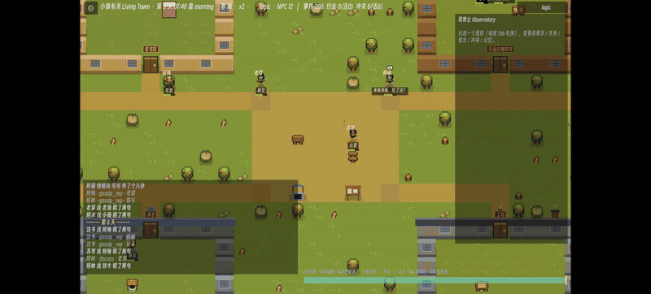
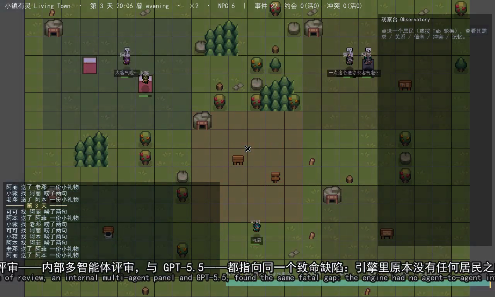

# Living Town

[中文](README.md)

*Living Town* is a pixel life-sim prototype. Residents have needs, memories, personalities, and relationships. They can keep or break appointments, argue, reconcile, build reputations, and form factions. The foundation is a deterministic social engine; a local LLM/SLM only turns engine-enumerated legal choices into dialogue and selection.

The game keeps running when the model is unavailable. Network failures, timeouts, or invalid outputs fall back to rule decisions, so model integration changes presentation rather than state reliability.



> Recorded on a physical Android device (`logic` backend): after nightfall, residents keep appointments, chat, spread gossip, and fall out — every step driven by the same deterministic social engine.


## Current State

- **Deterministic social substrate**: greetings, gifts, gossip, invitations, confrontation, apologies, relationship ledgers, belief boundaries, promises, conflicts, and resolution flow. Relationship changes are linked back to events, so the system can explain why a resident is angry or trusting.
- **Playable shell**: day/night lighting, clock and speed controls, NPC dialogue bubbles and expressions, free player-to-NPC conversation, and a replay observatory for inspecting residents, needs, beliefs, relationships, and conflicts at any tick.
- **Three AI backends**: `logic` for pure rules, `llm` for local OpenAI-compatible services, and `slm` for embedded GGUF inference through NobodyWho. All backends run the same engine and can fall back safely.
- **Measured local inference**: Qwen2.5-1.5B-Q4 through embedded SLM runs in roughly 1-2.5 seconds on tested consumer GPU/APU machines; 3B is around 2.9 seconds. Startup probes set deadlines from the current machine.

Demo videos:

- [Main demo, 3 minutes, Chinese narration with bilingual subtitles](docs/media/living_town_demo.mp4)
- [Factions and alliances](docs/media/s3_social_demo.mp4)
- [Embedded SLM on local hardware](docs/media/slm_gpu_demo.mp4)



## Technical Highlights & Innovations

**1. Deterministic and observation-independent: how the town lives does not depend on where you look.**
The decision logic uses no wall-clock time and no global random — all randomness is stably derived from `seed + tick + salt(+agent)` (never wall-clock or a global RNG). The same seed is byte-identical, and the replay observatory reconstructs the world exactly from any tick. A stronger red line: **rendering may follow the camera, but the simulation LOD that decides *who* gets simulated in detail must not depend on it** — otherwise the same save viewed differently would replay a different history. This observation-independence runs through the whole engine.

**2. An observation-independent aggregate LOD (the focus of this stage).**
Scaling the town to hundreds of residents means reducing fidelity for distant ones; the hard part is that a conventional LOD keyed on camera distance would make history depend on the observation path, breaking the determinism red line above. So the full-detail cohort is chosen entirely from committed simulation state (who is doing work / a stateless rotation / near the player), never from the camera (the one older conservative branch that dims by camera radius is bench-diagnostic only, not shipped). It passes six checks: byte-identical when off, **camera-path invariance** (5 fixed `lod_focus` values → one digest), deterministic across save/load and fresh-vs-restart, hard invariants at scale, honest cost, and a liveness floor — of which camera-path invariance and determinism are wired into CI as permanent gates.
> Stated honestly: this is an **observation-independent prototype**, not "hundreds of NPCs delivered." Microsecond profiling on a real phone showed the frame splits roughly into thirds — sim tick / social drawing / static redraw — so the LOD is a necessary third, not a sufficient fix. The methodological lesson (in [docs/33](docs/33-viewer-independent-lod-delivery.md)): **don't infer the bottleneck, instrument and measure it** — I misjudged the single bottleneck three times before the on-device microsecond split made it clear.

**3. Decision and expression are decoupled: the model never mutates world state.**
The engine enumerates legal candidates; the model only reads candidates and context and returns one candidate index plus optional dialogue. The world advances purely through the deterministic engine — the model never writes state directly. Invalid output, timeout, or a missing model all fall back safely to rules. The presentation layer is swappable (canned lines / local SLM / cloud LLM) without changing the reliability of the world.

**4. Emergent social dynamics.**
Gossip spreads third-party reputation → consensus forms → it can escalate into collective avoidance; disagreement crystallizes into factions; mutual-aid pacts carry GTFT-style forgiveness. None of this is scripted — it emerges from rule interactions, and every step traces back to a concrete event, so the system can explain why a resident is angry or trusts someone.

**5. Invariant regression gates plus a shadow counterfactual probe.**
A 30-day soak checks 37 social invariants (belief provenance, promise settlement, money conservation, private-channel secrecy, and more). Going further, a "shadow probe" measures — **without changing the trajectory** — exactly which decisions an intervention flips, turning "does this mechanism actually matter" from anecdote into a number.

## Engineering Design

1. **The model does not mutate state directly.** The engine enumerates legal candidates; the model returns a candidate index and optional dialogue. Invalid output, timeout, or missing service falls back to deterministic rules.
2. **Invariants act as regression gates.** The 30-day soak checks 37 properties of the simulated society, including belief provenance, promise settlement, apology flow, reputation effects, private-channel secrecy, money conservation, and no overdraft. The methodology and list are in [docs/08-测试与验证.md](docs/08-测试与验证.md).
3. **Event sourcing enables replay.** Randomness is derived from `seed + tick + salt`, without wall-clock time or global random state. The same seed produces byte-identical summaries, and the replay observatory rebuilds the world from any tick.
4. **Two runtimes share the same logic.** The Node port gives fast iteration; Godot 4.6.2 runs the actual game shell. Both pass the same invariant suite, separating logic errors from engine integration issues.

## Quick Start

The fastest validation path only needs Node:

```bash
node tools/sim_social_port.mjs --days 30 --seed 20260626 --verbose
```

Windowed mode requires [Godot 4.x](https://godotengine.org/):

```bash
godot --path game -- --speed 2.0
```

Controls: space pauses, `1/2/3/4` changes speed, mouse wheel zooms, clicking a resident opens state, and the timeline scrubs replay. After selecting a resident, type in the bottom input to talk.

Headless soak run for CI:

```bash
godot --headless --path game --script res://scripts/sim_soak.gd -- --days 30
```

Optional local model backends:

- `--backend llm`: start LM Studio or another OpenAI-compatible local service at the default `localhost:1234`, then load an instruction model.
- `--backend slm`: install [NobodyWho](https://github.com/nobodywho-ooo/nobodywho) under `game/addons/nobodywho/` and place a GGUF model, such as Qwen2.5-1.5B-Instruct-Q4_K_M, under `game/models/`.

Integration details are in [docs/03-LLM集成架构.md](docs/03-LLM集成架构.md). Hardware measurements are in [docs/11-LLM部署实测对比与选型.md](docs/11-LLM部署实测对比与选型.md).

## Layout

```text
game/                  Godot 4 project: scripts, data, scenes, and test scenes
  scripts/Sim.gd       World state, ticks, needs/utility AI, legal candidate API
  scripts/AIBackend.gd Pluggable AI backends with timeout and fallback handling
  scripts/Memory.gd    Memory stream retrieval by recency, importance, and relevance
tools/                 Node logic port, soak scripts, recording pipeline
docs/                  Design, architecture, review notes, measurements, and experiments
```

## Documentation

| Document | Contents |
|---|---|
| [01 产品愿景与玩法](docs/01-产品愿景与玩法.md) | Game concept, core loop, and non-goals |
| [02 技术架构](docs/02-技术架构-混合仿真.md) | Deterministic engine with LLM as presentation layer |
| [03 LLM 集成](docs/03-LLM集成架构.md) | Backends, structured output, timeout, and fallback |
| [07 社交底座](docs/07-技术文档-社交底座.md) | Social transactions, relationships, beliefs, promises, and conflicts |
| [08 测试与验证](docs/08-测试与验证.md) | Invariants, dual-runtime checks, and reproduction steps |
| [11 部署实测](docs/11-LLM部署实测对比与选型.md) | Measured latency across machines and model sizes |
| [13 实验札记](docs/13-实验札记-experiment-journey.md) | Chronological experiment notes |

Other planning, research, scaling, and mobile feasibility notes live under [docs/](docs/). Documentation is primarily in Chinese.

## Assets And License

Code is MIT licensed. Pixel assets come from CC0 packs such as Puny World and Characters; sources are listed in [docs/09-美术资产与版权.md](docs/09-美术资产与版权.md). The cover image is AI-generated. Model weights and NobodyWho binaries are not distributed in this repository; fetch them from upstream sources.

Some documents refer to an upstream game-evaluation pipeline for headless rendering, automated recording, and LLM-as-judge experiments. This repository does not depend on that pipeline at runtime.
