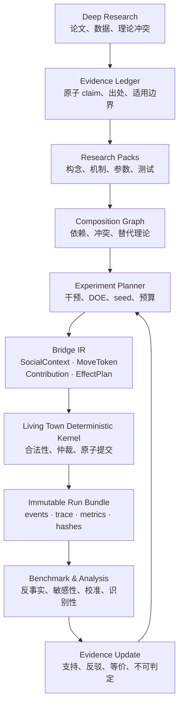

# Living Town 跨学科社会机制框架与研究台构想

> 文档日期：2026-07-12\
> 状态：设计提案（尚未实现）\
> 适用对象：Living Town 维护者、后续实现 agent、跨学科研究协作者\
> 与代码的关系：本目录只记录架构与实验方法，不表示仓库已经具备这些能力。

## 执行摘要

Living Town 已经拥有一块适合继续发展的研究基座：确定性模拟内核枚举合法候选，logic/LLM/SLM 只在候选中选择，最终效果由内核提交；事件日志、digest、跨 seed 不变量和因果 bench 又提供了初步可重复性。下一步不建议把更多社会理论继续硬编码进 `Sim.gd`，也不建议建立一个宣称统一解释社会行为的“万能模型”。

建议把长期架构拆成两层：

1. **Social Mechanism Framework（内层）**：回答“一个机制组合如何被安全、确定、可解释地执行”。核心是 deterministic kernel、窄而有类型的 Bridge IR、可插拔 Research Packs、版本化事件和严格的事实边界。
2. **Mechanism Multiverse Workbench（外层）**：回答“应研究什么、组合哪些机制、运行哪些实验、如何校准/选择/确认，以及结论有多少证据”。它是面向研究流程的控制平面，不应与游戏运行时绑死。

一句话原则：

> 冻结跨理论的最小协议，不冻结理论；枚举假设空间，选择性执行最有信息量的实验；允许模型竞争和不可区分，不强行产生唯一赢家。

## 从当前项目到目标结构

## 已有资产与关键缺口

### 可复用资产

- `game/scripts/Sim.gd`：确定性阶段顺序、合法候选、canonical effects、事件账本。
- `game/scripts/SimExtensions.gd`：已有 `ScenarioProvider`、`CandidateProvider`、`AcceptanceModifier`、`NightlyHook`、`ActionExecutor` 等扩展接缝。
- `game/bench/Harness.gd`：S0 跨 seed、不变量和 determinism gate。
- `game/bench/CausalHarness.gd`：S5 定向因果干预 bench。
- 现有社会机制：需求、承诺、冲突、秘密/流言、关系、派系、经济、职业、节日、选举、生命周期等。

### 在扩展研究用途前应处理的缺口

- 当前 extension 仍是 duck typing，并可接触/修改完整 Sim 对象；权限边界不足。
- 异步 AI 请求缺少冻结候选快照、request id/world epoch 和完整取消语义；研究运行必须先避免迟到回包污染。
- player/live-model 等外生输入尚未全部进入生产 input journal，不能把现有 replay 等同于完整实验重建。
- 事件和候选尚未形成足够稳定的跨模块 schema、版本与 provenance。
- 现有 S0/S5 是好起点，但还不覆盖参数恢复、替代理论区分、敏感性、外部效度和 benchmark 泄漏。

详见既有仓库评审：[`../repository-review-2026-07-12/README.md`](../repository-review-2026-07-12/README.md)。

## 决策状态与首轮 ADR 默认值

本目录区分“用户愿景”“仓库约束”“建议默认值”和“已批准 ADR”。除非具名维护者在 ADR/评审记录中批准，以下内容都不能被解释为已经冻结的公共 API。

| 状态 | 本目录中的内容 | 权限含义 |
|---|---|---|
| User-stated vision | 复用 Living Town、跨学科组合、simulation/benchmark/analysis 闭环 | 作为产品方向输入，不等于字段级批准 |
| Repo-derived constraint | 当前候选链、S0/S5、`SimExtensions` 与已知缺口 | 必须在目标 commit 上重新验证 |
| Recommended default | Bridge IR、R0–R4、profiles、三机制 pilot | 首轮 ADR/spike 默认方案，可被评审修改 |
| Open decision | 许可、首要用户、计算预算、真实数据、确认集保管 | 必须由用户/维护者或相应 owner 决定 |
| Accepted ADR | 尚无 | 只有具名批准后才可作为稳定契约 |

建议首轮 ADR 以以下原则为默认输入：

1. **Kernel 是唯一世界写入者。** 模块只能读取冻结 context，并返回受验证的 contribution 或 `EffectPlan`。
2. **事实、感知、规范、潜变量假设、分析投影和叙事分离。** LLM 或解释模块不得创造 canonical truth。
3. **Bridge IR 保持小、稳定、有类型。** 不建立无边界的 `Dictionary` 或万能 `psychology_score`。
4. **能力接口优于巨型基类。** Research Pack 组合 Observer、CandidateProvider、Strategy、Metric、Invariant 等能力。
5. **模块默认关闭并由 profile 选择。** 不默认同时启用所有理论。
6. **先 observer/lens，后 modifier/mechanism。** 新理论先以只读分析接入，通过验证后才能影响行为。
7. **组合结果不压成单一总分。** 用多轴指标和 Pareto 比较，允许多个适用域不同的模型共存。
8. **调试、校准、结构选择与最终确认严格隔离。** 用过确认集调参后，该集合不再是确认集。
9. **游戏仓库与研究控制平面解耦。** Living Town 提供窄的 headless adapter；大规模编排、artifact 和分析由独立 workbench repo 承担。

## 非目标

- 不建立一套声称统一社会学、博弈论、心理学和精神分析的本体论。
- 不以“仿真能生成某宏观模式”证明现实世界理论为真。
- 不允许 LLM 直接修改世界、补造证据或决定论文是否支持某 claim。
- 不把 NPC 的 psychodynamic hypothesis 当真人诊断或角色本质。
- 不在第一阶段重写 `Sim.gd`、引入十个学科模块或建设昂贵 UI。
- 不用一个任意加权总分同时代表科学真实性、游戏趣味性、性能与可解释性。

## 文档索引与建议阅读顺序

1. [`social-mechanism-framework.md`](social-mechanism-framework.md)：内层社会机制框架、Bridge IR、Research Pack 和确定性约束。
2. [`multiverse-workbench-concept.md`](multiverse-workbench-concept.md)：外层研究台、deep research ingestion、组合空间和证据闭环。
3. [`integration-roadmap.md`](integration-roadmap.md)：Living Town 渐进接入顺序、里程碑、验收门和首个 pilot。
4. [`risks-and-open-questions.md`](risks-and-open-questions.md)：风险登记、效度威胁、伦理边界、开放决策。
5. [`agent-handoff.md`](agent-handoff.md)：供下一位 agent 直接开工的上下文、约束、任务清单和 DoD。
6. [`review-and-audit.md`](review-and-audit.md)：独立评审结论、残余风险和实施就绪度。

## 最小可信结果

第一阶段的成功不是“平台能够自动发现最优社会理论”，而是完成一个可复现的三机制 pilot：

> 公开违约是否通过第三方声誉与规范制裁，提高未来守约率？

组合：`commitment consequences × gossip/reputation × norm enforcement`，共 `2³ = 8` 个结构组合；采用 paired seeds、positive/negative/placebo scenarios、冻结的确认集和 immutable run bundles。

最低验收标准：

- 关闭新 adapter/module 后与具名 `baseline_corrected_v1` 在 pinned runtime 中的 digest byte-identical；历史缺陷行为另存为 `baseline_legacy_evidence`，不得冒充正确性目标。
- dormant module 不消耗 RNG、不改变候选顺序和事件。
- 相同 `ResolvedRunSpec` 的重复执行具有相同 `run_id` 和 `result_digest`；不同 attempt 的时间、日志与资源事实允许产生不同 `bundle_content_id`。
- 能恢复人工植入的 synthetic-truth 机制，并识别至少一个交互项。
- 当两个模型不可区分时输出 equivalence class，而不是虚构赢家。
- 每一条研究结论可追溯到 claim、机制版本、实验规范、run、event/trace 和 metric 版本。

## 文档状态约定

本目录使用以下词义：

- **当前（current）**：在本次审阅的 Living Town 代码中可观察到。
- **提议（proposed）**：建议的接口或流程，尚未实现。
- **实验性（experimental）**：可以在 shadow mode 运行，但尚无行为写权。
- **确认（confirmed）**：只表示通过预先冻结的项目内验收，不等同于外部现实效度。
