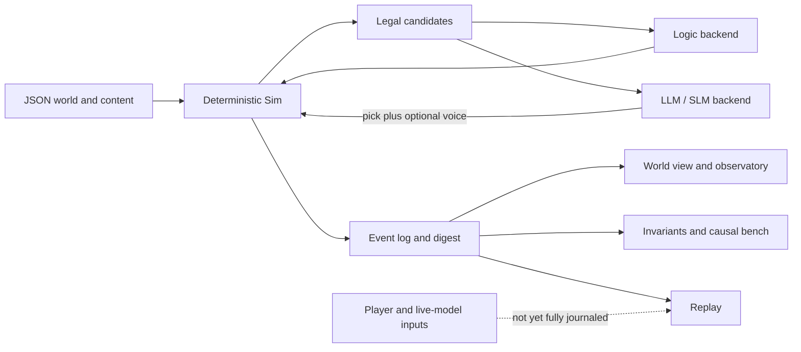

# Living Town repository review — 2026-07-12

> 结论先行：这是一个**研究原型明显强于普通独立游戏原型，但产品化、发行与异步 AI 正确性尚未闭环**的项目。最值得保留的是“确定性社会引擎负责事实与因果，模型只在合法候选里选择并负责表达”的路线；最应该暂停扩张、优先修复的是 AI 请求生命周期、真实回放/存档、职业数据接线、CI 与发行资产合规。

## 评审范围与分支隔离

- 评审日期：2026-07-12（Asia/Shanghai）
- 实际评审对象：本地 `master` 的 `e568151`，当时相对 `origin/master` 超前 7 个本地提交
- PR 文档基线：`origin/master` 的 `1d2be97`
- 高优先级问题均在两个基线上复核；本文代码行锚点以 PR 基线为准
- 本次只新增本目录中的评审文档；没有改 README、游戏代码、数据、资产或当前 `master`
- 那 7 个本地提交没有被带入或推送到评审 PR

## 一句话判断

**Go，继续做；但下一阶段应从“继续加系统/NPC/NPU”切换到“修正确性 + 做成一局真正可玩的垂直切片”。**

当前项目已经证明了几个很难的命题：确定性社会系统可以产生可解释的承诺、冲突、秘密、派系、经济和选举；无模型时游戏仍能运行；完整的跨 seed 门当前是绿的。尚未证明的是：普通玩家能否顺利开始、理解自己的影响、保存进度，并在开启本地模型后仍得到语义一致且可回放的体验。

## 评审记分卡

| 维度 | 判断 | 摘要 |
|---|---|---|
| 产品差异化 | 强 | “厚世界、薄 LLM”比聊天框换皮更有长期价值 |
| 确定性仿真 | 强 | 37 条不变量、跨 seed、双摘要与因果 bench 是真正资产 |
| AI 权限设计 | 方向强，落地有 P1 | 合法候选 + logic fallback 正确；异步请求却存在候选错配与迟到回包污染 |
| 可扩展内容 | 中上 | JSON + `SimExtensions` 已形成接缝，但 schema/外键 lint 缺失 |
| 代码可维护性 | 中下 | `Sim.gd` 2,423 行，`Main.gd` 935 行，动态 Dictionary 边界被多处穿透 |
| 测试资产 | 强 | S0/S5/replay/player/backend/LOD 等专项测试丰富 |
| 自动化门禁 | 弱 | 没有 GitHub Actions；README 两条公开快速验证当前都红 |
| 玩家体验 | 中下 | 默认更像开发观察器；玩家模式藏在 CLI，目标、反馈、移动端输入和音频不足 |
| 存档/回放 | 弱 | logic-only 的重演地基存在，但玩家与 live model 输入没有进入生产 journal |
| 发行准备度 | 弱 | SimHei 字体、依赖清单、构建复现、版本元数据、宽 Android 权限尚未收口 |

## 最突出的优点（Pros）

1. **核心架构命题是对的。** 引擎枚举合法动作，模型只选号；缺模型、超时或脏输出回退规则层。模型不直接拥有世界状态写权限。
2. **确定性不是口号。** 项目有 per-agent 派生 RNG、不可变量门、事件摘要、decision trace、跨 seed 通过率与因果干预 bench。
3. **社会系统已有“因果链”，不是随机气泡。** 承诺、爽约、积怨、对质、道歉、秘密、声誉、派系、经济、节日和选举能共享同一账本。
4. **无模型也能完整运行。** 这让硬件、网络和模型许可都不再是游戏可玩的单点故障。
5. **数据化与扩展接缝已有雏形。** 场景、候选、接受修正、夜间 hook 与 executor 已经有明确排序和确定性意识。
6. **性能工作有测量纪律。** LOD、active commitment、预算、探针、NPU/ranker 研究都带真实指标，而不是只靠架构想象。
7. **文档与实验诚实。** 大量失败路径、硬件实测和设计取舍被记录下来，这对研究项目非常有价值。

## 最关键的缺点（Cons）

1. **模型看到的动作与最终执行的动作可能不是同一个。** 请求没有保存候选快照；几秒后回包用当前候选解释旧编号。
2. **异步请求缺少 request id / world epoch / 完整取消。** 超时 HTTP 仍在飞，迟到回包可写进同 NPC 的下一次请求；重开、scrub、改 NPC 数也会跨局污染。
3. **时间轴的产品承诺大于实现。** 玩家历史不回放，生产入口默认不记录模型决策，live backend 下 `goto_tick()` 仍会发异步请求。
4. **公开验证路径不可信。** 30 天 Node 与 Godot README 命令当前均退出 1；但正式 60 天跨 seed 门是绿的。缺 CI 使这种漂移长期存在。
5. **一个已宣称落地的职业链实际断线。** `extra_advertises` 在对象仍为 Array 时按字符串 id 查询，导致“看摊”永远没有注入。
6. **产品入口仍偏开发者。** 默认没有玩家实体，玩家模式靠 `--player`；UI、输入、触控、可访问性、音频、存档和新手目标尚未形成闭环。
7. **发行资产与依赖没有收口。** 仓库自带的 SimHei 字体没有可再发行证明，项目文档也明确要求正式发布前替换。

## 架构主链

这条主链值得保留。需要修的是 `A → S` 的异步协议，以及 `P → R` 缺失的外部输入日志，而不是推翻确定性地基。

## 建议的决策顺序

1. 先修统一 AI request lifecycle：候选 stable key、request id、world epoch、取消、超时和并发。
2. 修职业工位接线，并把 README 命令、玩家测试和文档链接拉回绿色。
3. 把现有 S0 接入 CI，同时增加 JSON/schema、Markdown link 和 Godot import smoke。
4. 明确启动时的三种模式：观察小镇 / 作为居民入住 / 开发观测台。
5. 做最小存档 + 输入 journal + 周期快照，时间轴先诚实标成 logic-only，完成后再恢复“任意 tick 重建”承诺。
6. 交付一个 20–40 分钟、logic-first、能保存、能解释玩家影响的桌面/Web 垂直切片。
7. 用真实玩家 A/B 决定 ranker/LLM 是否带来可感知价值；在此之前不要继续扩大 NPU 发行集成或地图规模。

## 本目录

- [findings.md](findings.md)：按 release blocker / P1 / P2 / P3 分级的详细技术发现
- [recommendations.md](recommendations.md)：工程、产品和路线图建议，以及可验收的完成标准
- [verification.md](verification.md)：实际执行的命令、结果、范围与限制

## 总结

Living Town 现在最稀缺的不是更多模拟系统，而是把已经很有潜力的系统变成**玩家看得懂、影响得到、存得住、回得去、发布得出去**的一局游戏。确定性地板、合法候选和因果 bench 应当成为项目护城河；异步 AI、存档回放和产品入口则是下一阶段的主线。
