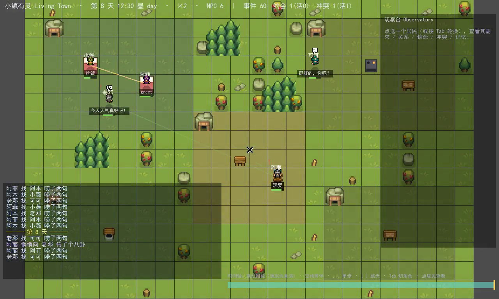
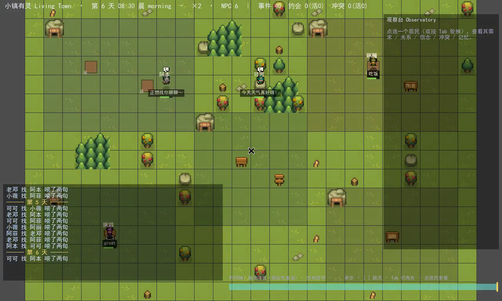
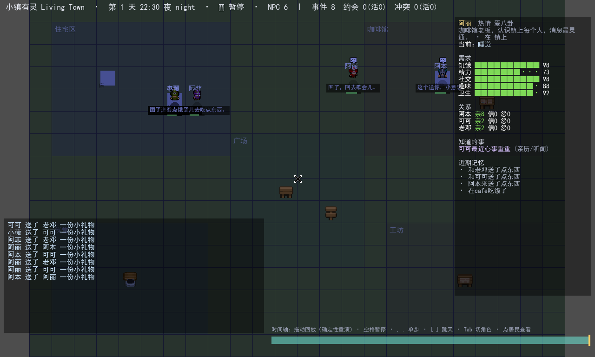
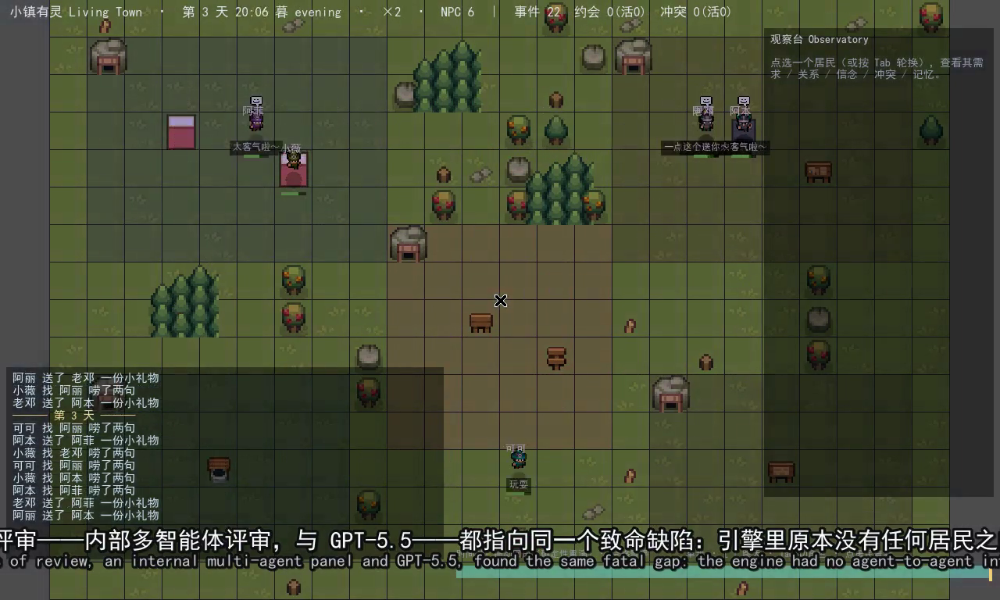

# 07 · 技术文档 · 确定性社交底座（M1）

> 范围：M1 阶段「无 LLM 的确定性社交小镇」全部已实现并验证的技术细节。
> 它是两轮架构评审（[docs/06](06-评审与风险册.md)：内部 7 维多 agent + GPT-5.5 Pro）共同判定的**最高优先级地基**——
> 在接入任何大模型之前，先让两个角色的状态能真实地相互改变。
> 配套演示视频：[`media/living_town_demo.mp4`](media/living_town_demo.mp4)（181s，柔和中文女声旁白 + 中英双语字幕）。



---

## 1. 分层与文件地图

```
View 层（纯订阅者，可热重建）   scripts/WorldView.gd  scripts/Main.gd(HUD)  scripts/Art.gd
        ↑ 订阅 Sim 信号（ticked/agent_changed/social_event/day_changed/log_line）
Sim 层（autoload，headless 可测，确定性）   scripts/Sim.gd
        · 世界树(area>object) + Agents(需求/性格/关系/记忆/inventory/beliefs)
        · tick → 需求衰减 → 决策 → 推进 option → 解算承诺 → 扫描冲突
        · agent_candidates()/agent_apply() 合法候选契约
        · 关系账本 / belief 知识边界 / 不可变 event_log / 承诺 / 冲突
后端（可注入）   scripts/AIBackend.gd（logic 委托 Sim；M2 接 llm/slm）   scripts/Memory.gd（记忆流）
数据   data/{agents,personas,needs,map}.json
工具   tools/{sim_social_port.mjs, soak-godot.ps1, record-godot.sh, shots.sh, build_video.py, narration.json}
```

| 文件 | 职责 |
|---|---|
| [Sim.gd](../game/scripts/Sim.gd) | 权威状态机：世界/Agent/关系/belief/承诺/冲突/事件账本；候选契约；确定性 RNG；社交事务/承诺/冲突全部逻辑 |
| [AIBackend.gd](../game/scripts/AIBackend.gd) | 可插拔决策后端；当前 logic 档委托 `Sim._logic_decide`；M2 实现 llm/slm 异步路径 |
| [Memory.gd](../game/scripts/Memory.gd) | 记忆流：recency+importance+relevance 检索 + summarize-and-forget（`class_name MemoryStream`，被 Sim 以 `preload` 引用） |
| [WorldView.gd](../game/scripts/WorldView.gd) | 像素渲染 + 社交可视化（关系连线/对话连线/冲突标记/约会标记/台词气泡） |
| [Main.gd](../game/scripts/Main.gd) | 入口/相机/HUD（状态条 + 滚动事件日志 + 图例）；CLI `--backend/--seed/--speed` |
| [Art.gd](../game/scripts/Art.gd) | 调色板 + 中文字体加载（`assets/fonts/cjk.ttf` 运行时喂字节） |
| [sim_soak.gd](../game/scripts/sim_soak.gd) | headless 自走子 + 13 条不变量门（违反即 `quit(1)`，可当 bench build_check） |

---

## 2. 核心契约：候选 → 决策 → 执行（引擎永远兜底）

继承《小鱼岛》纪律，并推广到社交：

```
Sim.agent_candidates(ag) -> [合法候选...]      # 引擎枚举：物件交互 + 社交 + 赴约(attend)
后端.decide(ag, cands, ctx) | Sim._logic_decide  # 在候选里挑一个（logic：max + _rng_at 抖动）
Sim.agent_apply(ag, intent)                     # 执行；非法/缺失 → 回退引擎自选（永不破坏仿真）
```

候选三类（`kind`）：
- `object`：床/灶/吧台/长椅… 的「广告」交互（The Sims 式 motive→advertised interaction）。
- `social`：对**同区可感知**的其他 agent 的 `greet / give / gossip / invite / confront / apologize`。
- `attend`：手头有临近 deadline 的 meet 承诺时，去赴约。

**关键解耦**：`Sim.backend` 可注入；为空时走内置 `_logic_decide`。因此 Sim **不引用任何 autoload 全局名**，能在 `--script`/headless 下独立实例化（soak/bench 用 `preload("Sim.gd").new()`，同 22nd `sim.gd`）。

---

## 3. 数据模型

**Agent**（`Sim.agents` 每项）：
```
{ id, persona, pos, home, needs{hunger,energy,social,fun,hygiene}, option,
  talking, inventory{gift}, relationships{}, beliefs{}, memory(MemoryStream), last_say }
```
**关系账本** `relationships[other_id]`：`{affinity, trust, resentment, familiarity, last_pos, last_neg}`，每次变化的 `last_pos/last_neg` 指向 `event_log` 里的事件 id（可溯源）。

**belief（知识边界）** `beliefs[claim_id]`：`{claim, subject, source, via, tick}`。claim 只能经 **gossip 事务**或**亲眼观察**获得；无 source 的信念不存在 → 杜绝「全知蜂群」。种子谣言 R1（阿丽知道「可可最近心事重重」）靠 gossip 扩散。

**承诺** `Sim.commitments`：`{id, type:"meet", a, b, area, created, deadline, status: active|fulfilled|broken}`。

**冲突** `Sim.conflicts`：`{id, a(委屈方), b(冒犯方), status: simmering|escalated|confronted|repaired|lingering, triggered, severity, escalations, confronted, repaired}`。

**事件账本** `Sim.event_log`（不可变，replay/debug/bench 的根）：`{id, tick, type, actor, target, subject, accepted, witnesses}`。

---

## 4. SocialTransaction（社交事务协议）

GPT-5.5 §7.2 的核心建议：光加候选不够，社交要走**原子事务**。`_commit_social` 实现：

1. **发起**：actor 选中社交候选 → `option` 绑定 `partner` + 多 tick 对话相（`CONVERSE_TICKS`），并把对方也短暂绑入（轮次/暂停）。
2. **评估**：`_acceptance_rule`（确定性 + `_rng_at` 抖动）按对方好感/社交需求/性格（寡言、爱八卦…）决定**接受/拒绝**。
3. **提交**：接受 → 效果（需求/affinity/familiarity；give 转移礼物；gossip 写入 belief 并受知识边界约束）；拒绝 → affinity↓ + 累积怨气。
4. **记忆**：双方 + **旁观者**各写一条**视角不同**的记忆（含人物 id tag + 写入期 importance 派生）。
5. 全程落 `event_log`，关系变化挂 event id。



---

## 5. 承诺系统（GPT-5.5 §7.2）

- **`invite`**：约对方在**当下同区**于 `deadline = now + MEET_HORIZON` 前再聚；按熟悉度加权（约熟人）。
- **`attend`**：临近 deadline（≤ `ATTEND_WINDOW`）引擎给「去赴约」加权、主动前往约定地；**但任一需求 < `NEED_CRISIS` 则放弃赴约**——这是确定性的「危机即背叛」之源。
- **`_resolve_commitments()`**（每 tick）：双方按时到场 → **fulfilled**（trust↑/affinity↑）；到点缺席 → **broken**（按谁缺席**归责**：trust↓/resentment↑/affinity↓ + 违约事件 + 双方记忆）。

---

## 6. 冲突生命周期（GPT-5.5 §9.3）

状态机：**simmering → escalated → confronted → repaired / lingering**

- **触发**：爽约(+5)/被婉拒(+3) 经 `_bump_resentment` 累积；过 `CONFLICT_TRIGGER` → 新建冲突。再被亏待 → `escalations++`，过 `ESC_THRESH` → `escalated`。
- **`confront`（当面对质）**：冒犯方接茬 → `confronted`（通往和解）；否认/回避（寡言者更易）→ `escalated`（severity↑、怨气↑）。
- **`apologize`（道歉）**：**仅在被对质后**才会发起（知识边界——冒犯方被挑明才知错）；委屈方按 `severity` 决定原谅 → `repaired`（清账、trust/affinity 恢复）或拒绝（留待下次）。
- **`_sweep_conflicts()`**：久未对质（> `LINGER_AFTER`）→ `lingering`（冷战）。

→ 小镇由此长出完整因果链（全确定性、零模型）：**约见 → 爽约 → 积怨 → 冲突 → 对质 → 道歉 → 和解（或拒绝/冷战）**，每步可溯源、双方各有记忆。


---

## 7. 确定性

- 所有随机走 `Sim._rng_at(salt)`：`seed = seed_base + tick_no*911 + salt`，逐字节可复现。
- `_logic_decide` 用 `_rng_at` 做**平局抖动**（修掉评审点名的「严格 `>` 致平局退化到字典序」死代码问题）。
- soak/回放走内置 logic、零模型 → 可复现、可机检（见 [docs/08](08-测试与验证.md)）。

---

## 8. 可视化层（为录屏/截图而建）

- **WorldView**（世界空间）：平铺草地（CC0 Grass 瓦片）+ 半透明区域 + 对象；**居民=真像素精灵**（Puny Characters，每 persona 一款，取 32×32 正面帧、最近邻放大、软阴影）+ 名字 + 当前动作/台词气泡 + 最紧迫需求条；**关系连线**（绿=亲密/红=敌意，粗细随强度）、**对话连线**（黄）、**冲突标记**（红 `!`）、**约会标记**（黄「约」）。缺纹理时回退程序化圆点（三级回退见 [docs/09](09-美术资产与版权.md)）。
- **HUD**（屏幕空间，CanvasLayer）：顶部状态条（天/时段/速度/计数）、左下**滚动事件日志**（把社交戏剧用中文讲出来、按类别配色）、右上图例。
- **中文渲染**：项目自带 `assets/fonts/cjk.ttf`（SimHei），`Art.font()` 运行时喂字节加载——绕过「未导入项目无 .ttf 资源 / 容器无 CJK 字体」的 headless 坑。



---

## 9. Docker 渲染 / 录制 / 出片流水线（复用 22nd 镜像）

本机无 Godot，复用《小鱼岛》(22nd) 已构建的镜像 **`gamecraft-runner:4.6.2`**（Ubuntu + Godot 4.6.2 + Xvfb/ffmpeg/xdotool + python），起**独立一次性容器**（不碰 22nd 的常驻容器/compose）。

- **录制** [`tools/record-godot.sh`](../tools/record-godot.sh)：Xvfb + `--rendering-driver opengl3`（llvmpipe 软件渲染）+ `ffmpeg x11grab`，配方照搬 22nd `verifier/replay.py`。
- **截图** [`tools/shots.sh`](../tools/shots.sh)：从录屏抽帧。
- **出片** [`tools/build_video.py`](../tools/build_video.py)：归一化分段旁白 → 插静音拼接整轨 → 按实际时长生成中英双语 `.ass`（`fontsdir` 喂 SimHei 给 libass 防豆腐）→ 烧字幕 + 配音合成。
- **旁白** [`tools/narration.json`](../tools/narration.json) + 本机 SAPI `Microsoft Huihui`（中文女声，语速 −2）。



---

## 10. 如何运行

```powershell
# A) 真 Godot 跑 soak + 13 条不变量门（复用 22nd 镜像、独立容器）：
./tools/soak-godot.ps1 -Days 30 -Seed 20260626          # 退出码 0=全过 / 1=失败

# B) 无 Docker/Godot 时：等价逻辑 + 不变量（Node 端口）：
node tools/sim_social_port.mjs --days 30 --seed 20260626

# C) 录屏 + 出片（容器内，需挂 game/ tools/ docs/media）：
#   bash /tools/record-godot.sh 190 20260626 2.0 /out/town_raw.mp4
#   python3 /tools/build_video.py --media /out --narr /tools/narration.json \
#       --fontdir /game/assets/fonts --video /out/town_raw.mp4 --out /out/living_town_demo.mp4

# D) 窗口模式（有本机 Godot 4.6.2 时）直接看：
#   godot --path game -- --speed 2.0
```

> 下一步（M2 之前）：SocialTransaction 字段化(preconditions/effects)、Topic 对象、类型化反思、还礼/秘密类承诺、扩到 15 个社交动作；之后才接 LLM 对话。见 [docs/05](05-路线图与里程碑.md)。

---

## 10. 时间系统 + 回放观察台（2026-06-27）

**时间（[Main.gd](../game/scripts/Main.gd)）**：显式时钟 `第N天·HH:MM·晨/昼/暮/夜`；昼夜 `CanvasModulate` 按 `time_of_day()` 在夜蓝→晨暖→白昼→暮橙间插值（只染世界、不染 HUD CanvasLayer）；速度档键 `0=暂停 1/2/3/4=1×/2×/4×/8×`；滚轮/`±` 相机缩放；`Sim.CONVERSE_TICKS=10` 让对话够读。

**回放观察台**——把"涌现"做成可观察、可倒带（类演化 observatory）：
- **确定性 scrub**：`Sim.goto_tick(t)` = 重置到种子 + 重演到第 t tick（因全程确定性，重演必得同一状态，**无需存快照即可前后拖动**）。底部时间轴可拖动；`[` `]` 跳天、`,` `.` 单步。`Sim.export_trace(path)` 可存档事件账本。
- **角色明细面板**：点居民或 `Tab` 轮换 → 右侧显示其**需求条 / 关系(亲·信·怨, top3) / 知道的事(claim+来源) / 进行中冲突(状态) / 近期记忆 / 当前动作**。`![docs/media/shot-07-observatory.png]` 为面板示例；`shot-08-scrub-rewind.png` 为回跳到早期 tick（关系尚"还没有交集"、事件数骤减）——可见状态随时间确定性演化。
- **验证**：`tools/observe-shoot.sh`（容器内 xdotool 注入 空格/Tab/`[` + ffmpeg 截图）跑通，无脚本错误。交互需有显示，故用此脚本而非纯录屏验证。

## 11. NPC 对话显示（罐头台词，M2 换 LLM）

社交事务发起/响应时，双方头顶短暂显示**罐头台词**（`WorldView.DIALOG` 库 + `_set_dialogue`，按动作类型与接受/拒绝选词、hash 取变体）：
- greet/gossip/give/invite/confront/apologize/meet 各一组 init/yes/no 台词（例：give→"一点小心意，你收下。"／"谢谢你！"；confront→"咱们得谈谈。"／否认"这跟我没关系。"）。
- 气泡优先级：对话台词（短暂 `SAY_TICKS`）> 当前动作；与头顶 emote 表情并存。
- 这是**占位层**：M2 接 LLM 后，由模型按人设 + 记忆 + 当下情境生成台词替换 `DIALOG` 库。
- 验证：`shot-10-dialogue.png` 实拍——阿丽头顶"一点小心意，你收下。"+ 赠礼 emote。

## 12. M2 · 接 LLM（异步接线，已验证；真模型待本机联调）

四档可插拔后端（`AIBackend.backend`）：`logic`(默认，Sim._logic_decide 兜底) / `llm`(LM Studio OpenAI 兼容 HTTPRequest) / `slm`(godot-llm GDLlama，后台 Thread，动态实例化，缺扩展即回退) / `mock`(确定性，验证用)。
- **异步生命周期**（`AIBackend.decide` 返回三态）：`{"_wait":true}`=思考中本 tick 不落地（保持 option==null 下 tick 再问）/ `{}`=放弃→Sim 用 logic 兜底 / 非空=落地。`thinking` 标志 + `MAX_INFLIGHT=2` 在飞上限 + `DEADLINE_TICKS=8` 超时兜底。结果作为"游戏输入"经 `Sim.agent_apply` 回灌，不直接写状态、不卡帧。
- **pick→candidates[pick] 健壮 glue**（`parse_decision`，移植 22nd `_llm_pick`）：抠 `{...}` 子串、越界/负/缺 pick/非 JSON/空串 → 全部回退 `{}`；台词截断、`affinity_delta` clamp。**模型永不能凭空造非法动作**。
- **结构化输出**：`DECISION_SCHEMA`（`pick` 必填 + speech/emotion/affinity_delta），HTTP 走 `response_format: json_schema`；slm 走扩展的语法约束。
- **prompt**：静态 system（世界规则+输出契约，可 prompt-cache）+ per-NPC 人设/记忆/候选；`max_tokens=80`。
- **验证**（`scenes/m2_test.tscn`，跑场景以加载 autoload）：parse glue 9/9；mock 异步跑 10 天 event_log=72/接受 65/触底 0/无卡死。
- **真模型用法**：开 LM Studio（:1234 加载模型）→ `godot --path game -- --backend llm`；或内置 GGUF + godot-llm 扩展 → `--backend slm`。**确定性红线不变**：soak/headless 永远 logic，LLM 只在窗口交互态。

### 12.1 玩家 → NPC 自由对话（#1）
选中居民（点/Tab）→ 底部出现输入框「对 X 说…」→ Enter 发送（或快捷键 C 打招呼）：
- `AIBackend.chat(agent, player_text, ctx, cb)`：自由文本回复（非 pick）。`llm`=HTTPRequest free-text；`slm`=Thread+GDLlama；`mock`/无模型=**人设化罐头**（按 traits：爱八卦/寡言/温柔/豁达/好奇…）。
- 玩家面对的对话**不设 deadline-to-罐头**（docs/03 §6 区分两类延迟）；回复显示为 NPC 头顶气泡（`WorldView.show_say`）+ 事件日志 + **写入该 NPC 记忆**（"玩家问…我答…" → 它会记得你）。
- 验证（`tools/chat-shoot.sh`，mock）：选阿丽→打招呼→回"哎呀你来啦！…我跟你说个新鲜事～"（爱八卦人设），气泡+日志+面板齐全（`shot-11-player-chat.png`）。真模型换 LM Studio 即 LLM 生成。
