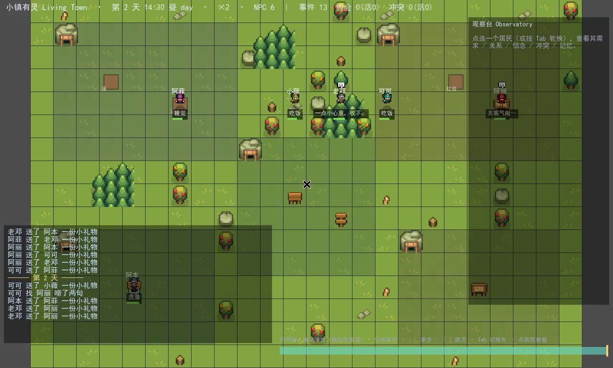

# 08 · 测试与验证 · 确定性社交底座（M1）

> 配套：技术细节见 [docs/07](07-技术文档-社交底座.md)；演示视频 [`media/living_town_demo.mp4`](media/living_town_demo.mp4)。
> 结论：M1 社交底座（社交事务 + 关系账本 + 知识边界 + 承诺 + 冲突）以 **13 条机检不变量**为门，
> 先在 Node 端口跨多 seed 验证，再回写 GDScript **在真 Godot 4.6.2 引擎里跑通**；determinism 双跑一致。
>
> **更新（2026-06-28）**：随 S1 声誉 / S2 意见动力学落地，不变量已增至 **20 条**；并升级为 **Causal Bench S0**——
> 不变量抽成单一真相源 [`bench/Invariants.gd`](../game/bench/Invariants.gd)，跨 seed 网格 + 真确定性校验由 [`bench/Harness.gd`](../game/bench/Harness.gd) 跑（封装 [`tools/bench-godot.ps1`](../tools/bench-godot.ps1)）。
> 实测 **12 seed × 60 天，20/20 全过、确定性 3/3、GATE PASS**。`sim_soak.gd` 重构为复用同模块的单 seed 详细视图。
> 完整三路 LLM 实测对比 + bench-first roadmap 见 [docs/11](11-LLM部署实测对比与选型.md)。下一步 **S5**（配对反事实 PN/PS + PI/cascade/Gini + 后端对比矩阵）。

---

## 1. 测试哲学：双阶段 + 不变量门

本机无 Godot，且 GDScript 有引擎专有语义，故采用**双阶段**：

1. **Node 端口**（[`tools/sim_social_port.mjs`](../tools/sim_social_port.mjs)）：读**同一份** `game/data/*.json`，忠实镜像 Sim 的社交逻辑。用于**快速迭代**与跨 seed 压测（秒级）。
2. **真 Godot**（[`tools/soak-godot.ps1`](../tools/soak-godot.ps1) → `sim_soak.gd`）：复用 22nd 镜像、独立容器跑**真引擎**。捕捉 Node 端口测不出的 **GDScript 专有问题**（见 §5）。

两边跑**同一套不变量**；任一不通过即 `exit 1` / `quit(1)`——可直接当 22nd bench 的 `build_check`。
> RNG 实现不同（端口 mulberry32 vs Godot `RandomNumberGenerator`），故两边数值不同；**不变量在两种 RNG 下都成立** → 逻辑对 RNG 鲁棒。determinism 指**同实现同 seed 双跑一致**。

---

## 2. 13 条不变量

| # | 不变量 | 守护什么 |
|---|---|---|
| 1 | 无饿穿 | 需求/效用平衡：全程无任一需求触底 |
| 2 | 社交发生 | 已接受的社交事务 > 0 |
| 3 | 无永久孤立 | 每个 NPC 至少与 1 人有过被接受的社交 |
| 4 | 关系分化 | affinity 出现非零分化（关系真的形成，非死数据） |
| 5 | 谣言传播 | 种子谣言 R1 至少传到 1 个非源 NPC |
| 6 | 知识边界 | 每条非种子 belief 都有合法 source + 对应 gossip 事件（无凭空知情） |
| 7 | 账本可溯源 | 关系的 last_pos/last_neg 指向真实 event_log 条目 |
| 8 | 承诺生命周期 | 发起过约见且至少一次如约兑现 |
| 9 | 无悬挂承诺 | 已过 deadline 的承诺必被结算（fulfilled/broken），无泄漏 |
| 10 | 违约可溯源 | 每个 broken 都有 meet 违约事件；有违约则有 resentment |
| 11 | 冲突生命周期 | 触发过冲突且至少一段走到对质/修复 |
| 12 | 先对质后和解 | repaired 必先经 confronted（知识边界：被挑明才会道歉） |
| 13 | 修复可溯源 | 每个 repaired 都有被接受的 apologize 事件支撑 |

> 不变量是**累进**的：社交切片 7 条 → 承诺 +3（共 10）→ 冲突 +3（共 13）。

---

## 3. 结果 · Node 端口（30 天，多 seed，全部 exit 0）

| seed | 事件 | 接受/拒绝 | 谣言R1 | 承诺 创建/兑现/爽约 | 冲突 触发/对质/修复 |
|---|---|---|---|---|---|
| 1 | 308 | 253/55 | 4 人 | 24/24/0 | 15/15/14 |
| 42 | 309 | 243/66 | 2 人 | 21/21/0 | 6/6/6 |
| 7777 | 289 | 258/31 | 5 人 | 28/27/1 | 22/22/20 |
| 20260626 | 350 | 294/56 | 3 人 | 54/51/3 | 10/10/8 |
| 100003 | 314 | 265/49 | 2 人 | 22/22/0 | 6/6/4 |

- **60 天**（seed 20260626）：承诺 182/178/4、冲突 20/19/17 含 1 例 `lingering`（冷战路径亦触发）；13/13 过。
- **determinism**：同 seed 双跑 digest 逐字一致（如 `350|294|3|54/51/3|10/10/8/0|-40..100`）。

---

## 4. 结果 · 真 Godot 4.6.2（独立容器，全部 exit 0，13/13）

| seed / 天 | 承诺 创建/兑现/爽约 | 冲突 触发/对质/修复/冷战 |
|---|---|---|
| 20260626 / 30 | 13/13/0 | 18/18/17/0 |
| 7 / 45 | — | 14/14/13/0 |
| 42 / 45 | — | 6/6/3/0 ← 含「道歉未被原谅」分支 |
| 99 / 45 | — | 19/18/17/0 ← 含「尚未对质」 |
| 20260626 / 45 | — | 26/26/24/… |

- **determinism**：seed 20260626 / 30 天双跑逐字一致（`event_log 332`，冲突 18/18/17）。
- 全部 6 NPC 末态健康（need 均值 84–92），无饿穿。


---

## 5. 真引擎逼出并修复的 GDScript 专有问题（Node 端口测不出）

这正是坚持「回写 + 真 Godot 跑」的价值：

| 现象 | 根因 | 修复 |
|---|---|---|
| `Cannot infer type of "avg"/"total"/"c_created"` | `max()`/无类型 autoload 实例的成员返回 Variant，`:=` 推不出 | 显式标注类型 / `float(maxi(...))` |
| `Identifier "MemoryStream" not declared` | 项目从未在编辑器导入 → 无全局类缓存 | Sim 改用 `preload("Memory.gd")` 常量引用 |
| `Identifier not found: Sim` / autoload 实例化失败 | Sim 前向引用了**晚注册**的 AIBackend autoload | **解耦**：`Sim.backend` 可注入、Sim 不引用任何 autoload 全局名、可独立 headless 实例化 |

---

## 6. 涌现案例（一条真实因果链）

视频与日志里可直接读到，全部**零模型、确定性**生成：

> 阿丽约老邓在某处见面 → 老邓需求告急、爽约 → 阿丽积怨、成冲突 → 阿丽当面对质（老邓寡言、当场没接茬 → 冲突升级）→ 后来老邓主动道歉 → 阿丽看在情分上原谅 → 和解清账。

每一步都有 `event_log` 条目、双方各写视角不同的记忆、关系账本（affinity/trust/resentment）随之变化且可溯源。



---

## 7. 如何复现

```powershell
# 真 Godot（复用 22nd 镜像、独立容器）：退出码 0=13 条全过
./tools/soak-godot.ps1 -Days 30 -Seed 20260626

# Node 端口（无 Docker/Godot）：
node tools/sim_social_port.mjs --days 30 --seed 20260626 --verbose

# 重出演示视频（录屏 + 配音 + 烧双语字幕）：见 docs/07 §9-10
```

产物：本目录 `media/` 下 `living_town_demo.mp4` + 截图 `shot-01..06`、字幕 `subs.ass`。

> 评测路线（M5）：把 `sim_soak.gd` 的不变量门接成 22nd bench 的 `build_check`，并对**涌现质量**另设 causal bench（关系/谣言/承诺/冲突的状态级断言，而非只看帧）——见 [docs/06 §7.2](06-评审与风险册.md)。
