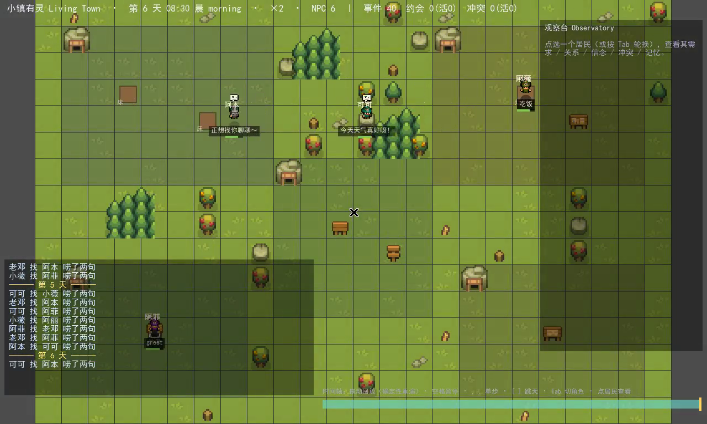
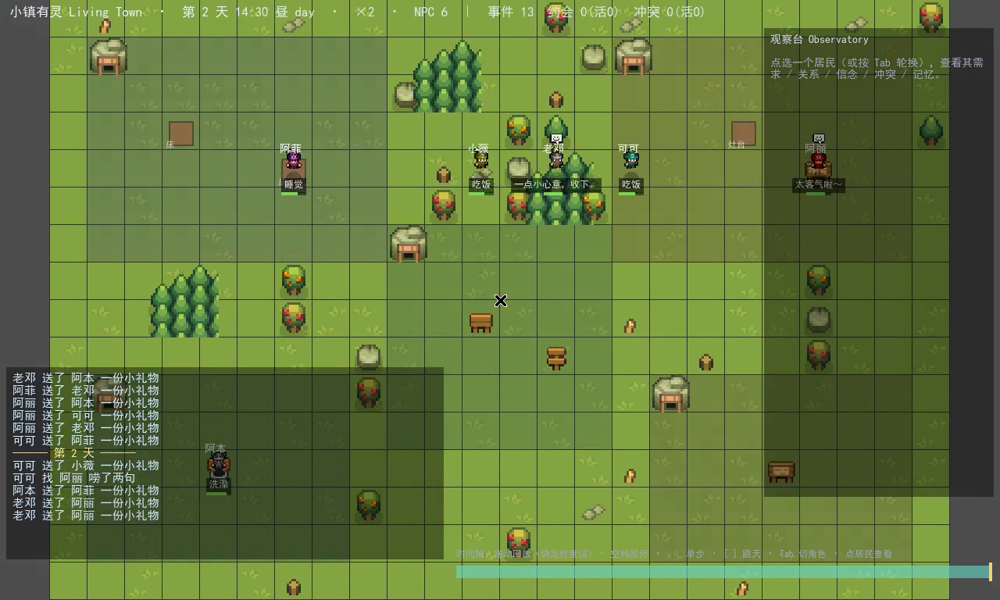

# 08 · 测试与验证 · 确定性社交底座（M1）

> 配套：技术细节见 [docs/07](07-技术文档-社交底座.md)。
>
> **当前状态（2026-07-25 核对）**：不变量门是 **37 条**，权威定义在 [`game/bench/Invariants.gd`](../game/bench/Invariants.gd)
> （**23 条硬 / 14 条软**，划分见该文件的 `HARD_IDS`）。CI 入口是 `bash tools/ci.sh`，跑 10 道关（含 4c 场景确定性门与 4d 外部后端门），
> 其中 S0 门 = **12 seed × 60 天 × determinism 3 双跑**。§2 的 13 行表是 2026-06-27 的历史快照，已在下方标注。
>
> 下面 §1、§3-§7 记的是 M1 阶段（2026-06-27~28）的方法与当时实测，**数字按当时**保留；
> 本文档不再跟随代码更新数字——要当前数字请直接跑 CI。

---

## 0. 当前的门（唯一权威）

```bash
GODOT=/path/to/godot bash tools/ci.sh      # 10 道关，任一红即 exit 1
```

| # | 关 | 内容 |
|---|---|---|
| 1 | `tools/lint_data.py` | `game/data/*.json` 解析 + 外键自洽 |
| 1b | `tools/audit_map.py` | 地图导航自洽：typed-layers 一致、全可达、每家具有交互格、≥2 条路线；节日对象坐标合法（`festivals.json` 缺失即跳过） |
| 2 | `tools/lint_links.py` | markdown 相对链接 + 图片 + 纯文本 `docs/NN` 引用都要落地 |
| 3 | godot `--import` | 解析冒烟：无 SCRIPT ERROR / Parse Error |
| 4 | `game/bench/Harness.gd` | **S0 门**：37 条不变量 × 12 seed × 60 天 + determinism 双跑 |
| 4b | `game/bench/lod_verify.gd` | **观察无关红线**：5 个 `lod_focus` 值 → 同一 digest（机器化"相机不喂仿真"） |
| 4c | `game/bench/DetGate.gd` | **场景确定性门**：default/faction/betray/freerider × 硬不变量 + 同 seed 两跑 + 金标 |
| 4d | `game/bench/BackendGate.gd` | **外部后端门**：#01「无饿穿」在【模型/随机后端挑】的那条路上。上面每一道门都恒 `Sim.backend=null` ⇒ `decide()` 从不被调用 ⇒ 此前 #01 只在引擎地板上验过（[docs/45](45-external-backend-invariant-gate.md)） |
| 5 | 6 个集成场景 | `m2_test` / `reqlife_test` / `player_agency_test` / `s4_replay_test` / `space_test` / `save_load_test` |

`.github/workflows/ci.yml` 下载 Godot 4.6.2 后就是调这个脚本，本地与 CI 同一条路径。

### 硬 / 软划分

- **硬（23 条）** `HARD_IDS = [1,6,7,9,10,12,13,21,22,23,24,25,27,28,29,30,31,32,33,34,35,36,37]`——
  全是"**若 X 发生过，则 X 必良构**"式的正确性断言（可溯源、无悬挂、守边界、金钱守恒……）。**任一红即 CI 红。**
- **软（14 条）** 其余 `[2,3,4,5,8,11,14,15,16,17,18,19,20,26]`——涌现性质（社交真的发生了、关系分化、
  谣言传过、观点不坍缩……）。它们**按设计允许在个别 seed 上漂**，门看的是跨 seed 通过率而非逐条全绿。

### ⚠️ #15「涌现放逐」是已知有缺陷的指标，只报不门

`Invariants.gd` 的 #15 用**终态**声誉挑出"最坏名声者"，却拿**全程**日志算它的接受率——
时间泄漏。[docs/31](31-15-resolution.md) 已结案：修掉泄漏后的 #15v2 在 126 个 seed（dev 1-42 + held-out 43-126）
上**全部 INCONCLUSIVE**，"放逐没咬住"的信号消失。结论是**不加任何机制**，并且**不拿这条指标当门**。
检查保留在代码里作诊断信号。

---

## 1. 测试哲学：双阶段 + 不变量门（M1 当时的做法）

M1 阶段本机无 Godot，且 GDScript 有引擎专有语义，故采用**双阶段**：

1. ~~**Node 端口**（[`tools/sim_social_port.mjs`](../tools/sim_social_port.mjs)）：读**同一份** `game/data/*.json`，忠实镜像 Sim 的社交逻辑。~~ **已于 2026-07-26 正式退役**（[docs/39](39-node-port-disposition.md)）：它**不再镜像** Sim 的社交逻辑——逻辑冻结在 2026-07-03，两天后就被"阵容 6→12"打破（定值打分的冲突/派系动作吃光了 urgency 缩放的关系动作：invite 35→0、gossip 2→0）；且引擎自 P3 起用 `_area_key(space,floor,pos)` 寻址而端口**没有 space/floor 概念**，只读 22 个数据文件里的 4 个。它也**从来不是 differential**（两边各跑各的轨迹、从不比对状态）。保留为历史构件，**不作验证依据**。
2. **真 Godot**（[`tools/soak-godot.ps1`](../tools/soak-godot.ps1) → `sim_soak.gd`）：复用 22nd 镜像、独立容器跑**真引擎**。捕捉 Node 端口测不出的 **GDScript 专有问题**（见 §5）。

> RNG 实现不同（端口 mulberry32 vs Godot `RandomNumberGenerator`），故两边数值不同；两边只比**性质**不比数值。
> determinism 指**同实现同 seed 双跑一致**。

### ⚠️ 两个运行时的覆盖面【不相同】（2026-07-25 实测核对）

早前本节写作"两边跑**同一套不变量**"。**这句已不成立**，逐条核对如下：

| | Node 端口 | Godot（权威） |
|---|---|---|
| 断言条数 | **33**（自报"全部 33 条断言通过"；文件头注释仍写"10 条"，是更早的残留） | **37** |
| 覆盖范围 | 对应 #1-#33 | #1-#37 |
| 缺口 | **无** #34 金钱守恒 / #35 货币非负 / #36 节日配对 / #37 选举计票（`grep -iE 'money\|econ\|election\|festival'` 命中 0） | — |
| 在 CI 里？ | **否**——`tools/ci.sh` 与 workflow 都没有 node 步 | 是（S0 门 + LOD 门 + 6 场景） |
| 最近改动 | 2026-07-03 首次公开快照，此后未动 | 持续 |
| 当前是否全绿 | **否**——`--seed 20260626 --days 30`（README 早前引的那条命令）**退出 1**，红 #5 谣言传播 / #8 承诺生命周期 / #20 谣言变冷；seed 1 与 42 则 33/33 全过 | 是（37/37，12 seed × 60 天） |

**结论**：端口是 M1-S3 社交内核的**历史交叉验证**（"逻辑对 RNG 实现鲁棒"这一点它确实证过），
不是当前的回归门。**权威是 Godot 侧**。端口已跟数据/引擎漂开，要么补齐要么退役，见 [docs/05](05-路线图与里程碑.md)。

---

## 2. 13 条不变量（历史快照 · 2026-06-27）

> 下表是 M1 冲突切片落地时的 13 条。**当前是 37 条**，权威清单见 [`game/bench/Invariants.gd`](../game/bench/Invariants.gd)
> ——那里每条都带 id、中文名和失败详情字符串，比在文档里复制 37 行更不容易过时。保留本表作为演进记录。

| # | 不变量 | 守护什么 |
|---|---|---|
| 1 | 无饿穿 | 需求/效用平衡：全程无任一需求触底 |
| 2 | 社交发生 | 已接受的社交事务 > 0 |
| 3 | 无永久孤立 | 每个 NPC 至少与 1 人有过被接受的社交 |
| 4 | 关系分化 | affinity 出现非零分化（关系真的形成，非死数据） |
| 5 | 谣言传播 | 种子谣言 R1 至少传到 1 个非源 NPC |
| 6 | 知识边界 | 每条非种子 belief 都有合法 source + 对应 gossip 事件（无凭空知情） |
| 7 | 账本可溯源 | 关系的 last_pos/last_neg 指向真实 event_log 条目 |
| 8 | 承诺生命周期 | 发起过约见且至少一次如约兑现 |
| 9 | 无悬挂承诺 | 已过 deadline 的承诺必被结算（fulfilled/broken），无泄漏 |
| 10 | 违约可溯源 | 每个 broken 都有 meet 违约事件；有违约则有 resentment |
| 11 | 冲突生命周期 | 触发过冲突且至少一段走到对质/修复 |
| 12 | 先对质后和解 | repaired 必先经 confronted（知识边界：被挑明才会道歉） |
| 13 | 修复可溯源 | 每个 repaired 都有被接受的 apologize 事件支撑 |

> 不变量是**累进**的：社交切片 7 条 → 承诺 +3（共 10）→ 冲突 +3（共 13）。

---

## 3. 结果 · Node 端口（30 天，多 seed）· 历史快照 2026-06-27

> ⚠️ 下表的数字**今天已复现不出来**：`game/data/*.json` 与端口镜像的逻辑都已前进，
> 同样 30 天 seed 20260626 现在是 1000+ 事件而非 350，且该 seed 已跑红（见 §1 的核对表）。
> 保留原表作为当时的记录。

| seed | 事件 | 接受/拒绝 | 谣言R1 | 承诺 创建/兑现/爽约 | 冲突 触发/对质/修复 |
|---|---|---|---|---|---|
| 1 | 308 | 253/55 | 4 人 | 24/24/0 | 15/15/14 |
| 42 | 309 | 243/66 | 2 人 | 21/21/0 | 6/6/6 |
| 7777 | 289 | 258/31 | 5 人 | 28/27/1 | 22/22/20 |
| 20260626 | 350 | 294/56 | 3 人 | 54/51/3 | 10/10/8 |
| 100003 | 314 | 265/49 | 2 人 | 22/22/0 | 6/6/4 |

- **60 天**（seed 20260626）：承诺 182/178/4、冲突 20/19/17 含 1 例 `lingering`（冷战路径亦触发）；13/13 过。
- **determinism**：同 seed 双跑 digest 逐字一致（如 `350|294|3|54/51/3|10/10/8/0|-40..100`）。

---

## 4. 结果 · 真 Godot 4.6.2（独立容器，全部 exit 0，13/13）· 历史快照 2026-06-27

> ⚠️ 同上，这是 13 条不变量时代的数字。当前请跑 §0 的 CI（37 条 × 12 seed × 60 天）。

| seed / 天 | 承诺 创建/兑现/爽约 | 冲突 触发/对质/修复/冷战 |
|---|---|---|
| 20260626 / 30 | 13/13/0 | 18/18/17/0 |
| 7 / 45 | — | 14/14/13/0 |
| 42 / 45 | — | 6/6/3/0 ← 含「道歉未被原谅」分支 |
| 99 / 45 | — | 19/18/17/0 ← 含「尚未对质」 |
| 20260626 / 45 | — | 26/26/24/… |

- **determinism**：seed 20260626 / 30 天双跑逐字一致（`event_log 332`，冲突 18/18/17）。
- 全部 6 NPC 末态健康（need 均值 84–92），无饿穿。



---

## 5. 真引擎逼出并修复的 GDScript 专有问题（Node 端口测不出）

这正是坚持「回写 + 真 Godot 跑」的价值：

| 现象 | 根因 | 修复 |
|---|---|---|
| `Cannot infer type of "avg"/"total"/"c_created"` | `max()`/无类型 autoload 实例的成员返回 Variant，`:=` 推不出 | 显式标注类型 / `float(maxi(...))` |
| `Identifier "MemoryStream" not declared` | 项目从未在编辑器导入 → 无全局类缓存 | Sim 改用 `preload("Memory.gd")` 常量引用 |
| `Identifier not found: Sim` / autoload 实例化失败 | Sim 前向引用了**晚注册**的 AIBackend autoload | **解耦**：`Sim.backend` 可注入、Sim 不引用任何 autoload 全局名、可独立 headless 实例化 |

---

## 6. 涌现案例（一条真实因果链）

视频与日志里可直接读到，全部**零模型、确定性**生成：

> 阿丽约老邓在某处见面 → 老邓需求告急、爽约 → 阿丽积怨、成冲突 → 阿丽当面对质（老邓寡言、当场没接茬 → 冲突升级）→ 后来老邓主动道歉 → 阿丽看在情分上原谅 → 和解清账。

每一步都有 `event_log` 条目、双方各写视角不同的记忆、关系账本（affinity/trust/resentment）随之变化且可溯源。



---

## 7. 如何复现

```bash
# ① 整条门（推荐）——10 道关，退出码 0 = 全绿
GODOT=/path/to/godot bash tools/ci.sh

# ② 只跑 S0 不变量 + determinism，自选 seed 网格
godot --headless --path game --script res://bench/Harness.gd -- --seeds 1-12 --days 60 --det 3

# ③ 单 seed 详细视图（逐事件、逐不变量）
godot --headless --path game --script res://scripts/sim_soak.gd -- --days 30

# ④ Node 端口——历史交叉验证，不是门；部分 seed 已红（见 §1）
node tools/sim_social_port.mjs --days 30 --seed 1

# 重出演示视频（录屏 + 配音 + 烧双语字幕）：见 docs/07 §9-10
```

> `tools/soak-godot.ps1`（22nd 镜像 + 独立容器）是 M1 时代本机无 Godot 的走法，现在本机直接有 Godot，
> 上面 ①-③ 是当前路径。

产物：本目录 `media/` 下 `living_town_demo.mp4` + 截图 `shot-01..06`、字幕 `subs.ass`。

> 评测路线（M5）：把 `sim_soak.gd` 的不变量门接成 22nd bench 的 `build_check`，并对**涌现质量**另设 causal bench（关系/谣言/承诺/冲突的状态级断言，而非只看帧）——见 [docs/06 §7.2](06-评审与风险册.md)。
