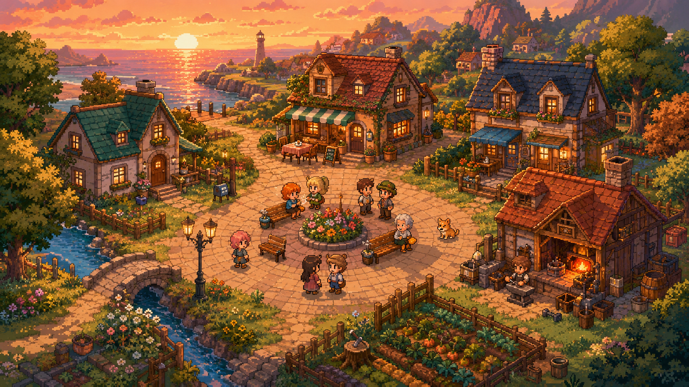

# 09 · 美术资产与版权（Credits & Assets）

> 策略=**混合**：游戏内精灵/瓦片用 **CC0 免费包**（干净、风格统一、可商用、免署名）；封面/关键图用 **GPT-5.5 Pro 出图**（单张精修大图它最擅长）。
> 落地零代码可换：`Art.gd` 三级回退 `assets/art/pro/<name>.png > 自带包 > 程序化兜底`（见 [docs/07 §8](07-技术文档-社交底座.md)）。



---

## 1. 游戏内精灵（CC0，OpenGameArt）

同一作者群、16×16 像素、顶视角，风格统一。下载到 `game/assets/art/library/<slug>/`，每个目录附 `LICENSE.txt`。

| 包 | slug | 许可 | 作者 | 用途 | 来源 |
|---|---|---|---|---|---|
| Puny Characters | `puny-characters` | **CC0** | Shade | 居民精灵（每 persona 一款，取 32×32 帧 (0,0)） | https://opengameart.org/content/puny-characters |
| PunyWorld Overworld Tileset | `punyworld-overworld` | **CC0** | Shade | 地块/建筑/物件（后续映射 object 槽位） | https://opengameart.org/content/16x16-puny-world-tileset |
| 16×16 Food | `puny-food` | **CC0** | admurin | 食物图标（咖啡馆/灶台等用） | https://opengameart.org/content/16x16-food |
| 16×16 Emotes | `puny-emotes` | **CC0** | admurin | 情绪/对话气泡图标（后续接 `social_event`） | https://opengameart.org/content/16x16-emotes-for-rpgs-and-digital-pets |

**已接线**（[WorldView.gd](../game/scripts/WorldView.gd) + [Art.gd](../game/scripts/Art.gd)）：
- **地面**：逐格在草地变体间确定性选择（`grass_a/grass_b/grass_flowers`，hash 加权），不再单图平铺（`Art.terrain_tex`）。
- **装饰散布**：区域外草地上确定性撒树/开花灌木/草丛/石/树桩/蘑菇（`Art.decor_tex`，~22% 密度，避开区域与物件）。
- **区域地标**：每个区角放一座小屋 `hut`（`Art.building_tex`），分区像"街区"。
- **居民**：按 `personas.json` 的 `sprite` 取 Puny 角色表，**4 向行走动画**（`_agent_frame` 按移动选帧：down/横向=row1、上=row3，cols0–3 循环；静止=正面 idle）。
  - 映射：阿丽=Mage-Red · 阿本=Warrior-Blue · 可可=Mage-Cyan · 老邓=Soldier-Yellow · 小薇=Archer-Green · 阿菲=Archer-Purple。
- **区域**：半透明色块叠在草地上（保留可读分区）。
- **物件**（`Art.object_tex(slot)`，slot=object id 前缀）：bath=井、counter=货摊、bench=木桌、desk=工作台、arcade=招牌（来自 overworld tileset，CC0）；**bed/stove 暂保留程序化**（该 pack 无室内家具，如实）。
- **emote 气泡**（`Art.emote_tex(event)`）：社交事件触发，actor/target 头顶短暂显示对应表情；10 事件→cell 映射见下。**注**：emotes 表无 angry/heart，conflict 用"忧虑"脸代替。

**这些 atlas 规格由一次并行 Workflow 产出**（3 个 agent 并行只读分析 emotes/角色表/overworld 三张网格图→返回精确 (col,row) 规格；主流程据规格 `tools/slice.py`/`slice_all.py` 切图 + 接代码）。emote 事件映射（col,row @20px）：greet(3,1) give(0,3) gossip(0,1) invite(2,5) meet✓(2,3) meet✗(5,3) conflict(6,1) confront(3,2) apologize✓(5,5) apologize✗(0,4)。

**重新获取**（幂等）：
```powershell
docker run --rm -v "<26th>/game:/game" -v "<26th>/tools:/tools:ro" gamecraft-runner:4.6.2 \
  python3 /tools/fetch_assets.py --catalog /tools/assets_catalog.json --dest /game/assets/art/library
```
清单见 [`tools/assets_catalog.json`](../tools/assets_catalog.json)，抓取器 [`tools/fetch_assets.py`](../tools/fetch_assets.py)（范式同 22nd `fetch_oga_assets.py`）。

---

## 2. 封面 / 关键图（GPT-5.5 Pro 出图）

- `media/cover.png`（1672×941，~2.8MB）：黄昏海边像素小镇主视觉，用作 README/标题主视觉。
- 由**本机 Chrome 的 GPT-5.5 Pro 会话**生成（当前无 API，故人工驱动浏览器出图）；提示词见会话「像素风小镇封面」，要点：温馨像素风、轻俯视小镇、黄昏暖色、广场上小村民聚集、16-bit JRPG 美学、**纯画面无文字**。
- 归属：AI 生成（OpenAI 服务，输出归用户）。**仅作本项目关键图**；如需正式商用发布请按当时 OpenAI 条款复核。

> 为何分工：图像模型不擅长**多角色一致的游戏精灵/可平铺瓦片/透明切片**（产出后处理重、看运气），但**单张精修大图**很强——故精灵走 CC0、关键图走 GPT。

---

## 3. 其它

- **UI 中文字体** `game/assets/fonts/smiley-sans.ttf`（**得意黑 Smiley Sans v2.0.1**，atelierAnchor，**SIL OFL 1.1**）：可嵌入、可随游戏再发行。全文 `game/assets/fonts/LICENSE-SmileySans.txt`，登记见根目录 [`THIRD_PARTY_NOTICES.md`](../THIRD_PARTY_NOTICES.md)。**保留字体名 `Smiley`/`得意黑`：原样嵌入不改，若日后修改字形/内部名必须改名。**
  - ~~旧：`cjk.ttf`（SimHei，本机 Windows 字体，无再发行证明）~~ → **已移除**（评审 R0-1 发行阻塞项：它会随 `export_filter="all_resources"` 打进 APK）。顺带 APK 瘦身 9.7MB → 2.6MB。
- 演示视频旁白：本机 SAPI `Microsoft Huihui`（zh-CN 女声）合成，见 [docs/07 §9](07-技术文档-社交底座.md)。

---

## 4. 待办（美术深化）

- ✅ 已完成：overworld 物件切片、emotes 头顶气泡、角色 4 向行走、**地面变体 + 装饰散布 + 区域地标小屋**（视觉大改，规格由第二次并行 workflow `visual-tiles-analyze` 产出，切图 `tools/slice_visual.py`）。
- ✅ 打磨：**行走左右镜像 + idle 微动**（`_agent_frame` 返回 flip，左向 `draw_set_transform` 水平翻转；静止时缓慢呼吸帧）、**bed/stove 程序化像素家具**（`_draw_bed`/`_draw_stove`，顶视角床=木框+枕+被、灶=炉体+灶面+火眼+烤箱门，风格可控）、**广场铺 dirt 地面**（中央集市感）。
- **bed / stove 真家具（可选升级）**：overworld pack 无室内家具（workflow 已确认）；当前用程序化像素家具，足够协调。要更精的可取 CC0 室内 pack（LPC Interior / Tiny16 interior，或同作者 PunyWorld Indoor 若有）。
- 行走 **左右朝向镜像**（当前左右复用 down 帧不翻转；Puny 无原生侧面图，需引擎水平翻转）。
- 角色 **idle 微动**（idle 行 cols0–3 呼吸帧）。
- 可选：用 GPT-5.5 出 6 张**角色立绘**用于 M2 对话框头像。
- 发布前的字体/资产授权终检。
