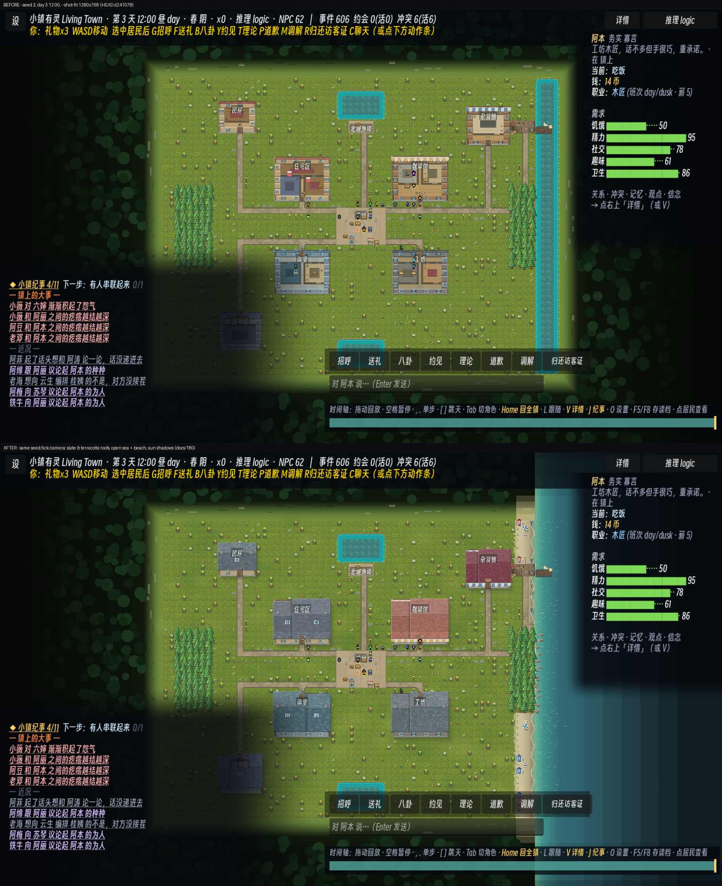
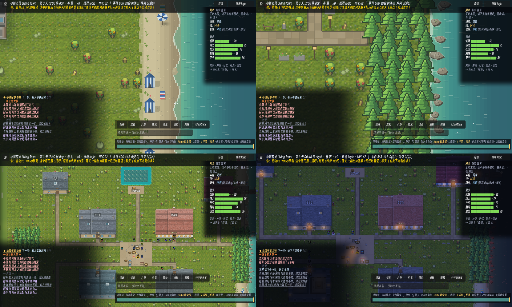

# 180 · 海滨美术一刀：屋顶、开阔海、沙滩、日照（车道 V，零 sim 金标）

> 触发：用户 2026-09-12——"继续开发，重心放在美术 / UI / UX / 设计；PixelLab MCP 可当资产工厂；
> 视觉细节与精致度对标 [mewamew/my_ai_town](https://github.com/mewamew/my_ai_town)（阴影、质感、光、地形、高差、瓦片、精灵）；
> 地图参照侯麦《夏天的故事》(Conte d'été, 1996) 里那座体量相当的海滨小镇"。

## 〇、参照系拆解（先看清要追的是什么）

**my_ai_town**（Godot 4.7，读过其仓库与 README 图）：
- 整张镇图是一张**预渲染 4K 底图**（`game/world/maps/town/assets/runtime/town_4k.png`）+ 分离的 collision / navigation / occlusion / lighting JSON。精致度来自"画出来的一整张图"，不是逐格拼瓦。
- 读得出来的手法：**每栋楼都有坡屋顶**（瓦纹、屋脊、烟囱、山墙），楼的正立面露出来；**统一的左上光**，树、楼、栅栏都往右下落影；地形有**台地崖面**与石阶（高差）；路是有机曲线的土路；水有岸线泡沫；草地有低频明暗而不是匀绿。
- ⇒ 我们与它的最大差距**不在瓦片分辨率**，而在：① 楼没有屋顶（切顶俯视读作"围了墙的院子"）；② 没有统一光向与投影；③ 东海只是一条青色竖带，看不出"海边"。

**《夏天的故事》**：Dinard / Saint-Lunaire（布列塔尼，Côte d'Émeraude）。可落到像素上的母题：
祖母绿浅水→深蓝外海、宽沙滩、**白蓝条纹沙滩帐篷一排**、阳伞、粉灰花岗岩礁与松林岬角、**板岩屋顶 + 白灰泥老虎窗 + 山墙两端的花岗岩烟囱**、海鸥。
镇子体量与我们 64×48 格相当——一条海滩、一个小码头、十来栋楼、一个广场。

## 一、这一刀做了什么（全部在 `WorldView.gd`，纯 View）

| 项 | 做法 | 为什么 |
|---|---|---|
| **坡屋顶 + 缩放掀顶** | 全镇俯瞰（zoom ≤ 0.62）每栋楼盖顶；≥ 0.80 淡出回到切顶视图看屋里；选中者所在那栋永远掀顶。南墙那一行不盖＝3/4 俯视里看得见的正立面（窗、门、招牌）。宽楼拆成**主屋 + 矮一截侧翼**两段屋脊。住宅＝板岩 + 白老虎窗 + 花岗岩山墙烟囱（冒炊烟）；商业＝陶瓦 + 条纹雨棚（全镇唯一暖顶 ⇒ 店一眼可找）；公共＝蓝灰板岩；工坊＝深板岩。 | 对标图里"一片屋顶的镇子"的读法；又不丢这个游戏的核心——**看得见屋里的人**。拉近即掀顶，所以不是二选一。 |
| 屋顶下的人/线/灯 | 盖顶时：楼内居民不画、关系线/派系环/对话线跳过（`_in_town` 加一条）、屋内与北墙/侧墙夜灯不透顶（`_collect_lights` 过滤）。 | 否则读作"人走在屋顶上"、夜里屋顶上冒光斑（第一版眼验两样都有）。 |
| **开阔海** | 东海 x60-63 按 1/4 格竖带画「浅滩绿→外海」梯度；每格两道随 tick 漂向岸的浪痕 + 日间碎光；**东界之外继续是海**（主层画，同吃昼夜水罩 + 季节/天气罩，离镇越远越暗），界外林子不再长到海上。 | 以前东界外是林子，东海是一条"水渠"。 |
| **沙滩 + 拍岸浪** | 水线往内 3 格（遇树/码头/路/楼即止）铺湿→干沙梯度 + 沙粒 + 伸进草地的不规则沙舌 + 滨草；每行 4 段浪花前沿随 tick 涨退，漫上沙的浅水 + 湿沙带；离岸碎浪线。 | 岸线要"活"，且不许读成等距画框（docs/41 §6 教训）。 |
| **花岗岩礁** | 松林直抵水边的行（东丛 y18-30）在水里散不规则七边形礁石：西北受光面、东南背阴、石缝、海藻、拍礁白浪。 | 岬角的母题；第一版是圆球，眼验读作"灰色气泡"，改成块状。 |
| **沙滩道具** | 条纹帐篷（隔行一顶，蓝白为主、偶有红白）、阳伞（8 瓣）、条纹浴巾、搁浅的小划艇、沙堡。全部行优先绘制、确定性落点。 | 侯麦海滩的标志物。第一版每行一顶 ⇒ 连成一堵墙，改隔行。 |
| **海鸥** | 4 只绕海盘旋，翼尖随拍翅上下，水面落淡影；相位只读 tick。 | 画面里第一个"天上的东西"。 |
| **统一日照（西北光）** | 每棵阻挡树脚下一块径向软影（一张贴图合成一批）；每栋楼向东南落 L 形投影（只落楼外）。 | 对标图最强的一条共性：所有东西都往同一侧落影。 |
| ~~草甸色斑~~（**已撤**，`8f55a60`） | 3 格一采样、~45% 落一块低频软色斑。 | docker 视觉门实跑后撤掉：DAYNIGHT/SEASON 取"HUD-free 横带世界主色"当草地基色，色斑把草地打散成上百档近色 ⇒ 主色退位给界外平涂底色 (11,18,9)，两门同时红。撤装饰、不改门的量法。 |
| 美术近景出图 | `Main.gd` 加 dev 旗 `--shot-at X,Y,ZOOM`（格坐标 + 缩放）。 | 以前只有整镇 `--shot-fit` 与跟随特写，美术迭代看不到近景。 |

近景（左上沙滩、右上岬角礁、左下屋顶、右下夜景屋顶）：

## 二、零金标的依据与守住的性质

- **Sim 读不到任何一样**：只读 `map.json` 的 water/trees/areas 与 `Sim.tick_no / time / 选中`，不写；`blockers[]` 一格未动 ⇒ digest 不变（docs/179 §〇 的"零 sim 金标"档）。
- **确定性**：布局全走 `_hash` / `_hash_mix`（不直接取 `_hash % 2/4`，见 V3 那条低位周期警告）；动画只读 `Sim.tick_no` ⇒ 冻结 tick 的 `--shot` 逐像素可复现；ON/OFF 负对照（货船门）同 tick 两拍仍可比。
- **界外静态层不读 tick**：界外海本体搬到主层画，界外层（`_draw_void_layer`，VOIDGATE 守"相机不动不重画"）只多画了顶/底外带的沙滩延长线，键不变。
- **池塘一像素不碰**：海＝贴东界、≥2 格宽的那段连续水；北/南池不进 `_ocean_x0`，草甸色斑离水 4 格内不落 ⇒ POND 门采样面不变。
- **调色板纪律**：新色全部进 `X_*` 扩表并写理由（`X_SEA_*` 四档、`X_SAND_*` 两档、`X_GRANITE`、`X_CANVAS_BLUE`、`X_SLATE`）；其余一律由已授权色派生。
- **draw-audit pass 名不增**：海滨挂在 `water`、沙滩道具在 `decor`、树影在 `trees`、楼影在 `walls`、屋顶在 `dressing`、色斑在 `grass` ⇒ `AUDIT_PASSES` 闭合校验一字不动。

## 三、验收回执（据实）

- 本机 Windows + Godot 4.6.2 真 framebuffer 出图（上两张图）；`--shot` 全程 0 条 `SCRIPT ERROR`。
- `tools/ci.sh` 第 5 步的 22 个 headless 集成场景（m2 … story_test / event_prose_test）：**22/22 exit 0、0 条 `SCRIPT ERROR`**（本机，工作树）。
- `lint_data` / `audit_map`（blockers=569 不变）/ `lint_links` 均 PASS。
- **没跑**：`tools/visual_gate.sh`（本机 docker daemon 未起、无 Xvfb ⇒ 该门会 77 SKIP，不是 PASS）。
  最可能被影响的是**整镇取景的像素统计门**：`assert_daynight`（屋顶改变了正午/夜帧的建筑区色）、`assert_season` / `assert_precip`（草甸色斑与屋顶进帧）。
  `assert_tree_stand`（树只多了脚下软影）、`assert_east_ocean_carrier`（同 tick ON/OFF 差分，海浪逐 tick 确定 ⇒ 仍只剩货船 crop）、室内系列（不经本层）预计不受影响——**预计，未测**。
- **欠一次互补锚刷新**：任何动 `game/` 的提交都会让 `gate_complement_guard` 的 ledger freshness 变 stale（docs/179 HOLE D），需在 committed 树上 `--bake-ledger`（~12 min），本棒未做。

## 四、下一刀（按收益排序）

1. **资产工厂接通 PixelLab**：本会话 PixelLab MCP 返回 `401 Missing Authorization`（MCP 客户端没配 Bearer token）。接通后的首批清单：
   - 居民：用 `create_character`（v3，8 向，~48px）按 docs/142 人设花名册重做全体居民——现在的 Puny 16px 小人与新屋顶/海的精致度落差最大。
   - 地形：`create_topdown_tileset` 链式出 **海→湿沙→干沙→草** 与 **草→花岗岩台地** 两套 Wang 瓦（取代程序化沙带；台地给"高差"用）。
   - 建筑件：`create_map_object` 出条纹帐篷、布列塔尼石屋山墙、灯塔、海堤石阶，替换本刀的程序化几何。
2. **高差**：北缘/岬角做程序化假崖面 + 石阶（docs/179 §二 (i)），先零金标，再议不可走岩体。
3. **有机路网**：石街现在是 L 形直角；按对标图改成带转角圆弧的路面（仍只写 `_path_set` 的绘制，不动导航）。
4. **HUD**：左下纪事面板的大块暗角压住了 1/4 张地图；改成带纸质底板的收起式卡片（对标图的对话气泡/面板是羊皮纸 + 金边）。
5. **海堤步道（la digue）**：沙滩与镇之间一条石砌步道 + 栏杆 + 路灯，Dinard 最有辨识度的一笔。
