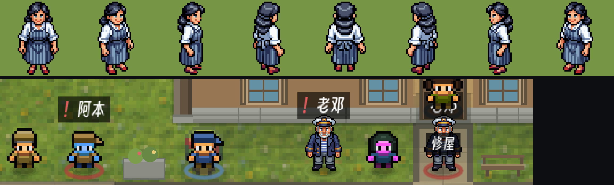
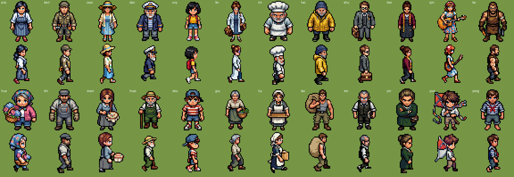
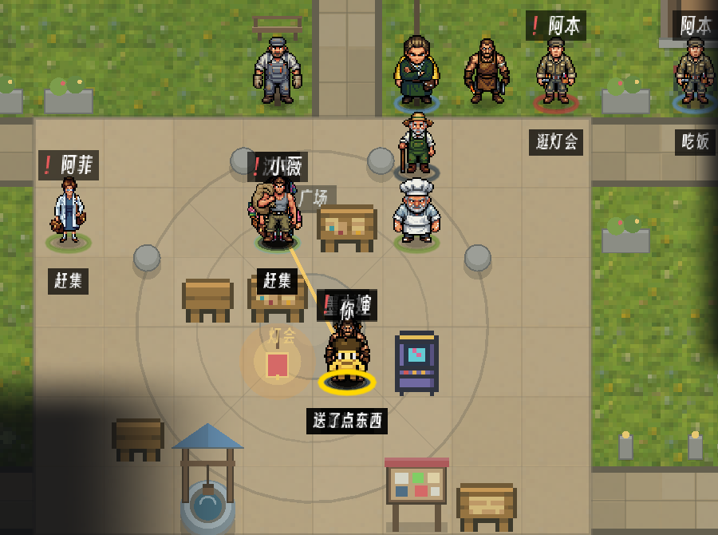

# 181 · 居民重做：PixelLab 8 向角色（车道 V，零 sim 金标）

> 触发：用户 2026-09-12——docs/180 之后"先做居民"。旧居民是 Puny Characters（CC0，16px 人形放大到 32px 格、2× 画），
> 在新屋顶/海/沙滩旁边精致度落差最大（docs/180 §四·1）。

## 全员（24/24，2026-09-12 落地）

上排南向静止、下排东向行走帧：

镇中心实机（seed 3、第 3 天正午、`--shot-at 32,24,1.4`）：

实际花费：本批全员 **174 generations**（24 人 × 2 本体 + 2 人 × 8 向行走 + 22 人 × 5 向行走 ≈ 48 + 16 + 110）。
比原估 220 省下的来自「只动画 S/SE/E/NE/N 五向、西三向由东向镜像」（`import_pixellab_char.py` 的 mirror 表）。
玩家（`sprite=""`）仍走旧 FALLBACK 回退——没有人设可生成，留作下一棒（玩家自定义外观）。

## 配方（全员同一套，保证一个镇子一种画风）

- PixelLab `create_character`：`mode=v3`、`size=48`、`view=low top-down`、单色黑描边、medium detail，8 向。
- 描述模板：「<性格一词> <职业> <年龄段> in a 1990s Breton seaside town, <服装两三件>, <一个道具/姿态>」——
  服装取侯麦《夏天的故事》的海边小镇（条纹海魂衫、帆布、草帽、油布雨衣），职业取 `personas.json` 的 bio。
- 动画：`animate_character` 模板 `walking-6-frames`，只做 S/SE/E/NE/N 五向（1 gen/方向），西三向导入时镜像。
- 成本：每人 ≈ 2（本体）+ 5（行走）= 7 generations；Tier 2 同时最多 10 个 job（本体占 2、五向行走占 5）。

## 管线

1. `tools/import_pixellab_char.py <persona_id> <zip>` → `game/assets/art/chars/<persona_id>.png`
   （8 行方向 S,SE,E,NE,N,NW,W,SW × 第 0 列静止 + 1..6 列行走，格 48×48）。
2. `Art.char_sheet(pid)` / `Art.char_sheet_feet(pid)`（南向静止帧 alpha bbox 的脚底行）。
3. `WorldView._draw_agent`：有表就走 8 向表（1× 整数尺，一格宽；脚压落脚线），朝向由 `_process` 里的格位移
   `DIR8_ROW` 查出，移动时 walk 帧按 `tick % 6`，静止用第 0 列。没表的居民走旧 Puny 路径，逐像素不变。
4. 克隆 `npc_*` 只带 persona 字典、没有 key ⇒ 按 persona **显示名**反查 `personas.json` 的 key 取表 ⇒ 克隆与本尊同形。

## 边界（据实）

- **旧 `assets/art/pro/` 与 `coif_characters.py` / art gate（2b）一概没动**：新表放在新目录，art gate 仍守旧表。
  旧表现在只服务于"没有新表的 persona"与 FALLBACK（玩家）；全员换完之后它们成为死资产，删不删是下一棒的事。
- 克隆的 L6 色相分化（`_hued_tex`）**不作用于新表**：克隆与本尊同色。N=62 的镇上同一张脸会出现两三次——
  要分化得另做（换发色/衣色的 `create_character_state`，或运行时 palette swap）。
- 室内平面（咖啡馆等）的居民走同一个 `_draw_agent` ⇒ 一并换上。
- 动画只有 walk；idle 是单帧。`breathing-idle` 模板可补（+8 gen/人）。
