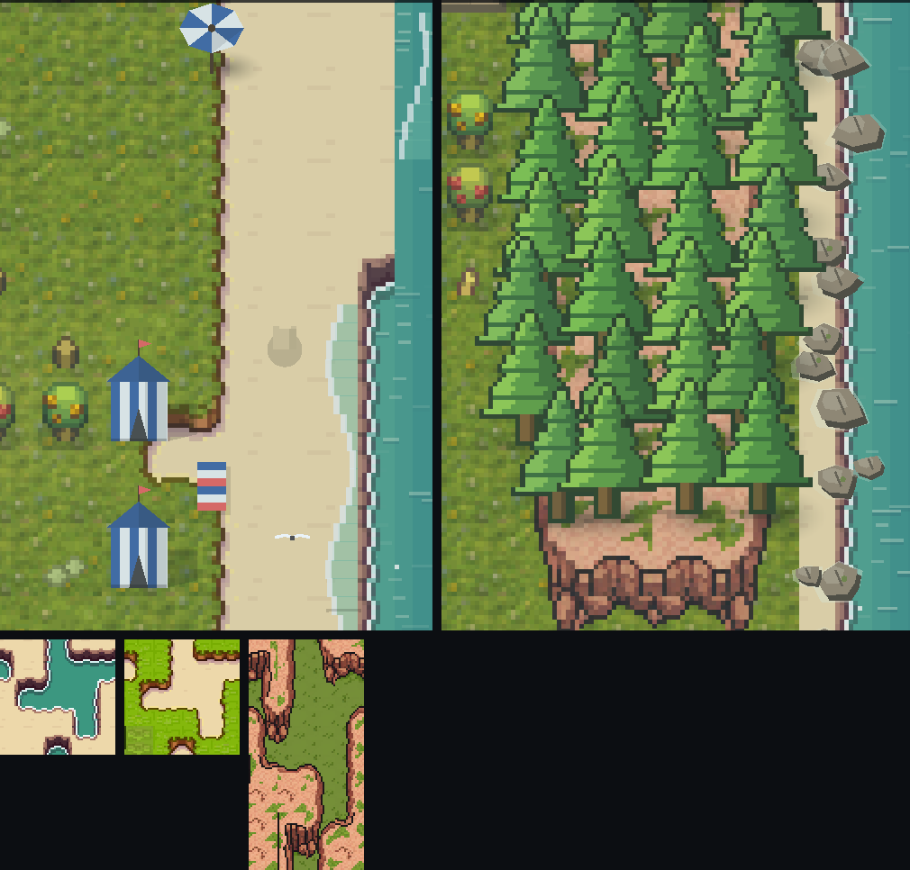

# 182 · 地形瓦：PixelLab Wang 瓦集（海岸 / 沙丘 / 花岗岩台地，车道 V，零 sim 金标）

> 触发：用户 2026-09-12「go ahead with the terrain tiles」（docs/180 §四·1 的第二项）。

## 三套瓦（均 16px、high top-down、lineless；游戏内 3× 整数尺 = 一格）

| 名 | PixelLab 模式 | lower → upper | 用在哪 |
|---|---|---|---|
| `seasand` | standard, 16 瓦, transition 0.5 | 青绿海 → 米色沙（湿沙边 + 细泡沫线） | 东海岸线 + 沙滩本体 |
| `sandgrass` | standard, 16 瓦, 与上一套链式共用沙/草基瓦 | 沙 → 橄榄草（沙丘草边） | 沙滩内缘 |
| `cliff` | **pro**, 25 瓦, raggedness 0.7 / slope 0.3 | 草 → 粉灰花岗岩台地 + 崖壁 | 东松林岬 |

**第一版全部返工过，据实记下**：首轮 standard 出图草是荧光绿（与出货草地瓦严重撞色）、海是平涂薄荷绿 + 卡通紫浪、
崖壁是**城堡砖墙**。第二轮在 prompt 里写死「muted / desaturated / olive / no bricks」后海岸两套可用；
崖壁在 standard 的整格过渡下仍是砌砖——换 **pro 模式**（带 raggedness/slope 形状控制）才出自然岩体。
花费：3 套废稿 + 2 套出货 standard + 1 套 pro，合计 **40 generations**（余额 4076 → 4036）。
图下排是三张**出货**瓦表（第一版砌砖崖壁不在其中）。

## 管线

- `tools/import_pixellab_wang.py <name> <sheet.png> <metadata.json> [--clear-lower|--clear-upper|--clear-green]`
  → `game/assets/art/wang/<name>.png` + `<name>.json`（角键 NW NE SW SE → sheet 坐标；切片**只用 metadata 的 bounding_box**）。
- **挖空**：纯海像素（`--clear-lower`，按纯海瓦调色板）/ 草像素（`--clear-green`，绿主导判据）设透明
  ⇒ 底下的**程序化动画海**与**出货草地瓦**透上来，瓦只贡献沙、湿边、泡沫、沙丘边、岩体 ⇒ 无色缝。
  草地第一版按纯草瓦调色板挖，过渡瓦里满地透明麻点，改绿主导判据。
- 新目录 `assets/art/wang/`：**terrain_gate 守的 13 张瓦（`assets/art/terrain/`）一张没动**，不碰 `--rebless`。

## 放瓦规则（`WorldView._draw_wang_coast / _draw_wang_cliff`）

- **海岸**：格地类 海=0 / 沙=1 / 其余=2；顶点地类 = 四邻格**最大值**（陆地优先）⇒ 岸线永远落在海格里，
  可走的沙格上是实沙。{0,1} 用 seasand，{1,2} 用 sandgrass，{0,2}（树脚/栈桥临海）按沙收一条窄边。
- **岸线抖动**：地图海岸是笔直一列，直接铺只会重复同一张直边瓦、读作边框。按 2-3 行一段的确定性哈希把
  岸线外推一格（沙嘴）、沙丘线内收一格 ⇒ 凹凸角瓦用得上。只改画哪张瓦：外推成沙的海格仍是阻挡水。
- **涨退浪**：只在岸线笔直的行上叠画（直边瓦岸线在格中线），相位只读 `tick`。
- **台地**：东松林岬 = 离海 ≤8 格、且南邻也是树的树格（南沿内收一行）；顶点高度用 min 规则；
  崖壁顶点 = 正北顶点在台地上的低处顶点（PixelLab 约定：崖壁占台地南沿之下两行）。
  ⇒ 崖壁两行**恰好落在林块最后两行树格上**（本就阻挡），这两行不再画松树精灵，露出崖面。

## 边界

- 西松林与北/南池没上台地/岸线瓦（池塘有 POND 门守着的岸，不动）。
- 台地西/北沿被松树遮住大半，只有南崖面和树间的岩面读得出高差。
- `assert_tree_stand`（林相门）量的是林块周期性：东林块少画了两行树，**预计**不致翻红，但本机无法跑视觉门（无 docker/Xvfb），未验。
