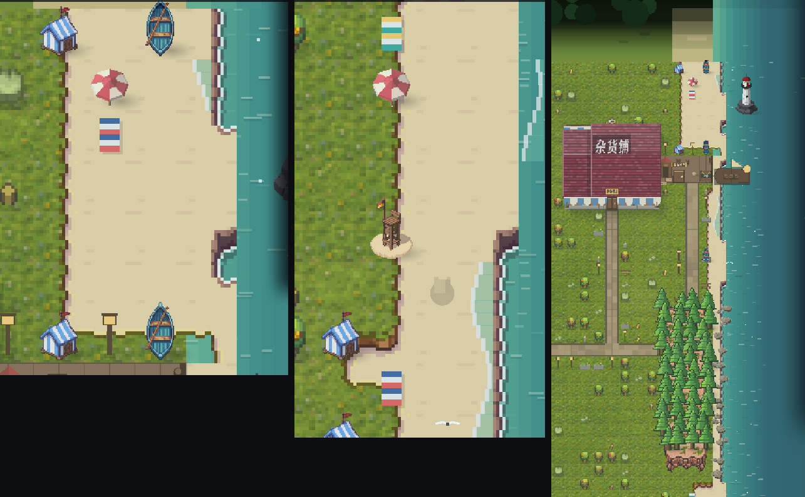

# 183 · 海滨道具：PixelLab 精灵（车道 V，零 sim 金标）

> 触发：用户 2026-09-12「go ahead with the seaside props」（docs/180 §四·1 第三项）。

## 五件（`create_map_object`，basic 模式，high top-down，1× 原生尺寸 = 一格 48px 同尺）

| 文件 | 尺寸 | 替换/新增 | 落点 |
|---|---|---|---|
| `props/tent.png` | 48×64 | 替换程序化条纹帐篷 | 沙滩最内一档、隔行 |
| `props/parasol.png` | 48×48 | 替换程序化阳伞 | 沙滩中档 |
| `props/rowboat.png` | 48×64 | 替换程序化划艇 | 水线一档（稀疏） |
| `props/lifeguard.png` | 48×80 | 新增救生椅 | 南滩正中（`y = h·3/4` 的中档沙格），每镇一座 |
| `props/lighthouse.png` | 96×160 | 新增灯塔 | 北滩外 `y=3` 那行、离岸两格的**海格**上（本就阻挡水）⇒ 读作礁上小岛 |

## 画法（`WorldView._prop_sprite`）

- 有精灵画精灵，缺文件回退到 docs/180 的程序化几何（逐像素回到旧样子）。
- 对地用精灵的 **alpha bbox 底行**（缓存在 `_prop_foot`），不用画布底边——生成图底下常有 5-10px 透明留白，
  按画布对地会让道具浮在沙上。
- 东南软影：一张径向衰减贴图（与树影同源、同向）。
- 同类道具按 `_hash` 挑一半水平镜像，打散重复感。
- 浴巾、沙堡仍是程序化（体量太小，生成图在 1× 下读不出来）。

## 没做（据实）

- **布列塔尼石屋山墙**：屋顶是程序化的整体（docs/180），单独一张山墙精灵没有挂点；要做得先把建筑外观改成精灵拼装。
- **海堤台阶（la digue）**：需要先定海堤走哪条线（沙滩与草地之间一整条），属于地形而不是散件，留给下一刀。
- 花费：5 件 basic map object 共 **5 generations**（余额 4036 → 4031）。
- 图：左 北滩（帐篷/阳伞/划艇）、中 南滩（救生椅）、右 整镇取景里的北滩外礁上灯塔（放大）。
