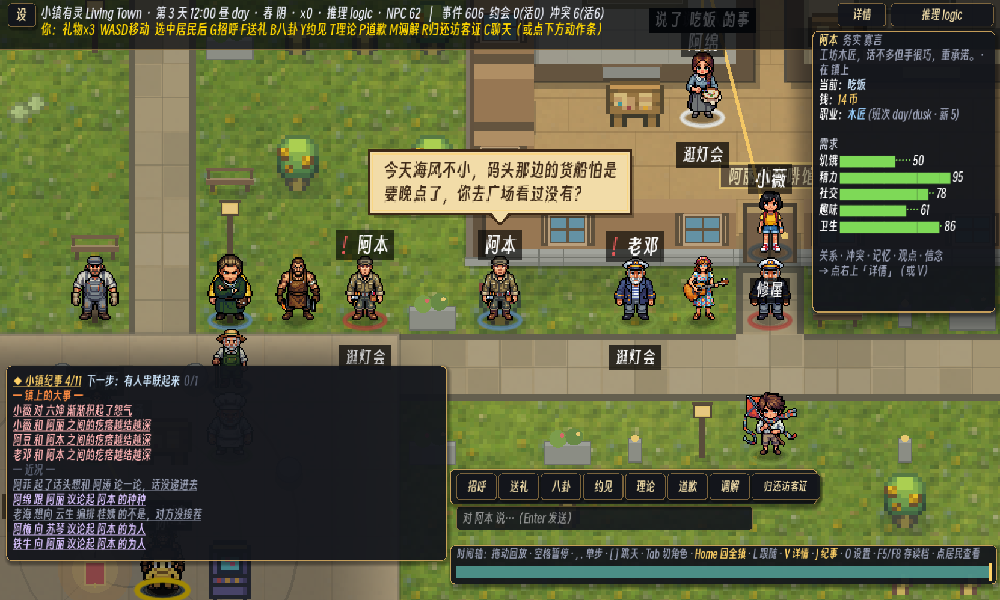

# 184 · HUD 一刀：墨底金边卡片 + 羊皮纸台词气泡（车道 V/UX，零 sim 金标）

> 触发：用户 2026-09-12「go ahead with the HUD pass」。docs/180 §四·4 点名的问题：左下纪事播报的
> 羽化暗角（576×354 的大块黑斜坡）压住约四分之一张地图；对标图的面板是深底 + 金边、对话是羊皮纸气泡。

## 改了什么

- **卡片**（`Main._mk_card / _card_style`）：墨色底 0.90 + 1px 金边 + 7px 圆角 + 落影，**精确包住正文矩形**。
  用在：纪事播报（8,468 564×250）、观察台（名片/卷宗两档都跟 `_sync_obs_panel` 走）、时间轴、玩家动作条。
- **旧羽化 scrim 退成柔影**：`_log_pan / _obs_pan` 仍是同尺寸、同羽化纹理的 TextureRect（`player_touch_test` 守的
  「羽化带在正文之外」「scrim 左/右缘是 alpha 斜坡」两条合同不变），只把 `self_modulate` 压到 0.45 —— 它现在是卡片外的一圈柔影，
  不再是一大块压在世界上的暗区。
- **按钮**（`_style_btn`）：设 / 详情 / 推理后端 / 七个动作 / 归还访客证 —— 墨底暗金边，悬停亮金边，按下暖棕；字色羊皮纸。
- **聊天框**：同一套墨底金边（聚焦时亮金）。
- **顶栏**：底板不变，底边加一道暗金线。
- **台词气泡**（`WorldView._draw_speech_bubble`）：正在说话的居民头顶出羊皮纸气泡——深棕描边 + 金色内线 + 指向说话人的尾巴、深色字，
  176px 折行、最多 3 行（尾行省略号）。**动作牌**（「吃饭」「逛灯会」）仍是脚下的小深色牌，不升级成气泡：
  气泡只留给「有人在说话」这一个信号，不然满屏气泡等于没有气泡。

## 守住的

- 时间轴底色：卡片墨色 0.90 ≥ 原 0.74 档 ⇒ T3 量过的键位提示行对比度只升不降。
- 所有新节点都进了 `_hide_clean_player_diagnostics` 与 `_hide_c1_legacy_hud` 的隐藏清单（clean/C1 两种呈现不漏一块卡片）。
- `player_touch_test`（HUD 几何/羽化/档位合同）PASS 0 fail；`player_agency_test` / `c1_locked_ortho_test` /
  `cafe_guest_access_test` / `s4_replay_test` / `player_replay_test` 全部 exit 0、0 条 SCRIPT ERROR（本机）。
- 眼验用 dev 旗 `--say <id>:<台词>`（`Main.gd`）：出图帧上让某居民说一句，用来拍气泡；只在 `--shot` 分支里生效。

## 没做

- 纪事卡片宽度仍按旧正文框 548px 定——大多数行只用到约 330px，右侧 200px 是空卡。缩窄要同时改 `_logbox` 宽与折行容量（`LOG_HOT_CAP` 一族），留给下一刀。
- 顶栏第二行（玩家模式键位提示）仍是一整行黄字；应当收进「?」帮助卡。
