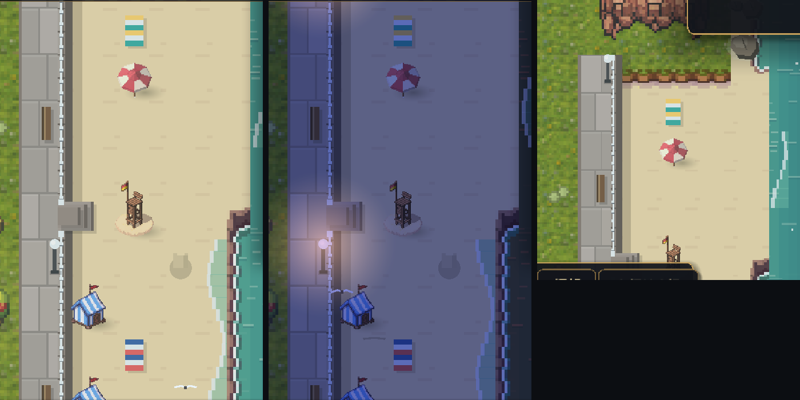

# 185 · 海堤步道（la digue）（车道 V，零 sim 金标）

> 触发：用户 2026-09-12「go ahead with the seawall promenade」（docs/180 §四·5、docs/183 §没做）。
> 参照：Dinard 的 Promenade du Clair de Lune / Saint-Lunaire 海滩后的石砌步道——白铁栏杆、球形路灯、面海长椅、下滩石阶。

## 做法（`WorldView._draw_promenade`，程序化，与镇上街灯/长椅同一套笔触）

- **落点**：沙滩满 `BEACH_DEPTH`（3）格深的行，其背后第一列若是空草格（可走、非路/区/家具/广场）就是步道格。
  当前地图得到南北两段（码头与东松林岬把海岸切成三截，岬角那段没有沙滩）。
- **铺面**：大块花岗岩石板，每格两块、隔行错缝、逐块 `_hash` 明暗 + 受光上沿；西缘一条路缘石。
- **堤岸**：步道东缘压顶石（受光棱 + 接缝）→ 一窄条堤面落在沙格西缘 → 堤脚落影 ⇒ 读出"步道比沙滩高一截"。
- **白铁栏杆**：沿压顶石一条白栏 + 每 1/4 格一根立柱 + 落影；段端收粗柱。
- **下滩石阶**：每 8 行一道（`PROM_STEP_EVERY`），三级踏步伸进沙里，栏杆断开、两侧门柱。台阶那一行沙滩不放帐篷。
- **路灯**：每 6 行一盏白球铁柱灯，夜里进加色光层（`_collect_lights` ⑥）。
- **长椅**：错开 3 行一张，纵向摆、靠背在西、面朝东边的海。

## 与既有层的衔接

- 海岸 Wang 选瓦里，步道格按「沙」参与（`_coast_class`）⇒ 沙↔草的过渡落在步道格里被石板盖住，
  堤脚下第一列就是整块实沙（第一版眼验：堤与沙之间夹着一条草边）。有步道的行不做沙丘线抖动（堤是直的）。
- 步道格上不画散布花草、不画 verge 街具（让位给步道自己的灯/椅）。

## 零金标

步道格本就可走、仍可走；堤面/台阶画在沙格上，不改任何格的可走性；不读 RNG，只读 `_hash` 与 `map.json`。
