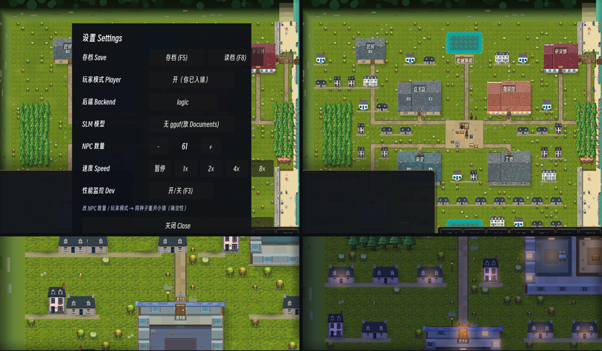

# 186 · 布景民居：PixelLab 石屋 + 屋前小巷（车道 V，零 sim 金标）

> 触发：用户 2026-09-12「continue working on art … building density, building appearances」。
> 整镇取景里 64×48 格只有 7 栋可进的大楼，其余是大片空草地——对标图（my_ai_town）与侯麦的 Saint-Lunaire 都是"一镇的房子"。

上左 改前 · 上右 改后（整镇）；下左 近景正午 · 下右 近景 22:00（门灯）。

## 资产（PixelLab `create_map_object`，basic、high top-down、1× 原生尺寸，与 docs/183 道具同尺）

| 文件 | 画布 | alpha bbox → 地块格 | 母题 |
|---|---|---|---|
| `houses/cottage.png` | 144×144 | 3×2 | 花岗岩渔夫石屋、板岩顶、两端山墙烟囱 |
| `houses/whitehouse.png` | 128×144 | 3×3 | 白灰泥小屋、蓝百叶、绣球 |
| `houses/townhouse.png` | 96×144 | 2×3 | 粉灰花岗岩窄楼、窗台天竺葵 |
| `houses/terrace.png` | 192×160 | 4×3 | 两户联排 |
| `houses/villa.png` | 144×160 | 3×4 | 白色海滨别墅（当前落点算法下没有 4 行高的空位，暂未出场） |

花费 6 generations（余额 4031 → 4025）：另有一张斜 45° 的石屋（与正交网格不合）作废。
Prompt 里写死 "seen straight from the front, flat facade facing viewer" 才出正立面；只写 "3/4 angle" 会出等距斜角。

## 选址：只落在"实跑里从没人站过"的地（零金标的依据）

- `game/bench/walk_heat.gd`：seed 1-8 × N∈{12,24,40,60} × 20 天，逐 tick 统计每个居民所在格（town 坐标）。
- `tools/place_houses.py <heat.json>` → `game/assets/art/houses/lots.json`（生成物，勿手改）：
  地块整块格矩形 + 外扩 1 格须 heat==0、非墙/水/树/阻挡、不压任何 area rect（外扩 1）、离海岸 ≥ 6 格；
  屋底对齐到每 5 行一条"街"（底边下一行是巷），行优先扫、按 hash 挑精灵（别墅/窄楼降权）⇒ 同一份 heat 逐字节同一份 lots。
  当前 48 栋：cottage 24 / townhouse 12 / whitehouse 8 / terrace 4。
- **兜底**：任何人（新 seed、玩家、改了行为的将来版本）走进某栋的精灵矩形，那栋当帧退成 0.30 透明，不会读作"人被房子吞了"。
- Sim 读不到这一层：格子可走性一格没动、不读 RNG，只读 `lots.json` 与 `_hash`。

## 画法（`WorldView._draw_houses`，挂在 `decor` pass ⇒ `AUDIT_PASSES` 不变）

- 精灵按 alpha bbox 对地（底边在地块最后一行的 94%，同道具），按底边排序画（南压北）。
- 西北光：墙脚一条贴地软影 + 东侧一块斜落影（与树/楼/道具同一张径向衰减贴图）。
- 屋前小巷：每栋底边下一条碎石巷，同一行间隔 < 1.2 格的连成一段 ⇒ 散落的房子读作"一条街"。只是地面颜色。
- 花草散布与 verge 街具在民居格上不画（布局不变）。
- 夜：约六成人家亮一盏门/窗灯（加色光层 ⑦）。

## 顺带修掉的 bug：负宽镜像

`draw_texture_rect(tex, Rect2(x + w, y, -w, h))` 在 Godot 里**不会**镜像到 [x, x+w]，而是整张右移一个宽度。
夜图眼验抓到（镜像的民居比它自己的门灯偏右 2.4 格）；docs/183 的镜像帐篷/阳伞同病（偏右一个精灵宽）。
统一改走 `_draw_mirrored`（`draw_set_transform` 负 x 缩放）。

## 验收回执（本机 Windows + Godot 4.6.2）

- `tools/ci.sh` 第 5 步的 22 个 headless 场景：**22/22 exit 0、0 条 `SCRIPT ERROR`**（工作树）。
- `assert_daynight.py` 本机近似（seed 3、tick 488/600、`--shot-fit`、opengl3，非 docker mesa）：**PASS**，
  正午主色 (117,141,54) 仍是草地，夜帧 dmax=1。
- `--shot` 全程 0 条 `SCRIPT ERROR`。

## 没做 / 风险（据实）

- **视觉门没跑**（本机无 docker/Xvfb）。docs/180 的草甸色斑刚因 DAYNIGHT/SEASON 门取"世界主色"而撤掉（8f55a60）；
  民居同样把一部分草地像素换成了屋顶/墙色，**可能**再次推动那两道门的主色判定——需在 docker 上实跑确认。
- 别墅没出场；也没做屋前花园篱笆、屋后菜园。
- heat 只覆盖默认场景；`--scenario` / 节日 / 玩家可能走到别处——靠 0.30 透明兜底，不是保证。
