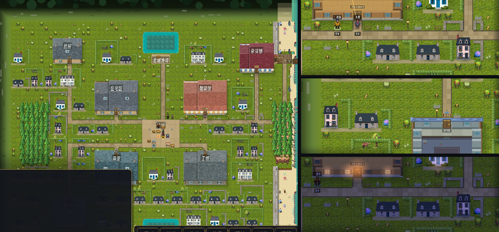

# 188 · 园子与绿篱（车道 V，零 sim 金标）

> 触发：用户 2026-09-12「go ahead with the gardens and hedges」（docs/186 §下一刀·1）。
> 布列塔尼小镇的屋子不是孤零零立在草地上：屋后菜畦、晾衣绳、苹果树，四周一圈修剪的黄杨绿篱或干砌花岗岩矮墙，门前绣球。

## 资产（PixelLab `create_map_object`，basic、high top-down、1×，`game/assets/art/gardens/`）

| 文件 | 画布 | 占格 |
|---|---|---|
| `hydrangea.png` 蓝粉绣球 | 48×48 | 1 |
| `veg.png` 卷心菜/韭葱菜畦 | 96×48 | 2 |
| `laundry.png` 晾衣绳（白床单 + 蓝条纹衫） | 96×64 | 2 |
| `apple.png` 小苹果树 | 64×80 | 1 |
| `barrow.png` 木手推车 + 陶盆 | 48×48 | 1 |

花费 5 generations（余额 4025 → 4020），无废稿。

## 落点（`tools/place_houses.py` → `lots.json` 的 `gardens`，与 docs/186 的民居同一份生成物）

- 每栋一个园子 = **屋后 1-2 行 + 屋两侧各 1 列**，能占多少占多少；所有园子格都在 walk_heat 实跑里 heat==0，
  不压任何房子、任何巷行、别家园子。48 栋 → 48 个园子（屋后 2 行 5 个 / 1 行 21 个 / 只有侧列 22 个）。
- 园中物：屋后那一行从左到右按 hash 摆（两格的菜畦/晾衣绳、一格的苹果树/绣球/手推车，约 1/4 留空）；侧列底格按 hash 放绣球。
- 民居 lots 一格未变（园子在房子全落完之后才算）。

## 画法（`WorldView._draw_gardens`，在 `_draw_houses` 里、巷之后房子之前 ⇒ `decor` pass，`AUDIT_PASSES` 不变）

- 园里草：深一档的修剪草坪 + 隔行割草纹。
- 外沿**北、西、东**三面：约 2/3 园子是**黄杨绿篱**（深绿体 + 逐段圆叶簇 + 西北受光棱 + 东南落影），
  1/3 是**干砌花岗岩矮墙**（错缝石块、顶上一线苔）。南面敞开对着巷；贴着自家屋身的那条边不画。
- 石街格运行时剔除：`_build_paths` 的门→广场石街可能没人走过（heat=0），园子格与园中物遇到石街/广场格一律不画。
- 园子格并入 `_house_cells` ⇒ 野花草/街具不散进园子。

## 零金标

只画、不写：可走性一格不动，不读 RNG；布局只读 `lots.json`、`_hash_mix`、`_path_set`。
