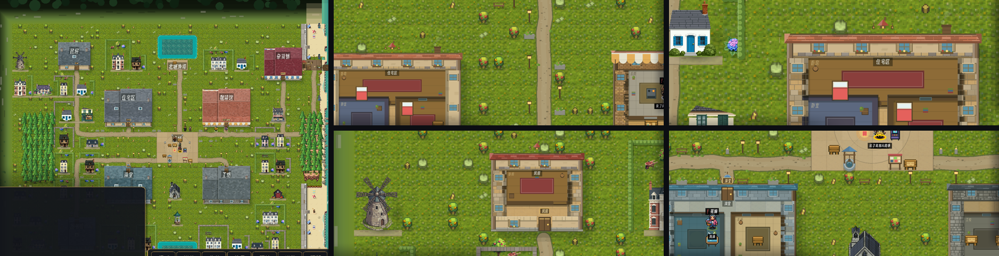

# 189 · 有机路网 + 外墙砌体 + 建筑多样性（车道 V，零 sim 金标）

> 触发：用户 2026-09-12 三条反馈：
> 1. 路和铺面太正交、太直，不自然；
> 2. 新加的房子缺辨识度，要变体、新设计、新设施；
> 3. 拉近掀顶后外墙很别扭，材质要打磨。

## 一、有机路网（`WorldView._build_roads / _draw_roads`）

`_path_set`（门→广场的连街格）与可走性**一格不动**，只换画法：

- 路格当图节点、四邻路格/广场格当边；节点按 `_hash_mix` 微摆 ±0.12 格；
- **L 形拐角节点往弯内侧拉 0.34 格** ⇒ 直角变成弧；
- 三层粗线 + 节点圆：暗色路肩（混一点草色）→ 暖石土路面 → 中间一道略亮的踩踏带；
- 沿每条边撒碎石/鹅卵石颗粒（三档明暗），路沿随机压几簇草 ⇒ 边缘不是一条尺子画的线。
- 旧的"每格方石板 + 四边路缘石"三趟画法删除（`paths` 审计 pass 名保留）。

## 二、外墙砌体（`WorldView._draw_wall_cell`）

旧：每格一块平涂主色 + 顶 22% 亮带 + 底 14% 暗带 ⇒ 掀顶后外墙是一圈带条纹的色块，每 48px 断一次。
新（仍以 `BLD_PAL` 的 face/top/foot 为底 ⇒ 四类一眼可分的锚不动，只在同一色族里加纹理）：

| 类型 | 立面 | 墙顶（东西竖墙俯视所见） |
|---|---|---|
| 住宅 | 白灰泥罩面 + 花岗岩勒脚 | 暖色花岗岩琢石 |
| 商业 | 暖色小砖 | 同 |
| 公共 | 规整大块琢石 | 同 |
| 工坊 | 毛石乱砌 | 同 |

- 横墙：上 30% 是**压顶石**（受光外沿 + 接缝 + 挑檐落影），下面是立面；转角格压一列**长短交替的角石**。
- 竖墙：整格按材质砌，朝屋内那侧一条内立面落影、朝外一线受光棱 ⇒ 读作有厚度的石墙。
- 砌块按**世界坐标**错缝 ⇒ 跨格连续；明暗只读 `_hash_mix`（确定性）。

## 三、建筑多样性（PixelLab `create_map_object`，11 generations，余额 4020 → 4009）

新增 10 张（`game/assets/art/houses/`）：

| 可重复民居 | 全镇一座的设施（先落位，按"最合适的地方"打分） |
|---|---|
| `longere` 粉花岗岩长屋 · `ochre` 赭黄窄楼（铁艺阳台） · `halftimber` 木筋屋 · `belleepoque` Dinard 美好年代别墅（尖塔） | `chapel` 花岗岩小教堂（离广场最近） · `bandstand` 铸铁乐亭（广场南） · `windmill` 石风车（镇北缘） · `netshed` 渔网棚（最靠海） · `bakery` 面包房（住宅区去广场的路口） · `creperie` 可丽饼店（北滩后） |

面包房第一版招牌字是乱码 "BAIKERY"，重出一版（prompt 写 "no text"，模型仍写了正确的 "BAKERY"）。

`tools/place_houses.py`：设施先落；民居每种封顶 7 栋（别墅 3），**同一行相邻两栋不用同一张**；设施不带私家园子。
结果 38 栋 14 种（原 48 栋 4 种）——栋数少了，是因为新房型更大，且都守着同一条"只落在没人站过的格"规则。

## 验收回执（本机，c348e58 干净 worktree）

- `tools/ci.sh` 第 5 步 22 个 headless 场景：**22/22 exit 0、0 条 `SCRIPT ERROR`**。
- docker 视觉门 `LT_VISUAL=require bash tools/visual_gate.sh`（`gamecraft-runner:4.6.2`）：rc=0，0 条 FAIL/SKIP；
  DAYNIGHT / SEASON / PRECIP / ROUNDTRIP×3 / FLOOR ROUNDTRIP 全 PASS。
- 互补锚 ledger 已重烘（fa14d46）。

## 零金标

只画、不写：`_path_set`、`blockers[]`、可走性一格不动；不读 RNG；布局只读 `lots.json` / `_hash_mix`。

## 已知、不在本棒

- `Main.gd:3290` `_probe.handle_input` 在 `_probe == null` 时收到输入会报 `SCRIPT ERROR`（出图窗口被鼠标划过时偶发），
  与本棒无关（本棒未改 Main.gd），另开任务。
