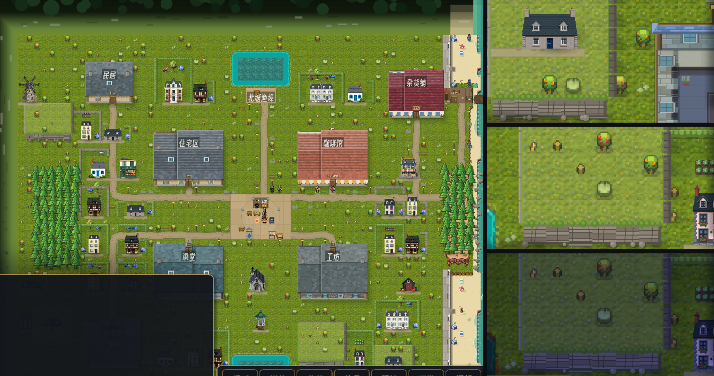

# 191 · 高差：花岗岩台地与崖面（车道 V，零 sim 金标）

> 触发：用户 2026-09-12「go ahead with the elevation and cliffs」（docs/186 §下一刀·3）。
> 对标 my_ai_town：地形有台地崖面，镇子不是一张平铺的草皮。

## 选址（`tools/place_houses.py` → `lots.json` 的 `terraces`）

- 规则与民居同源：**台地格、它南沿下面两行（崖面 + 崖脚影）、外扩一格**，全部必须在 walk_heat 实跑里 heat==0，
  且不压任何区（外扩 1）、不压石街/广场（离线复刻 `_build_paths`）。
- ① **北缘台地带**：逐列数"从 y=0 往下连续空闲几行"，台地深 = 空闲行 − 2，**不足 4 深不抬**、相邻列落差 ≤1、短于 5 列的段不要。
  （这张图北缘被北池/码头连街占着，本版实际没有落出北缘带。）
- ② **草甸小丘**：按 hash 次序挑 5-8 宽 × 4-5 深的矩形，最多 4 座。本版落出 4 座、共 99 格。
- 台沿一圈与崖面/崖脚三行记为**禁建**，民居与园子避开；**台地内部可以建房**（本版有 2 栋小屋坐在丘顶）。
- 运行时再防一道：台地格或它下面两行碰到石街/广场/区 ⇒ 这一格不抬（迭代到稳定）。

## 画法（`WorldView._draw_terrace_tops / _draw_terrace_faces`，程序化）

**第一、二版用 docs/182 的 PixelLab Wang 崖瓦，据实记下为什么弃用**：那套瓦四面都画岩沿，
2 深的台地只剩一圈岩边、读作"一条面包"；4-5 深的小丘读作"围了一圈土的畜栏"，南崖面只有一线，看不出高。
东岬松林的台地（docs/182）不动，仍用那套瓦。

- **顶面**（草地 pass 里、房子之前画）：暖受光一层；北沿（远侧台沿）一线亮草 + 一道细岩棱。
- **南崖面**（下一行上 0.88 格）：粉灰花岗岩层理（逐层 hash 明暗 + 层缝）、两道竖向裂隙、东端转角暗面、崖脚暗线；
  顶上一排圆草簇垂过崖沿、部分挂苔痕；崖脚散乱石；再往南/东南落一块软影（西北光，与树/楼同向）。
- **东侧**：一条背光岩坡（两档暗 + 横纹）+ 往东的软影；**西侧**：一条窄而亮的受光岩坡。
- 崖面格并入 `_cliff_face` ⇒ 野花草不散上去。

## 零金标

只画、不写：`blockers[]`、可走性一格不动，不读 RNG；布局只读 `lots.json`、`_hash_mix`。
