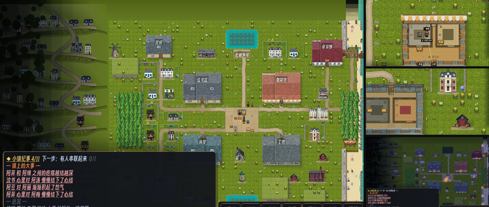

# 192 · 分区、大体量设施、西坡上城（车道 V，零 sim 金标）

> 触发：用户 2026-09-13「keep working on Known limit（docs/191 的高差读不出来）；镇子应当有分区与街道——商业、住宅、工业；
> 多一些建筑群；注意视觉层级与尺度；路要有曲率、顺着地形与地理走」。

## 一、先量清楚"界外能被看见多少"（决定了做在哪）

`ProbeController.CAM_MARGIN = 96`：相机边界只比地图宽 96px（2 格）⇒ 拉近时界外永远只露 2 格；
**只有整镇取景（fit）时，视口比地图宽，西侧 letterbox 露出约 14 格纵深**（东侧是海）。
第一版把"上城"做在北坡、工业区做在南面——实拍发现玩家根本看不到（北/南各只露 1.5 格，还压在 HUD 下），已删；
**高差与上城整体搬到西侧**。

## 二、西坡上城（界外静态层 `_draw_outer_town`）

- **8 级花岗岩台地**（每 6 格一级，崖沿是两层正弦叠出的缓弯曲线，不是尺子线）：顶面**越往北越亮**（越高越先见天光）、
  逐顶点与镇边地面环融合（贴镇边无接缝，往西才显出台地明暗）；每级南崖面 = 层理 + 草唇 + 崖脚线 + 往南落影；
  崖面高在贴镇边 2.5 格内收口到 0 ⇒ 读作"山坡在镇边落平"。
- **路顺地形**：每级崖沿后一条**等高线街**（随崖沿弯）；一条 **Catmull-Rom 蛇行盘山路**从镇西口斜切过每一级崖面上坡，另一条下坡去南。
- **一排排面朝南（看海）的房子**沿等高线街排；高处放地标：**教堂**（第 2 级）、**市政厅**（第 3 级）、**大酒店**（第 5 级）。
- **视觉层级 = 大气透视**：界外离镇 1 格起压暗压灰、12 格压满 ⇒ 可玩区永远是画面里最亮最饱和的那块；
  地标体量大一档（教堂 5 格高、酒店 5×4）⇒ 尺度层级 地标 > 设施 > 民居。
- 地面：由镇边往外一圈圈压暗的草色环，取代 docs/44 那道"三格内压到黑"的斜坡（那道黑圈正是"镇子是一座孤岛"的读法）。
- 纯画、只在界外层（静态缓存：只随相机/季节/天气重画 ⇒ VOIDGATE 不受影响）；布局只读 `_hash_mix`，与相机无关。

## 三、镇内分区（`tools/place_houses.py`）

- `DISTRICTS`：**商业**＝以 (36,17) 为心 12 格（广场/咖啡馆/杂货铺一带）；**工业**＝以 (44,36) 为心 9 格（工坊/滩头一带）；其余**住宅**。
  每区只从自己的房型池挑：商业＝赭黄窄楼/联排/美好年代楼/面包房/可丽饼店；工业＝仓库/网棚/长屋；住宅＝各式民居。
- **大体量设施**（先落位、按"最合适的地方"打分）：**室内市场 halles**（离广场最近的空地）、**大酒店 hotel**（北滩后）、**罐头厂 cannery**（工坊边）。
  设施不带私家园子。结果：镇内 27 栋（设施占地大，栋数比 docs/189 少；仍只落在"没人站过"的格上）。
- **路面随区换材质**（`WorldView._district_road_col`，与 DISTRICTS 同一份圆心/半径）：商业＝浅色石铺、住宅＝土路、工业＝灰碎石，边界 2 格内渐变。

## 资产（PixelLab `create_map_object`，6 generations）

`hotel`（256×224）、`church`（160×256）、`halles`（224×160）、`mairie`（192×192）、`warehouse`（224×160）、`cannery`（224×224）。
hotel / church / cannery 出图带不透明底色，用四角洪泛填充去底（容差 24）。

## 验收回执（本机，干净 worktree）

- `tools/ci.sh` 第 5 步 22 个 headless 场景：**22/22 exit 0、0 条 `SCRIPT ERROR`**（4d033ee）。
- docker 视觉门 `LT_VISUAL=require bash tools/visual_gate.sh`：**第一次跑 POND 门红**——
  界外地面第一版整段用粗环（每环约 5px 平涂一色），POND 门的"池周草色众数"取样环伸出地图上沿约 1 格，
  平涂像素压过了有纹理的真草 ⇒ 草众数从 (50,66,43) 变成 (41,56,27)、夜帧 0 条完整剖线。
  修法（b79b5a3）：贴边 3 格内恢复 docs/44 verge 的逐像素渐变，粗环只用在 3 格以外。
  重跑：rc=0，DAYNIGHT / SEASON / PRECIP / POND / ROUNDTRIP×3 / FLOOR ROUNDTRIP 全 PASS；POND 的草众数与剖线数回到 docs/191 的同值（昼 60 条 / 夜 55 条）。
- 互补锚 ledger 已在修复后重烘，`gate_complement_guard.py` rc=0。

## 零金标

只画、不写：可走性一格不动，不读 RNG；界外层只读相机/季节/天气。
