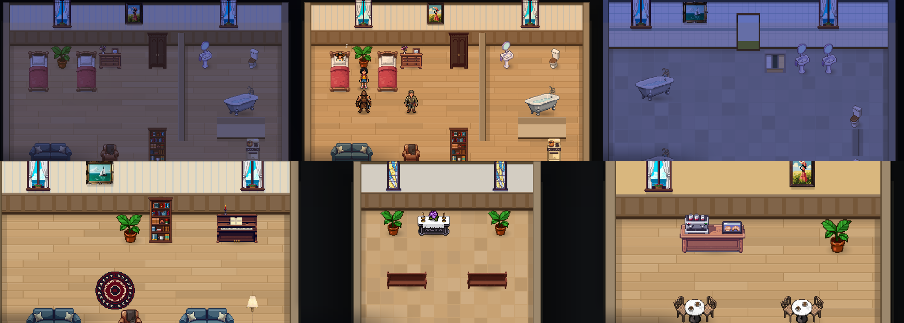
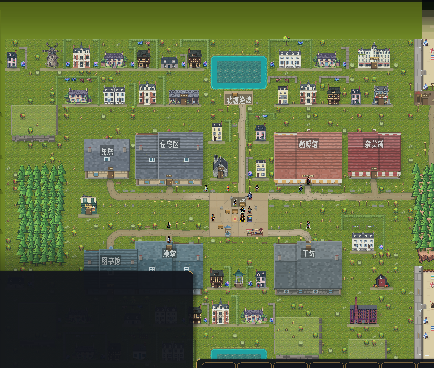
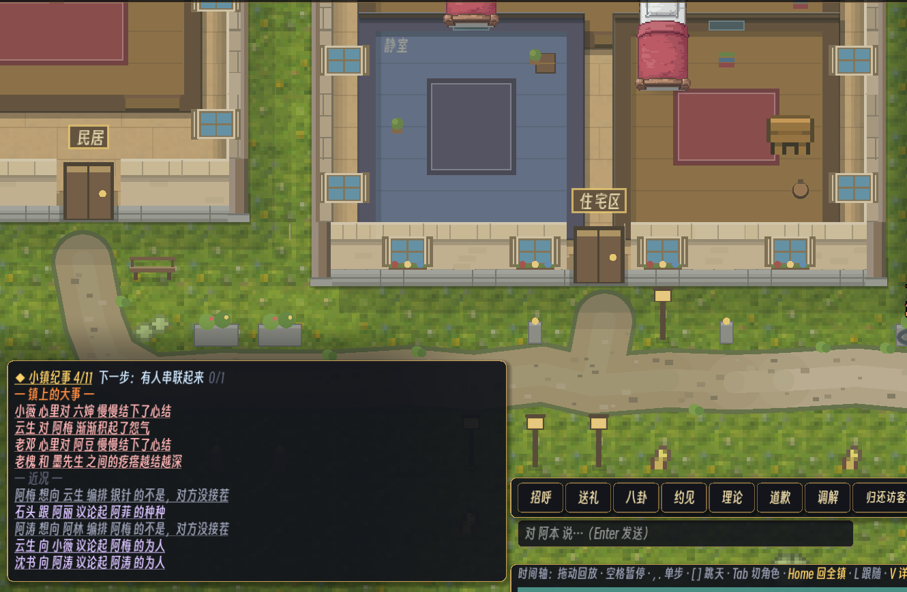

# 193 · 室内、会用的家具、更紧的镇子（车道 V + 有意移动 sim 金标）

> 触发：用户 2026-09-13「continue on Art, UI/UX and visual design」六条：
> ① 墙像豆腐块（尤其切顶俯视的室内）② 室内要有规划、设计与装饰 ③ 道具要能真的用——在桌上吃饭、在浴室洗澡、上厕所、看画
> ④ 走路时脸朝错方向 ⑤ 建筑群与街区更靠近 ⑥ 布景建筑要落实、能用。
> 视觉标准 mewamew/my_ai_town，色调侯麦《四季》；PixelLab 作资产工厂。
> ③⑤⑥ 必然改 sim（新对象、新导航、新地图），开工前问过用户：选「允许并重烘金标」。

上排：住宅区（深夜有人睡在床上 / 早晨）、澡堂；下排：海滨大酒店、礼拜堂、面包房。seed 3 第 3 天，`--probe-space <id> --shot-fit`。

整镇取景：民居/杂货铺/图书馆挪到中央街区旁，41 栋实体房子（门口有招牌的是能进的设施）。

切顶俯视：竖墙只剩 0.34 格厚的墙顶，床换成家具精灵。

## 一、走路朝向（纯 View）

两个原因叠在一起：

1. **Sim 的路径是 4 连通的**（`_step_toward` 先 x 后 y；A* 的"斜线"是 E,S,E,S 的阶梯）。旧版逐步取向 ⇒ 斜着走的人每一格在"朝东/朝南"之间翻身。
   现在朝向取**最近 4 步的合位移**的 8 向（`WorldView._face_step`）：阶梯恒为 (2,2) ⇒ 稳定朝东南；拐角 (3,1)→(2,2)→(1,3) 逐步转过去。
   换 Space/Floor、瞬移（≥3 格）不算一步、不转身。
2. **两张 PixelLab 表本身有错**：`qin` 的 E/NE/NW/W 静止帧与行走帧朝向相反（`tools/fix_char_facing.py` 用该行最"并拢"的行走帧替换静止帧）。
   24 张表逐行比对"行走帧更像静止帧还是它的镜像"，只有 qin 是真错；`tao` 的 SW 被判红是假阳性（麻袋换了肩，脸与步伐方向是对的），记在脚本里。
3. 玩家用的 Puny 4 向表：横着走一直用的是第 1 行（正面走），改成第 2 行（侧面，朝左镜像）。

## 二、墙（纯 View）

- **切顶俯视的镇上建筑**：东西两侧竖墙原来整格砌满（48px 宽实心石条 = 用户说的豆腐块）。现在只画贴屋外一侧 0.34 格厚的墙顶（琢石压顶 + 受光棱 + 朝屋内落影），其余露出下面本来就铺好的室内地板；两侧都是室内（隔墙）时居中（`_draw_wall_thin_v`）。
- **室内 Space**：四圈整格砖块改成
  - 后墙 = 一面**有高度**的墙（往 bounds 上方长 0.85 格）：墙纸 + 护墙板 + 踢脚线 + 檐口，按房间用途换墙纸（起居：奶油底淡蓝细条纹；咖啡/面包：赭黄；浴室：白瓷砖 + 蓝腰线；书房：鼠尾草绿；礼拜堂：刷白花岗岩）；
  - 侧墙/前墙 = 0.30 格厚的墙顶，前墙以下是屋外暗处，门格画门槛与门垫；
  - 隔墙 = 家具清单里的 `slot:"wall"` 格（竖向画一道薄墙顶，横向画一小段带墙纸的立面）；
  - 木地板 = 1/4 格宽长条板、1.5-3 格错缝、逐板明暗；石地 = 半格方砖逐块明暗。
- 楼层标签挪到前墙之下（原位置现在是护墙板；檐口之上又被 HUD 顶栏盖住）。

## 三、室内规划与装饰（`tools/furnish_interiors.py`）

六栋生成的室内按手工规划重排，并放大 bounds：

| Space | 尺寸 | 规划 |
|---|---|---|
| home 住宅区 | 9×7 → 12×9 | 西卧室（两张单人床、五斗柜、衣柜、盆栽）· 东北浴室（隔墙 + 门洞：洗脸台、马桶、浴缸）· 东南厨房餐厅（灶、水槽、四人餐桌）· 西南起居角（沙发、扶手椅、书架、地毯、落地灯）· 后墙两扇窗一幅画 |
| home2 民居 | 6×5 → 9×7 | 双人床、五斗柜、角落卫生间（隔墙：马桶、洗脸台）、灶与水槽、小圆桌、扶手椅 |
| wash 澡堂 | 9×7 → 11×8 | 两只浴缸、一排洗脸台、两格厕位（隔板）、毛巾架、长凳、海景画 |
| work / shop / library | 9×7 | 工作台+工具；四排货架+柜台；四个书架+两张书桌+阅读角 |

- 家具条目新增 `size:[w,h]`（前左格 + 向后墙长），`Sim._build_interior_grids` 按占地挡满格。
- 校验（脚本内）：所有可走格都与门 4 连通；每件带 advertises 的家具都有可达的正交邻格（Sim 用曼哈顿≤1 起用）。
- 咖啡馆是手工精修的（AM1 门在读它）：只给后墙加画与窗、把 1F 吧台放宽成 2 格吧台精灵，不动任何可走格。

### 资产（PixelLab `create_map_object`，basic、high top-down、1× = 一格 48px，`game/assets/art/furn/`）

双人床、单人床、浴缸、马桶、洗脸台、四人餐桌、小圆桌、灶、水槽、衣柜、五斗柜、沙发、扶手椅、书架、货架、钢琴、工作台、落地灯、盆栽、波斯地毯、
咖啡吧台、写字台、两幅画（海与帆、撑伞的女人——侯麦的海边与夏天）、带窗帘的窗、礼拜堂长椅、祭台、市场摊位、彩色玻璃窗：**29 件 / 30 generations**（浴缸第一版全白重画一次）。

## 四、用家具的样子（纯 View，`_use_pose` / `_draw_pose`）

居民在**用**一件家具（`option.kind=="object"` 且 `phase=="use"`）时按家具的 slot 摆姿势：

| 姿势 | 家具 | 画法 |
|---|---|---|
| 躺 | 床 | 人移到床上，只露头枕在枕头上，被子盖着身子；头顶飘 z |
| 泡 | 浴缸 | 露头肩 + 水线 + 三缕热气 |
| 坐上去 | 马桶、沙发、扶手椅、长椅、礼拜堂长椅 | 人移到座位中心，腿被座面挡掉 |
| 坐在桌边 | 餐桌、小圆桌、书桌、吧台 | 原格坐低 6px、腿被桌沿挡掉、面朝桌 |
| 面朝它 | 画、书架、窗、灶、水槽、洗脸台、工作台、钢琴、祭台、摊位 | 转身面对，1px 起伏 |

## 五、更紧的镇子（改地图 ⇒ 移金标）

- `tools/relocate_buildings.py`：三栋被 gen_town 放在地图三角"远荒野"的建筑挪到中央街区旁——
  民居 (9,4)→(11,14)（住宅区西邻，隔一条巷）、杂货铺 (49,5)→(47,13)（咖啡馆东邻）、图书馆 (9,38)→(11,29)（贴着澡堂西墙，门改朝南）。
  墙环/blockers/门/街门 portal/房间 rect 一并跟着走；`audit_map.py` 的扩容 anchor 质心有意改冻。
- `tools/place_houses.py --solid`：镇上的 PixelLab 房子不再只落在"实跑里没人站过"的格上——
  占地写进 `map.json solid_lots`，`Sim._solid_prop_cells_in_world` 把它们挡进导航网（人绕着走），
  于是只需避开最繁忙的三成格（行人主干道）+ 原有硬避让；每放一栋做一次全镇 BFS，不许切出孤岛。27 栋 → 41 栋。
  台地沿用上一版 lots.json 的那一片（docs/191 眼验过的）。
- `game/bench/walk_heat.gd`：只统计 town 平面上的居民（室内局部格混进来会把地图西北角记成"最繁忙"）。

## 六、布景建筑落实（`tools/realize_facilities.py`）

`--solid` 在第一栋面包房 / 可丽饼店 / 礼拜堂 / 室内市场 / 大酒店的屋底中格留一格门；本脚本给它们各建一个室内 Space + 街门 portal + 家具：

| 设施 | 能做的事 |
|---|---|
| 面包房、可丽饼店 | 小圆桌「吃饭」（与咖啡馆同名动作 ⇒ 价格/库存/三餐统计一视同仁）· 墙上的画「赏画」 |
| 礼拜堂 | 长椅「静坐」、祭台「祈祷」 |
| 室内市场 | 摊位「逛集」 |
| 海滨大酒店 | 钢琴「弹琴」、沙发「歇着」、墙上的画「赏画」 |

## 七、sim 改动与一处 livelock

新增的对象都是普通的 advertises（没有新机制）。实跑第一轮 S0 12 个 seed 里 7 个硬 #01 红，逐 tick 追出一条**原本就潜伏**的 livelock：

- 饿到 0 的人站在两张床之间，候选里"睡觉"（energy 36，刚好 ≥ SURVIVAL_GATE）分数最高 ⇒ 选中；
  下一 tick「承诺 pre-empt」（另一需求 < PREEMPT_CRISIS 且当前 need 不急）把它中止；再选中……53 天没出家门。
  以前家里只有床、吃饭必须出门走行程，这个组合碰不到；家里有了餐桌才暴露。
- 修法（`Sim.gd` 决策入口）：危机中（min_need < PREEMPT_CRISIS）候选与 pre-empt 用同一把尺，先滤掉"不急的事"；一个救急候选都没有时保持原集合。

修掉 livelock 之后第二轮仍是 11/12 硬红，形状换了：**居民不出门了**。第一版把吃（餐桌）、洗（浴缸/洗脸台）、赏画、闲话家常都放进了家里，
而且数值与外面同一量级 ⇒ 家里什么都有 ⇒ 上工归零、镇库全线断链（#40 0/12：produce=40 consume=130），fun/social 触底
（社交候选在任一需求 < SURVIVAL_GATE 时整个关掉，出不了门就遇不到人）。这正是 `buildings.json _furnish_note` 早就量过的那件事的放大版。

⇒ **家里只保留三样能用的东西**：床（睡觉，原有）、沙发/扶手椅（歇着 fun 28 = 旧模板里住宅桌子那一条，换了件家具）、马桶（如厕 hygiene 22，6 tick）。
餐桌、浴缸、洗脸台、画在家里都只是摆设。**出门的理由留在外面**：吃在咖啡馆/面包房/可丽饼店的小圆桌上，泡澡在澡堂，看画在澡堂/酒店/咖啡馆/面包房，
静坐在礼拜堂，弹琴在酒店，逛集在市场。「在桌上吃饭 / 在浴室洗澡 / 上厕所 / 看画」四件事都有了，只是不全在自己家里——这也更像一个海边小镇。

## 验收回执

TBD（S0 金标重烘、ci.sh 第 5 步场景、docker 视觉门、互补锚 ledger）。
