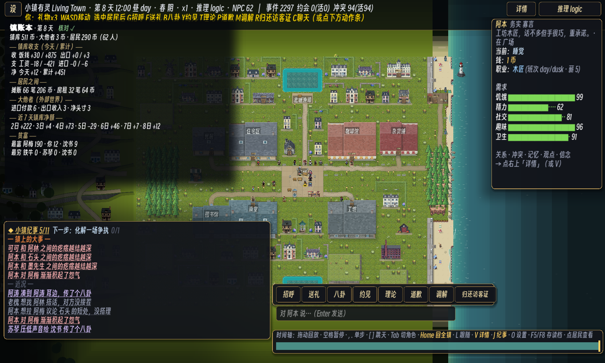

# 195 · P0 镇账本：钱的流水是 event_log 的纯折叠（零 sim 金标）

> 触发：用户 2026-09-13 审过 [194 服务业小镇设计稿](194-town-economy-and-society-design.md) 后说"open the PR, then start P0"。
> 本片 = 194 §四 的 **P0 账本视图**：之后每一相（家计、进口转向、服务业、镇公所、银行……）的效果都能在这张表上直接看见。

## 一、玩家看到什么

- **U 键**开合"镇账本"面板（与纪事 J / 故事 K 同一槽位、互斥）。内容：
  - 表头：第几天 + **核对 ✓/✗**（✗ 时写出第一条对不上的账户）。
  - 三个账户余额：镇库、大他者（外部世界）、居民合计（人数）。
  - **镇库收支**（今天 / 累计）：收 = 饭钱、出口；支 = 工资、进口；净额。
  - **居民之间**：摊贩、房租的笔数与金额（这两类钱不经镇库）。
  - **大他者**：进口付款、出口收入、净头寸。
  - **近 7 天镇库净额**，**贫富**（最富 / 最穷各三人）。
- dev 旗 `--ledger`：启动即打开面板（出图眼验用；上图是 `--seed 1 --warmup-tick 1800 --shot-fit --ledger`，桌面默认 NPC 62）。

## 二、怎么做的

1. **`Sim.transfer` 给每条 `pay` 事件记上 `amt`**（一行）。此前 pay 事件只有 付款人/收款人/reason，**没有金额**——
   账本从 event_log 根本折不出来（#45 是靠"单价 × import 事件件数"绕着算的）。
2. **`game/scripts/Ledger.gd`**：纯折叠，增量 `sync(event_log)`；按 reason 前缀分类
   （Sim.gd 里恰好六个 `transfer` 调用点：`price:` 饭钱、`buy:` 摊贩、`wage:` 工资、`rent`、`import*`、`export*`）。
   回放（goto_tick）或读档让 event_log 变短/换了内容 ⇒ 尾事件指纹对不上 ⇒ 自动从头重折。
3. **核对**（`Ledger.verify`，docs/194 §三"账本 = event_log 的纯折叠"）：每个账户
   `现余额 − 折叠净流入 == 开局额`（开局额只由数据决定：居民 `economy.start_coin`、镇库 `town_start`、大他者 0）；
   每条 pay 都带 amt；有流水的账户都在账户表里。**绕过 transfer 改钱 ⇒ 必红。**
4. **Main 只在面板开着时折叠**（关着零开销；打开那一刻一次追平），且只在 `Ledger.rev` 或"天"变了时重排文字。

## 三、为什么零金标

`amt` 不在任何哈希的字段串里：`Inv.digest`、`Inv.chain_step`、`Sim.event_digest` 都只拼
id / type / actor / target / accepted / subject / tick / witnesses / note / txid。
存档是整条 event_log 原样写出，读档后账本照样能折叠核对。**没有新 Sim 字段**（不涉及 `SAVE_LOAD_DENY`）。

## 四、门

- **新场景 `ledger_test`**（进 ci.sh 第 5 步）：
  - LF：seeds 1-3 × 8 天（N=12）+ seed 1（N=16），账本核对全绿、每条 pay 的 amt > 0；
  - LI：边跑边增量 sync（每 7 tick 一次）≡ 跑完一次性折叠；
  - LC（判别力）：饭钱/工资/房租逐 seed 都有；进口/出口在全体 run 里都出现过；
  - LN（负对照）：①直接改一人 coin ⇒ 红、改回复绿；②抹掉一条 amt ⇒ 红；
  - LR：存档读档后核对仍绿且与存档前相同、续跑一天仍绿；goto_tick 回退后增量实例自己重折 ≡ 一次折叠。
- 本机实测：`ledger_test` PASS 0 fail，无运行期错误行。全套 CI 回执见 §五。

**没做成硬不变量（#47）的理由**：新硬 ID 要同时进 `Invariants.HARD_IDS`、`gate_fixture_audit.py` 的副本和 complement 账本的 SPEC；
一个 CI 场景同样是硬门、而且能做负对照与读档/回放臂。等 P1 引入账单/家当这些新钱路时，再评估要不要升格成不变量。

## 五、验收回执

本机全套 `GODOT=… bash tools/ci.sh`（2079 s）：**CI PASS ✅**。其中：
- **S0（seeds 1-12 × 60 天，det 3）：金标一致 12/12 seed（含逐 tick 前缀链）** ⇒ 零 sim 金标的直接证据；硬不变量 12/12、软门 ≥11/12。
- 4a N=16 池尺度门 PASS；4b LOD、4c DetGate（金标 16/16）、4d BackendGate、4e ModelPathGate、4f VoiceGate、4g #43、4h state_projection 全 PASS。
- 第 5 步 26 个场景（含新 `ledger_test`）全 exit 0；第 6 步视觉门全 PASS；互补性守卫 PASS。
- 改时间轴提示（加「U 账本」、去掉「点居民查看」以免溢出）后复跑 `player_touch_test`、`ledger_test`：PASS 0 fail。

## 六、已知限制

- **docs/195 之前的存档**：里面的 pay 事件没有 amt ⇒ 面板表头显示"核对 ✗ N 条 pay 事件没有 amt（旧存档）"，金额类数字偏小。新局或读档后新发生的流水照常。
- **生活模式**（docs/190）没有接 U 键——生活模式有自己的输入表；等 P1 家计（居民自己的账单）时一起做"我的账本"。
- 开局额按"全员同 `start_coin`"核对：今天只有一个发钱点（`Sim._make_agent`）。P1 起若有人开局带不同的钱，`Ledger.expected_opening` 要跟着改。
