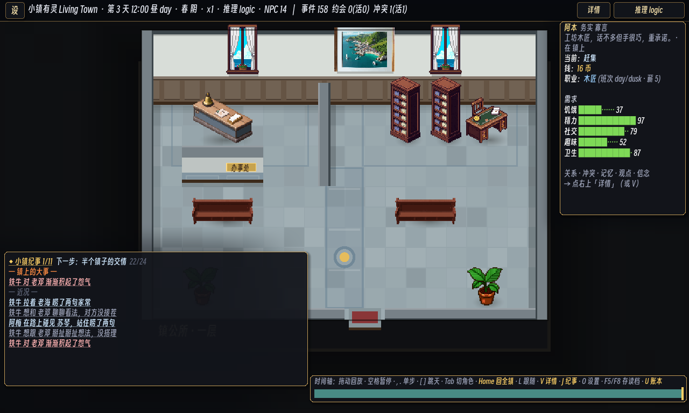

# 224 · P4c-6 镇公所室内设计与 PixelLab 资产

> 接 [223](223-p4c5-ballot-impact-receipt.md)：治理规则已经能选出镇长、记录公务、结算政绩并解释改投；本片把这条制度落到一间能读懂、能行走的镇公所里。

## 空间计划

镇公所不再沿用住宅房壳。`mairie` 显式使用公共建筑材质，并在原 10×6 格占地里形成三段：

- **左后办事区**：两格办事窗口靠后墙，横向隔墙把柜台和等候席分开；`(3,2)` 留开放口，黄铜“办事处”门牌标出入口。
- **中央公共轴线**：海蓝灰石带从门厅通向后场，地面徽章落在中轴；通路不放家具，访客与公务路线保持清楚。
- **右后档案与镇长办公区**：两座档案柜、镇长桌与港镇地图构成密集工作簇；议事长椅仍面向中轴，保留公共等候和会议用途。

四个 `wall` slot 写进 `interiors.json`，既画隔墙，也参与寻路阻挡。布局保留镇长桌的既有可达路线；`home2` 等其他室内没有坐标变化。墙面用浅灰泥、海蓝灰护墙板和深木收口，公共石地砖叠加区域边框、轴线与徽章，让房间边界在家具之外也能被读出。

这个取舍沿用 [my_ai_town](https://github.com/mewamew/my_ai_town) 的“住民在真实地点和设备上活动”方向，也以 [Elin](https://store.steampowered.com/app/2135150/Elin/) 室内常见的高密度道具、明显材质分区和可辨功能簇为视觉标准；没有复制两者的代码或美术。

## PixelLab 资产出货

四张图均由 PixelLab `create_map_object` 生成，统一使用 high top-down、selective outline、medium shading、high detail、透明背景和低饱和海滨市政配色。原图保持 1× 像素，不做插值缩放；渲染复用既有 alpha bbox 对地、软影和遮挡顺序。

| 资产 | 原生尺寸 | alpha bbox（右/下边界不含） | 视觉职责 | PixelLab object id |
|---|---:|---|---|---|
| `mayor_desk.png` | 64×64 | `(7,5)-(57,59)` | 绿皮书写垫、账册、钢笔和铜牌 | `d7cb50a8-5663-4534-8b6f-12e12061f5ad` |
| `civic_counter.png` | 96×64 | `(13,2)-(83,62)` | 两格蓝灰服务柜面、铃和文件盘 | `63389fab-0b46-49fc-8cda-4fc894d2b99b` |
| `civic_town_map.png` | 96×64 | `(12,6)-(83,58)` | 带木框的海港镇地图 | `6b0b7fd9-2335-4231-85b6-235afe68e5df` |
| `civic_archive.png` | 48×80 | `(6,0)-(42,79)` | 深橡木鸽笼格、文件束和黄铜标签框 | `d42b4bb6-6aeb-464a-80b1-10966cf411ad` |

`WorldView._furn_name()` 只在 `sid == "mairie"` 时将通用 counter、desk、painting_sea 与 bookshelf 映射到这组资产。图书馆、咖啡馆和住宅继续使用原有家具。

## 验收

- Godot 4.6.2 编辑器成功导入四张 PNG 并解析 `WorldView.gd`；真 framebuffer 以 seed 3、tick 600、`mairie/1f`、`--shot-fit` 成功出图。
- `governance_test` 通过，确认当选镇长仍能在每周窗口内到达镇长桌并完成公务，其他居民不能冒用。
- S0 N=12 seeds 1–12 × 60 天：硬不变量 12/12、#37 与 #40 均 12/12、现有金标和逐 tick chain 12/12、确定性 3/3；实际隔墙没有改变既有治理轨迹，因此不重烘。
- N=16 seeds 1–12：硬不变量 12/12、#37 12/12、#40 11/12；held-out seeds 13–30：硬/软 18/18，#37 与 #40 均 18/18。
- `DetGate` 四轨 × seeds 1–4 的硬不变量、重放、数据指纹与金标均 16/16；`ModelPathGate` 失败 0；`save_load_test` 与 `event_prose_test` 通过。
- `asset_gate.py`、`lint_data.py`、`lint_links.py` 与 `git diff --check` 通过。

本机启动仍会报告缺少 NobodyWho GDExtension 动态库；资源导入、脚本解析、零模型截图和测试随后正常完成。

[225](225-p4c7-civic-notice-board.md) 随后把后墙地图升级为可互动的镇务公示板，并用一张只读治理卡片集中展示现任、出勤、镇库、票箱、上届成绩单与政绩改投。
