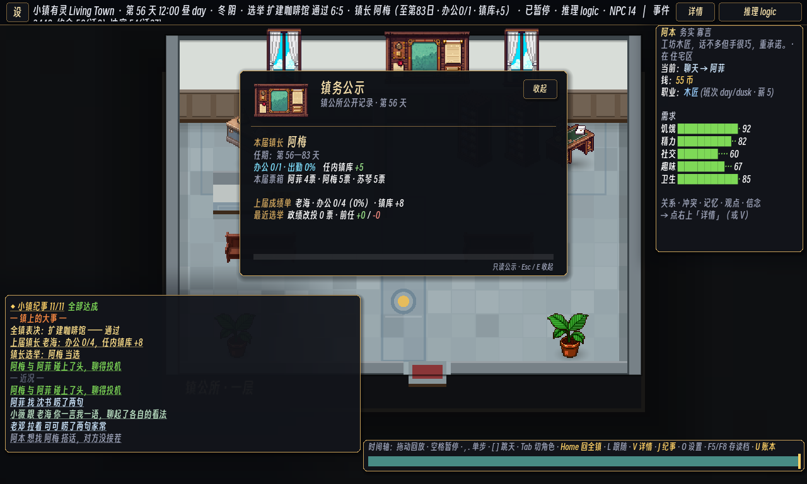

# 225 · P4c-7 镇务公示板与治理 HUD

> 接 [224](224-p4c6-pixellab-civic-furniture.md)：镇公所已经有清楚的空间分区和专属家具，
> 但墙上的海港地图仍只是装饰，玩家必须在顶栏、观察台和大事栏之间拼出一届镇政发生了什么。

## 这片补上的闭环

后墙中央改为一张可互动的镇务公示板。普通观察模式可直接点板；生活模式会把它列为
`E · 查看` 目标，点远处的板也能按整张 96×64 挂墙精灵命中，而不是只能点到墙脚的 48×48 地格。

打开后，公示卡集中显示：

- 现任镇长与任期边界；
- 已完成/应完成的公务、出勤率与任内镇库变化；
- 本届候选人的真实票箱；
- 上届冻结成绩单；
- 最近一次政绩造成的改投、前任得票与失票。

卡片沿用现有墨色、暗金与羊皮纸 HUD 语言，打开时暂停世界，`Esc`、`E` 或“收起”精确恢复原来的运行态。
进度条只画真实的 `duties_done / duties_due`，没有应到周期时保持空白，不把“尚未到期”画成满勤。

## PixelLab 出货

`civic_notice_board.png` 由 PixelLab `create_map_object` 以 96×64 原生像素生成：深橡木与黄铜框、中央海港图、
两侧羊皮纸公示、出勤表与红蜡镇印。资产保留透明背景、selective outline、medium shading 和 high top-down 视角；
没有插值缩放。PixelLab object id：`ba72ee3e-3b5a-458d-a8a3-5b97f2edf6b5`。

这次没有给另一个现有家具硬套治理交互。`interiors.json` 在独立公示板条目上声明
`civic_observatory: true`；Sim 只从这个 authored marker 找坐标，Main 与 LifeMode 都不抄 `[5,0]`。
原 `painting_sea` 的 `mairie1f_painting_sea / 赏画 / fun +30 / 10 tick` 行为槽仍原样留在同一格，
只在 View 层隐藏旧图片，避免一次美术与 HUD 改动悄悄删除 NPC 候选或改掉事件目标 id。

## 权威边界

`Sim.civic_observatory_projection()` 是两种 UI 的共同只读入口。它返回现任状态、当前任期记录、实时政绩、
最近成绩单和最近镇长选举事件的深拷贝。新增的公示板 marker 没有 `advertises`，因此不会新增 NPC 行为候选，
不会改变需求、工作、钱、选票、事件账本或随机流。测试还会修改返回副本并核对原账本逐项不动。

## 验收

- Godot 4.6.2 成功导入 96×64 PNG 并解析脚本；真实 OpenGL framebuffer 在 seed 3、tick 13320、
  `mairie/1f`、`--shot-fit --civic-panel` 下完成截图。
- `governance_test` 通过：坐标来自 authored marker；投影逐项等于治理权威记录；副本变异不回写；
  生活模式在相邻格只得到一个公示板只读目标。
- `player_touch_test` 通过：打开卡片立即暂停并显示首届提示，关闭后恢复原运行态；原触屏动作条、观察台与
  63 居民两档溢出门继续全绿。
- `asset_gate.py`、`lint_data.py` 与 `git diff --check` 通过。

本机运行仍会先报告 NobodyWho GDExtension 动态库缺失；资产导入、零模型截图和上述测试随后正常完成。

后续的跨切片影响复核与因果监测修正见 [226](226-p4c7-impact-and-causal-monitor.md)。
