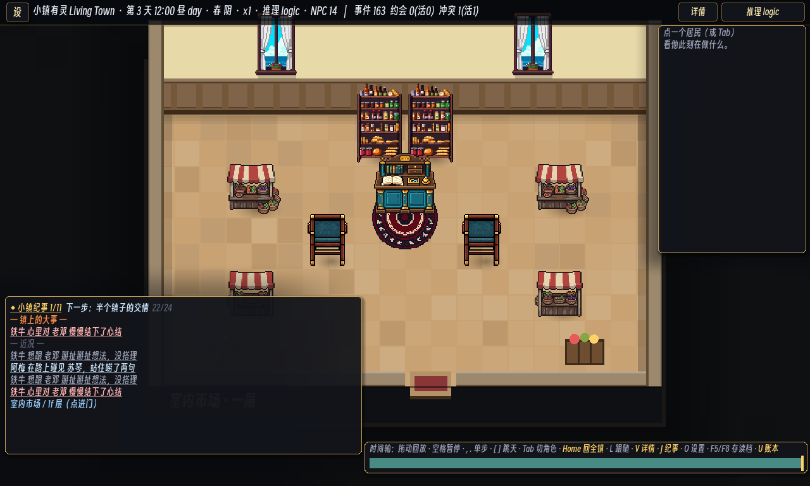
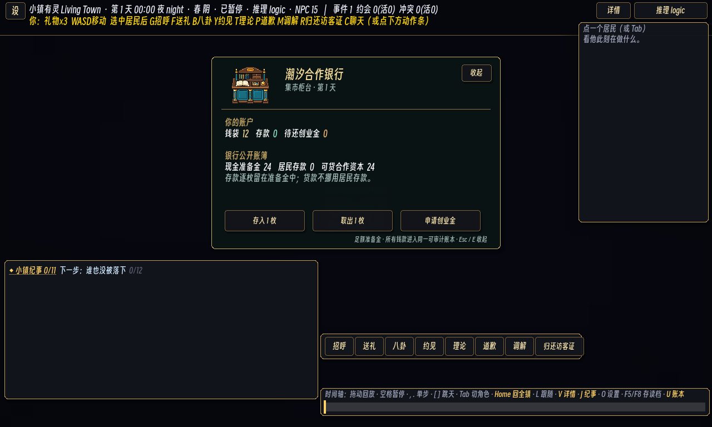

# 229 · P5a Cooperative Bank and Impact Receipt

> This slice establishes banking as a real institution rather than a decorative building or an unconstrained
> money faucet. It deliberately stops before deeds, leases, dividends, and employer payroll.

## Product result

The indoor market now hosts the **Tide Cooperative Bank** (`潮汐合作银行`). Its PixelLab-authored counter is
both the visible teller desk and the interaction anchor. Clicking it opens one compact finance card showing:

- wallet cash, demand deposit, and outstanding startup loan;
- bank cash reserve, total resident deposits, and lendable cooperative capital;
- deposit, withdrawal, and one bounded startup-loan action.





The production prop is `game/assets/art/furn/bank_counter_ledger.png`, generated in PixelLab as a reusable
64×64 low-top-down object (object `c5dbb477-3736-41c7-b21e-7732235536bf`). Walnut, muted teal, brass, ledger,
and coin tray carry the coastal civic palette into commerce. There is no hand-coded disposable visual fallback.

The halles composition follow-up replaces the four identically angled stalls with an eight-view PixelLab set
(object `0fee5155-e70d-4edb-80d3-ecb93842b665`) and adds a reusable eight-view teal waiting chair set
(object `15dec03b-4664-43b6-b56c-5f03c56820f8`). Furniture now owns an authored `facing` field; the renderer
selects a directional asset when one exists and safely retains the original sprite otherwise. Two stall rows face
their shared customer aisle, while two north-facing seats flank the bank rug and keep the doorway-to-counter
route four cells wide. The result is denser, directional, and legible without turning the room into an obstacle maze.

## Accounting model

`banking.json` owns the economic dose. Opening cooperative capital is 24 coins. Deposits transfer wallet cash
into the bank account and create an equal demand-deposit liability; they never create a second copy of money.
Withdrawals reverse that transfer. Loans may use only:

```text
lendable capital = bank cash - total demand deposits
```

The first business lane is intentionally small: Aria and Ben may each receive at most one 6-coin startup loan,
with 1-coin repayments whenever wallet cash remains above the 8-coin operating buffer. Residents automatically
save only surplus wallet cash above 18 coins, two coins per night, capped at 30 per account. Player actions use
the same transfer and receipt paths as autonomous residents.

Hard invariant **#47** independently folds every bank deposit, withdrawal, loan, and repayment receipt. It must
reconstruct live bank cash, deposit liabilities, and loan receivables exactly, while also proving bank cash is
never below deposits. Invariant #34 now includes bank cash in the conserved money set, and #35 includes its
non-negative balance. Deposits remain part of resident wealth observations but not spendable wallet liquidity.

## Measured impact

The dedicated banking probe over N=12, seeds 1–12, 60 days observed:

| Measure | Result |
|---|---:|
| Deposit transactions | 631 |
| Startup loans issued | 16 |
| Repayments | 62 |
| Autonomous withdrawals | 0 (withdrawal is player-controlled in this slice) |
| End deposits per seed | 73–126 coins |
| End lendable capital per seed | 19–24 coins |
| #47 full-reserve pass | 12/12 |

This is a useful non-explosive shape: saving is common, loans occur but remain rare, and every seed retains a
large positive capital margin after reserving all deposits. The normal 60-day S0 grid keeps every hard and soft
invariant green, supply #40 at 12/12, and deterministic replay at 3/3. The bank therefore changes household
liquidity and event history without opening a survival or supply failure path.

- N=16, seeds 1–12, 60 days: all hard and soft checks pass 12/12, including supply #40 and bank #47.
- Held-out N=12, seeds 13–18, 60 days: all hard checks pass 6/6; supply #40 passes 5/6, meeting the established
  soft gate. Seed 17's existing kind of pastry-supply variance is isolated from bank accounting.
- Scenario determinism: all four tracks × four seeds pass hard checks, replay, data fingerprint, and rebaked
  golden anchors (16/16). Model-path gate passes 4/4 after its intentional anchor rebake.
- Save/load round-trip preserves bank cash, deposit liabilities, loan receivables, and invariant #47.

The furniture follow-up was also treated as a simulation change because chairs and the moved teller desk alter
the indoor navigation grid. Its first dense draft narrowed the lower crossing to two cells: every hard check stayed
green, but supply #40 dropped to 10/12. Moving both seats into the rug-flanking service zone restored a four-cell
crossing and returned the final N=12 grid to hard 12/12, soft 12/12, supply #40 12/12, bank #47 12/12, and
deterministic replay 3/3. N=16 retained hard 12/12, supply #40 12/12, bank #47 12/12, with one allowed soft
faction-affinity variance (#26 at 11/12). The refreshed scenario gate is 16/16 and model-path anchor is 4/4.

The expected missing NobodyWho native-library warning remains non-blocking in this environment.

## Cross-phase progress after P5a

| Phase | Status after this slice |
|---|---|
| P0–P3 | Operational foundations remain intact. |
| P4 Governance | Core loop operational; council approval and one visible civic project remain. |
| P5 Bank/property/commerce | **Bank vertical slice operational**; deeds/leases, employer payroll, and dividends remain. |
| P6 Local specialties | Foundations only; now has a safe finance layer for shops and seasonal production. |
| P7 Scale | Partially de-risked; the full N=40 product grid still remains. |
| P8–P9 | Planned. |

## Coherent next candidates

1. **P4e council-funded visible civic project.** A market-square hydrangea improvement or seawall project can
   now contrast public treasury spending with private cooperative finance.
2. **P6a hydrangea and coastal-specialty identity pack.** Use PixelLab for flower beds, oyster baskets, produce
   crates, shop signs, and menu props, then connect one recipe and one seasonal market event.
3. **P5b deeds and leases.** Add one authoritative property registry and one shop lease before dividends or
   employer payroll broaden the money graph.
4. **P7 scale grid.** Run the complete N=40 matrix after the next meaningful simulation slice rather than
   tuning individual historical seeds.

The strongest next step is **P4e with a P6a PixelLab asset lane**: the bank is already sufficient to distinguish
public and private finance, while a visible civic project gives governance a town-scale consequence and P6a
delivers the largest immediate identity gain.
