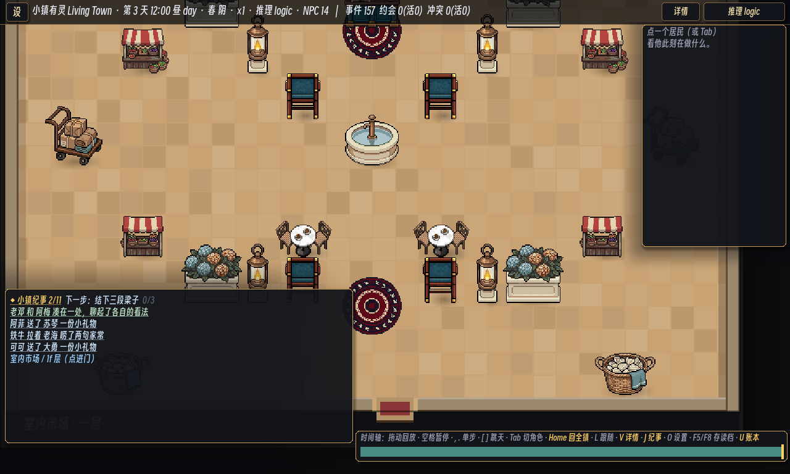
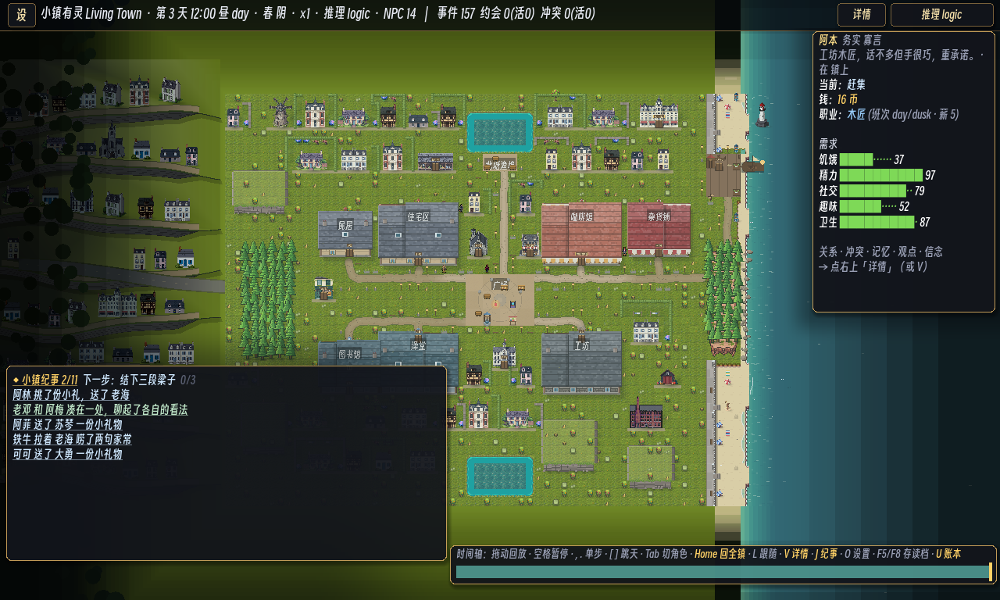

# 230 · Adaptive Interiors, Halles Composition, and Land Entrance

## Product result

Large interiors are no longer forced into the same whole-room presentation as a bedroom or café. Spaces may now
author a presentation-only camera policy. Compact rooms still open as one readable composition; an `explore`
space opens at a utility-appropriate scale and uses the existing drag, wheel, pinch, and keyboard camera movement.
The first application is the Halles, expanded from **10×7 to 16×12** and framed at 1.55× around its public-service
core. Camera policy never enters navigation, saves, resident decisions, or simulation digests.

The Halles is now composed as a public market rather than a sparse furniture box:

- a central arrival/processional axis leads from the street door to the cooperative-bank counter;
- a fountain forms the middle landmark, with circulation on both sides;
- paired stalls face their customer aisles instead of sharing an arbitrary screen direction;
- waiting chairs, café tables, rugs, lanterns, planters, baskets, and parcel trolleys form layered service zones;
- the main route remains broad enough for resident traffic rather than becoming a decorative obstacle course.

The attached Dragon Quest VII Reimagined abbey image was used only as visual reference. The translated principles
are hierarchy, a strong central landmark, paired secondary elements, edge density, and clear traversal—not copied
art, layout, or content.

## PixelLab asset-factory receipt

PixelLab generated a reusable 64×64 coastal public-interior kit in one review batch
(`2e994f9c-e606-4b5f-8d21-2b1c62f7f9ba`, 16 selected objects). The prompt asked for low-top-down pixel-art public
fixtures in the existing walnut, muted teal, warm brass, cream stone, hydrangea, and coastal-market palette, with
transparent backgrounds and readable silhouettes. This was object-generation mode, not a procedural placeholder
or hand-coded disposable asset pass.

Five production objects are used immediately:

| Runtime asset | PixelLab object | Purpose |
|---|---|---|
| `public_hydrangea_planter.png` | `f2208815-d828-498d-9d1d-7dcf33824909` | paired interior greenery |
| `public_floor_lantern.png` | `2d6b0de8-a784-430f-867a-29a31d25c7cf` | warm pools and vertical rhythm |
| `market_oyster_basket.png` | `f535b2ec-38be-4791-b642-d07bcfe5b97d` | coastal local-specialty cue |
| `public_stone_fountain.png` | `18a7a878-7336-4070-9a43-1eeef9a12203` | central spatial landmark |
| `market_parcel_trolley.png` | `6f70d2c9-8874-4499-b5d9-0974a18251ba` | edge activity and delivery story |

The other selected kit objects remain reusable PixelLab-library assets for later civic, hotel, shop, and festival
slices; they were not bulk-copied into the repository before a real placement exists.

## Land entrance

The forked mountain-switchback/highway silhouette outside the west edge has been replaced by one calm two-way
road that meets the town's main street. It uses a broad shoulder, subdued stone surface, and a restrained centre
marking. There are no ramps, junction forks, or vehicle props suggesting a transport system that the simulation
does not yet own.

## Impact and abnormality review

The floor expansion is not treated as cosmetic: furniture cells and the moved bank anchor alter resident path
lengths and therefore can affect work, supply, and social opportunity. The checks after the final composition were:

| Gate | Result |
|---|---|
| JSON/FK lint | 25 JSON files parsed; all required files and foreign keys valid |
| Space, portal, and authority contract | PASS, 0 failures |
| Banking conservation/save-load contract | PASS, 0 failures |
| Player touch/HUD equivalence | PASS, 0 failures |
| Halles physical portal round-trip | PASS; entry camera 1.55×, town return camera byte-stable |
| N=12, seeds 1–12, 60 days | hard 12/12; every soft invariant 12/12; #40 supply 12/12; #47 bank 12/12; replay 3/3 |
| N=16, seeds 1–12, 60 days | hard 12/12; soft gate passes; #40 supply 11/12; #47 bank 12/12 |
| Scenario gate | hard/replay/data fingerprint/golden 16/16 |
| Model-path anchor | 4/4 |

The only scaled-grid variance is N=16 seed 3 on soft supply invariant #40: seafood fulfillment is 0.48 with 27
shortage days. This is inside the established 11/12 soft threshold, while all hard constraints, banking, money,
inventory provenance, and liveness remain green. It is recorded rather than tuned around one historical seed.
The N=12 baseline and scenario/model-path anchors were intentionally rebaked because the larger navigable floor
changes legitimate resident trajectories.

The expected missing NobodyWho native-library warning remains the only environment warning.

## Whole-slice progress

| Slice | Current state |
|---|---|
| P0–P3 foundations | Operational; portals, camera navigation, authority, save/load, and mobile-equivalent input remain green. |
| P4 governance/civic presentation | Operational core plus public notice board and mayoral platform; council-funded visible works remain. |
| P5 banking/property/commerce | P5a bank is operational and now sits in a credible public hall; deeds, leases, payroll, and dividends remain. |
| P6 local identity | Advanced visually by the hydrangea/oyster/parcel kit; one production recipe and seasonal event remain the next functional step. |
| P7 scale | N=16 is green at its defined gates; the broad N=40 product grid is still deliberately outstanding. |
| P8–P9 | Planned, not pulled forward ahead of the coherent town loop. |

## Coherent next candidates

1. **P4e + P6a visible civic project:** fund a market-square hydrangea arcade or seawall improvement through the
   existing treasury, using the PixelLab kit as the visual lane and producing a visible before/after state.
2. **P6a coastal specialty loop:** connect oyster baskets and produce crates to one authored recipe, one vendor
   interaction, and one seasonal market presentation.
3. **Adaptive interiors as a reusable pattern:** apply `explore` only to genuinely large utility spaces such as a
   future council chamber or expanded hotel lobby; keep homes and small shops compositionally fitted.
4. **P5b deeds and leases:** add one authoritative property registry and one shop lease before broadening finance
   into payroll or dividends.
5. **P7 N=40 product grid:** run after the next meaningful simulation slice, keeping the known hard need-floor risk
   distinct from this visual/navigation pass.

The most coherent next move is candidate 1: it joins governance consequence, local visual identity, and the newly
legible market/land-entry presentation without opening several unrelated economic systems at once.
